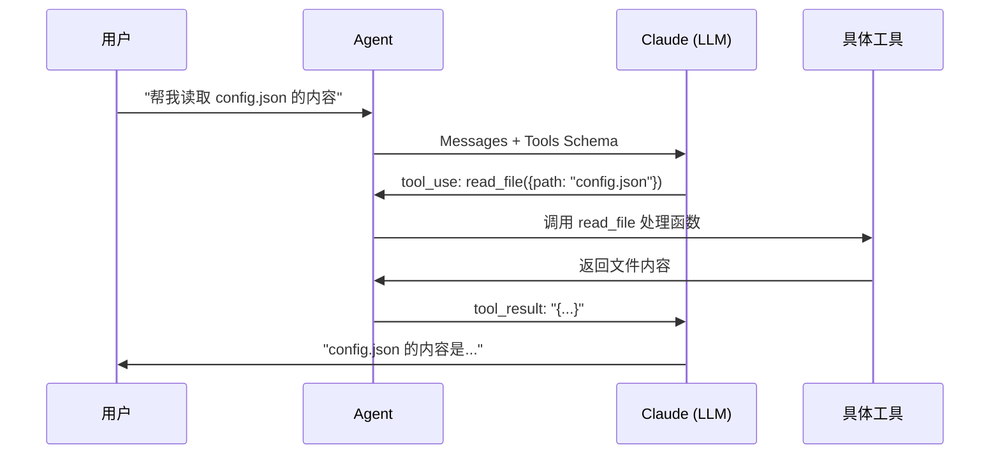
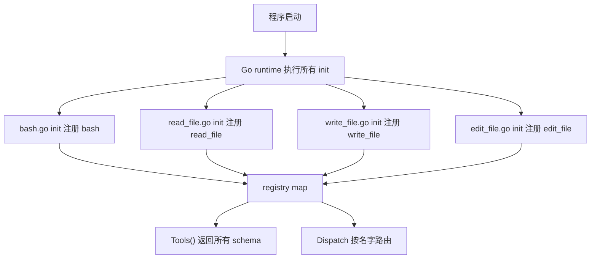
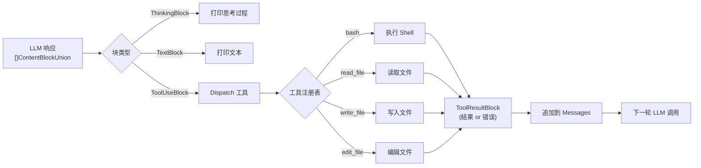
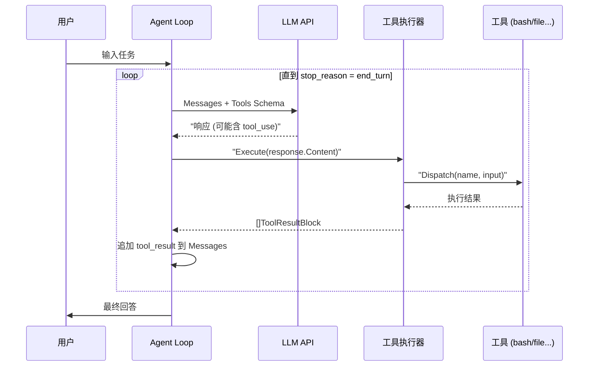
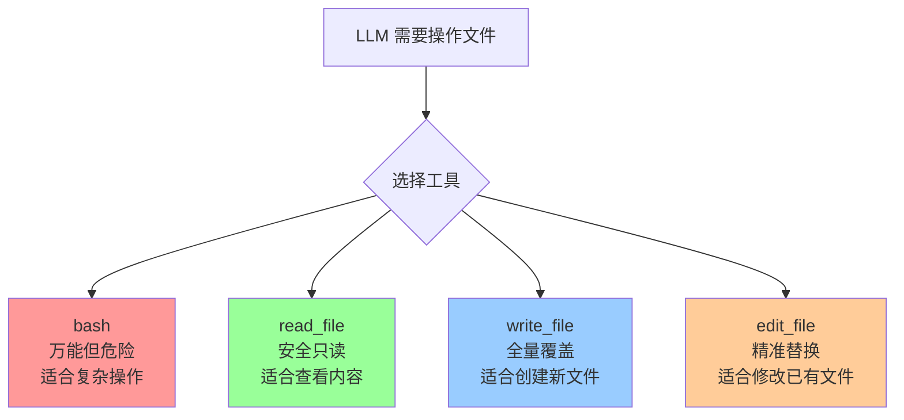

> Agent = LLM（大脑）+ Tools（手脚）+ Loop（神经反射弧）


上一篇[Agent 的本质：一个 Loop 循环](https://mp.weixin.qq.com/s/dkdrwVlwe3IkH2hzSzy53A)讲了 Loop。  
这篇讲 Tools。


如果 Loop 是 Agent 的神经反射弧，那工具就是它的手脚。  
没有工具，LLM 再聪明，也只是个嘴上功夫的大脑。  
什么都说得出来，什么都做不了。


## 一、项目进度回顾

evo-agent 是一个从零开始构建 Agent 的学习项目。


[之前](https://mp.weixin.qq.com/s/dkdrwVlwe3IkH2hzSzy53A)，我们实现了 Agent 最核心的骨架：

- 接入 Anthropic API
- 实现 ReAct Loop（思考 → 行动 → 观察 → 循环）
- 提供第一个工具：`bash`（执行 Shell 命令）


**这篇文章**，我们扩展了工具系统：

- 新增 `read_file`：读取文件内容
- 新增 `write_file`：写入文件（自动创建目录）
- 新增 `edit_file`：精准替换文件片段
- 重构工具注册机制，支持工具自注册，方便后续扩展


当前项目目录结构如下：

```
src/
├── main.go                    # 入口：交互式 REPL
├── internal/
│   ├── agent/
│   │   ├── loop.go            # Agent 主循环
│   │   └── state.go           # 对话状态
│   ├── tools/
│   │   ├── tool.go            # 工具注册表 & Dispatch
│   │   ├── executor.go        # 工具执行器（解析 LLM 响应）
│   │   ├── bash.go            # bash 工具
│   │   ├── read_file.go       # read_file 工具
│   │   ├── write_file.go      # write_file 工具
│   │   └── edit_file.go       # edit_file 工具
│   ├── config/
│   │   └── config.go          # 配置加载（.env）
│   └── ui/
│       └── terminal.go        # 终端彩色输出
```


## 二、工具是什么？

在 Agent 的语境里，工具（Tool）就是一个 LLM 可以"主动调用"的函数。  
注意这里的关键词是"主动"。  
不是我们程序员硬编码去调，而是 LLM 自己判断"我现在需要用这个工具"，然后发起调用。


LLM 本身只能生成文本。  
但如果我们事先告诉它："你有这些工具，每个工具叫什么名字、接收什么参数、有什么用"。  
那 LLM 在需要的时候，就会输出一段结构化的"工具调用请求"。


Agent 系统拦截这个请求，真正去执行工具，再把结果还给 LLM。  
这个过程叫 **Tool Use**（工具调用）。


举个例子。  
用户说："帮我读取 config.json 的内容"。  
LLM 不会傻乎乎地编一段文件内容出来，而是会说："我要调用 read_file 工具，参数是 config.json"。  
系统执行完，把真实的文件内容返回给 LLM，LLM 再基于真实内容回答用户。


整个过程长这样：





而且工具调用不是一次性的。  
LLM 可以连续调用多个工具，直到它认为信息足够了，才输出最终答案。  
这就是[上一篇](https://mp.weixin.qq.com/s/dkdrwVlwe3IkH2hzSzy53A)讲的 Loop 的作用。


## 三、工具的数据结构

每一个工具，本质上就是两件东西的组合：


1. **Schema（接口描述）**：告诉 LLM 这个工具叫什么、接收什么参数。这是给 LLM 看的"说明书"。  
2. **Handler（执行逻辑）**：真正的函数实现，这是给 Go 程序执行的。


一个给 LLM 看，一个给程序跑。


在代码里，我们用 `ToolDef` 把这两件事绑在一起：

```go
// tool.go

// Handler 是每个工具必须实现的函数签名
type Handler func(input json.RawMessage) (string, error)

// ToolDef 把工具的 API schema 和 handler 绑定在一起
type ToolDef struct {
    Schema  anthropic.ToolParam
    Handler Handler
}
```


- `Schema` 里包含工具名称、描述、参数的 JSON Schema，发给 Anthropic API  
- `Handler` 接收 LLM 传来的 JSON 参数，返回字符串结果（或错误）


## 四、自注册模式：让工具"自己报到"


一个常见的工程问题：**工具越来越多，怎么管？**


最朴素的方式是维护一个全局列表，每次新增工具都去改那个列表。  
但这很容易出错，耦合度也高。  
改着改着就乱了。


evo-agent 采用了 Go 的 `init()` 自注册模式。


**核心思路**：每个工具文件自己负责把自己注册到全局注册表。  
`main` 包只需要 `import` 这些文件，注册就自动完成了。  
谁也不用管谁。

```go
// tool.go —— 全局注册表

var registry = map[string]ToolDef{}

// Register 向注册表添加一个工具
func Register(def ToolDef) {
    registry[def.Schema.Name] = def
}

// Tools 返回所有注册的工具 schema，用于发给 Anthropic API
func Tools() []anthropic.ToolUnionParam { ... }

// Dispatch 根据工具名找到 handler 并执行
func Dispatch(name string, input json.RawMessage) (string, error) { ... }
```


每个工具文件里，在 `init()` 里调用 `Register`：

```go
// bash.go
func init() {
    Register(ToolDef{
        Schema: anthropic.ToolParam{
            Name:        "bash",
            Description: anthropic.String("Run a shell command in the current workspace."),
            InputSchema: GenerateSchema[BashInput](),
        },
        Handler: func(input json.RawMessage) (string, error) {
            var in BashInput
            json.Unmarshal(input, &in)
            return runBash(in.Command), nil
        },
    })
}
```


这样，**添加一个新工具，只需要新建一个 `.go` 文件**。  
不需要修改任何已有代码。  
完美的开闭原则。





## 五、Schema 自动生成

上面说了，每个工具都需要一份 JSON Schema，告诉 LLM 这个工具接收什么参数。  
但这个 Schema 怎么来？


如果手写，`read_file` 的 Schema 大概长这样：

```go
anthropic.ToolInputSchemaParam{
    Properties: map[string]interface{}{
        "path": map[string]interface{}{
            "type":        "string",
            "description": "The relative path of a file in the working directory.",
        },
        "limit": map[string]interface{}{
            "type":        "integer",
            "description": "Maximum number of lines to return (0 = no limit).",
        },
    },
}
```


这还只是两个字段。  
如果工具有五六个参数，而且项目里有十几个工具，每个都这样手写……  
不仅代码量爆炸，参数描述和实际的 Go 结构体还是两套东西。  
改一个忘了改另一个，迟早出问题。


所以 evo-agent 用反射来自动生成 Schema：

```go
// GenerateSchema 用反射从 Go 结构体生成工具的 InputSchema
func GenerateSchema[T any]() anthropic.ToolInputSchemaParam {
    reflector := jsonschema.Reflector{
        AllowAdditionalProperties: false,
        DoNotReference:            true,
    }
    var v T
    schema := reflector.Reflect(v)
    return anthropic.ToolInputSchemaParam{
        Properties: schema.Properties,
    }
}
```


只需要定义一个 Go 结构体，用 tag 写上字段描述，Schema 就自动生成了：

```go
type BashInput struct {
    Command string `json:"command" jsonschema_description:"The shell command to run."`
}

type ReadFileInput struct {
    Path  string `json:"path"            jsonschema_description:"The relative path of a file."`
    Limit int    `json:"limit,omitempty" jsonschema_description:"Maximum lines to return (0 = no limit)."`
}
```


一石二鸟。  
LLM 会读这份 Schema，知道该传什么参数。  
Go 程序收到 LLM 的 JSON 后，`json.Unmarshal` 进对应的结构体，完成类型安全的参数解析。  
定义一次，两边都用。


## 六、四个工具详解

### 6.1 bash：万能瑞士军刀

`bash` 是最灵活的工具。  
只要是 Shell 能做的事，它都能做。

```
bash(command="ls -lh")
bash(command="git log --oneline -5")
bash(command="grep -r 'TODO' ./src")
```


但灵活也意味着需要更多防护。  
实现上有几个关键设计：

- 用 `exec.CommandContext` 设置 **120 秒超时**，防止命令卡死  
- 合并 `stdout` 和 `stderr`（`CombinedOutput`），让 LLM 能看到完整输出（包括错误）  
- 输出截断到 **50000 字符**，避免 token 爆炸  
- 空输出返回 `"(no output)"`，而不是空字符串，LLM 更容易理解

```go
func runBash(command string) string {
    ctx, cancel := context.WithTimeout(context.Background(), 120*time.Second)
    defer cancel()

    cmd := exec.CommandContext(ctx, "bash", "-c", command)
    out, err := cmd.CombinedOutput()

    if ctx.Err() == context.DeadlineExceeded {
        return "Error: Timeout (120s)"
    }
    // ...
}
```


### 6.2 read_file：精准读取

`bash` 当然也能 `cat` 文件。  
但专门的 `read_file` 工具更语义化，也更可控。

```
read_file(path="src/main.go")
read_file(path="large_log.txt", limit=50)   // 只读前 50 行
```


实现要点：

- 支持 `limit` 参数，读大文件时只取前 N 行，后面追加 `"... (N more lines)"`  
- 同样做 50000 字符截断  
- 不支持读目录（目录用 `bash` + `ls` 处理）

```go
func runReadFile(path string, limit int) (string, error) {
    data, _ := os.ReadFile(path)
    text := string(data)
    if limit > 0 {
        lines := strings.Split(text, "\n")
        if limit < len(lines) {
            text = strings.Join(lines[:limit], "\n") +
                fmt.Sprintf("\n... (%d more lines)", len(lines)-limit)
        }
    }
    return text, nil
}
```


### 6.3 write_file：全量写入

`write_file` 用于创建新文件，或者完全覆盖一个文件。

```
write_file(path="output/result.txt", content="Hello, World!")
write_file(path="src/new_feature.go", content="package main\n...")
```


实现要点：

- 自动创建父目录（`os.MkdirAll`），不用先 `mkdir -p`  
- 返回写入字节数，方便 LLM 确认写入成功

```go
func runWriteFile(path, content string) (string, error) {
    os.MkdirAll(filepath.Dir(path), 0o755)
    os.WriteFile(path, []byte(content), 0o644)
    return fmt.Sprintf("Wrote %d bytes to %s", len(content), path), nil
}
```


### 6.4 edit_file：精准替换

这是最精妙的一个工具。


为什么需要它？  
`write_file` 每次都要写整个文件。  
如果只需要改一行代码，让 LLM 重写整个文件，效率很低，而且它容易"改着改着把其他内容搞丢了"。


`edit_file` 只替换文件中的一个片段。  
传入旧内容 `old_str` 和新内容 `new_str`，只动这一处，其他地方纹丝不动。

```
edit_file(
  path="src/main.go",
  old_str="fmt.Println(\"hello\")",
  new_str="fmt.Println(\"hello, agent!\")"
)
```


实现要点：

- `old_str` 必须在文件中**唯一存在**，避免误改  
- `old_str` 为空且文件不存在时，等价于创建新文件（复用 `write_file` 逻辑）  
- 用 `strings.Replace(..., 1)` 只替换第一处匹配，作为额外的安全兜底

```go
func runEditFile(path, oldStr, newStr string) (string, error) {
    data, err := os.ReadFile(path)
    if os.IsNotExist(err) && oldStr == "" {
        return runWriteFile(path, newStr)  // 文件不存在 + 空 old_str = 创建
    }

    content := string(data)
    if !strings.Contains(content, oldStr) {
        return "", fmt.Errorf("edit_file: old_str not found in %s", path)
    }

    newContent := strings.Replace(content, oldStr, newStr, 1)
    os.WriteFile(path, []byte(newContent), 0o644)
    return fmt.Sprintf("Edited %s", path), nil
}
```


## 七、工具执行器：连接 LLM 和工具

LLM 返回的响应是一个内容块列表（`[]ContentBlockUnion`），里面可能包含三种东西：

- `ThinkingBlock`：模型的思考过程（扩展思维功能）  
- `TextBlock`：普通文本输出  
- `ToolUseBlock`：工具调用请求


`executor.go` 负责遍历这个列表，碰到 `ToolUseBlock` 就去执行：

```go
func Execute(content []anthropic.ContentBlockUnion) []anthropic.ContentBlockParamUnion {
    var results []anthropic.ContentBlockParamUnion

    for _, block := range content {
        switch v := block.AsAny().(type) {
        case anthropic.ThinkingBlock:
            ui.PrintThinking(v.Thinking)

        case anthropic.TextBlock:
            ui.PrintText(v.Text)

        case anthropic.ToolUseBlock:
            ui.PrintToolCall(v.Name)                                         // 打印工具名
            ui.PrintCommand(fmt.Sprintf("%s(%s)", v.Name, v.Input.Raw()))   // 打印参数

            inputBytes, _ := json.Marshal(v.Input)
            output, err := Dispatch(v.Name, inputBytes)                      // 执行工具

            isError := err != nil
            results = append(results, anthropic.NewToolResultBlock(v.ID, output, isError))
        }
    }

    return results
}
```


执行结果会被打包成 `ToolResultBlock`，下一轮发给 LLM，让它继续思考。


整个数据流如下：





## 八、Agent 主循环的完整视角

前面分别讲了 Loop 和 Tools。  
现在把它们合在一起看，整个 Agent 的运作过程就一目了然了。





核心代码（`loop.go`）非常简洁：

```go
func (a *Agent) RunOneTurn(state *LoopState) bool {
    // 1. 调用 LLM
    resp, _ := a.client.Messages.New(ctx, anthropic.MessageNewParams{
        Messages: state.Messages,
        Tools:    tools.Tools(),  // 所有注册的工具
        // ...
    })

    // 2. 追加助手响应
    state.Messages = append(state.Messages, resp.ToParam())

    // 3. 执行工具
    toolResults := tools.Execute(resp.Content)

    // 4. 没有工具调用 → 结束
    if len(toolResults) == 0 {
        return false
    }

    // 5. 追加工具结果 → 继续下一轮
    state.Messages = append(state.Messages, anthropic.NewUserMessage(toolResults...))
    return true
}

func (a *Agent) Loop(state *LoopState) {
    for a.RunOneTurn(state) {}
}
```


你看，整个 Loop 的逻辑其实就一行：`for a.RunOneTurn(state) {}`。  
简洁到有点过分。  
但就是这一行，驱动了 Agent 的全部行为。


## 九、为什么要有多种文件工具？

有人可能会问：有了 `bash`，`cat`、`echo`、`sed` 什么都能干。  
那为什么还要单独实现 `read_file`、`write_file`、`edit_file`？


原因有三。


**第一，语义更清晰，LLM 选择更准确。**  
LLM 在选工具时，是根据工具描述来判断的。  
`read_file` 的描述明确说"读文件内容"，比让 LLM 自己去猜该用什么 shell 命令更可靠，出错率更低。


**第二，安全性和可控性更好。**  
`bash` 是万能的，但万能也意味着危险。  
`rm -rf /` 也是合法的 bash 命令。  
专用文件工具只做文件操作，边界清晰，日后加权限控制也方便。


**第三，输出更结构化，便于处理。**  
用 `bash` 执行 `cat` 的输出可能有细微差别（比如某些情况下多了换行符）。  
专用工具的输出就是干净的文件内容，LLM 处理起来更省心。


简单说就是：**能用专用工具就别用万能工具。**  
能用确定性的方案，就别引入不确定性。





## 十、总结

回顾一下这篇文章的几个要点：


**1. 工具决定了 Agent 的能力边界。**  
你给它什么工具，它就能干什么活。  
只有 bash 和有一整套文件操作工具，体验完全不一样。


**2. `init()` 自注册，加工具不用改老代码。**  
新建一个文件就搞定，干净利落。


**3. 能用专用工具就别用 bash。**  
语义更清晰，更安全，LLM 选错的概率也更低。


**4. 工具描述写给 LLM 看，不是写给自己看。**  
名字要直白，描述要具体，参数要明确。  
LLM 读不懂你的工具描述，它就不会用。


到这里，我们的 Agent 已经有了大脑（LLM）、神经反射弧（Loop）、和手脚（Tools）。  
下一篇，我们继续完善这个 Agent，看看还能给它装上什么新能力。


《完》


-EOF-

本文公众号：天空的代码世界  
个人微信号：tiankonguse  
公众号ID：tiankonguse-code
