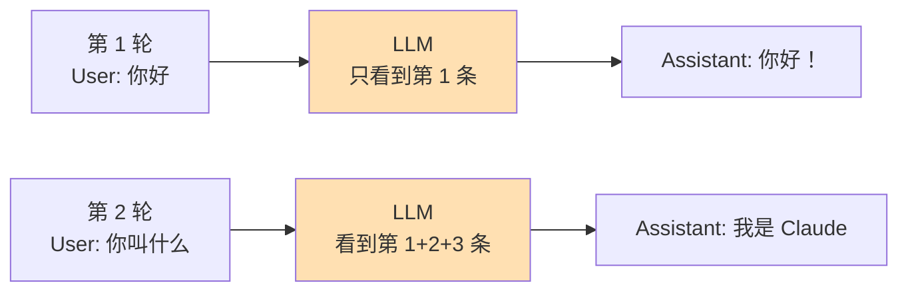
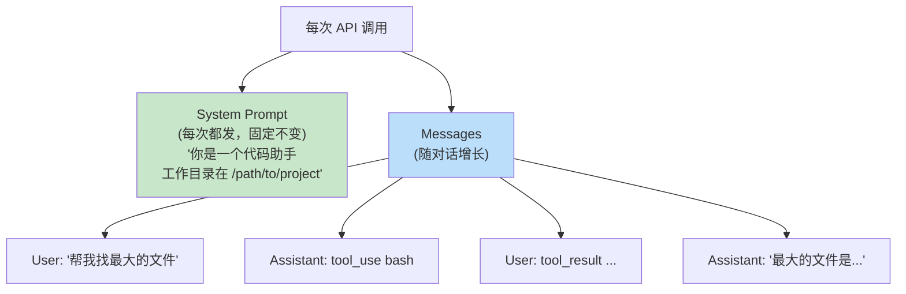
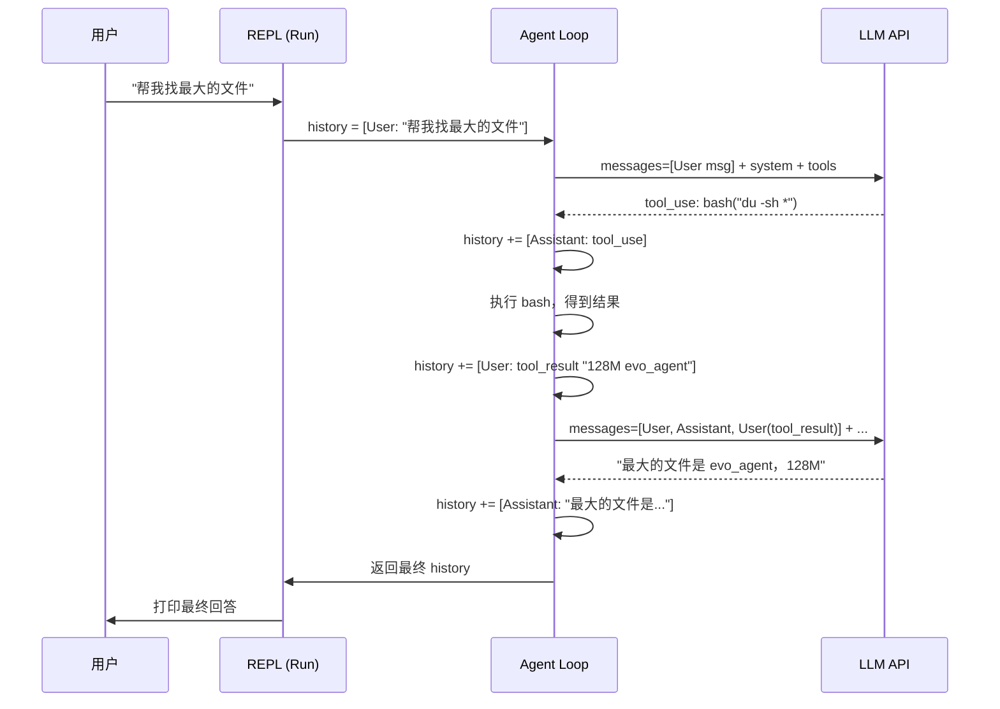
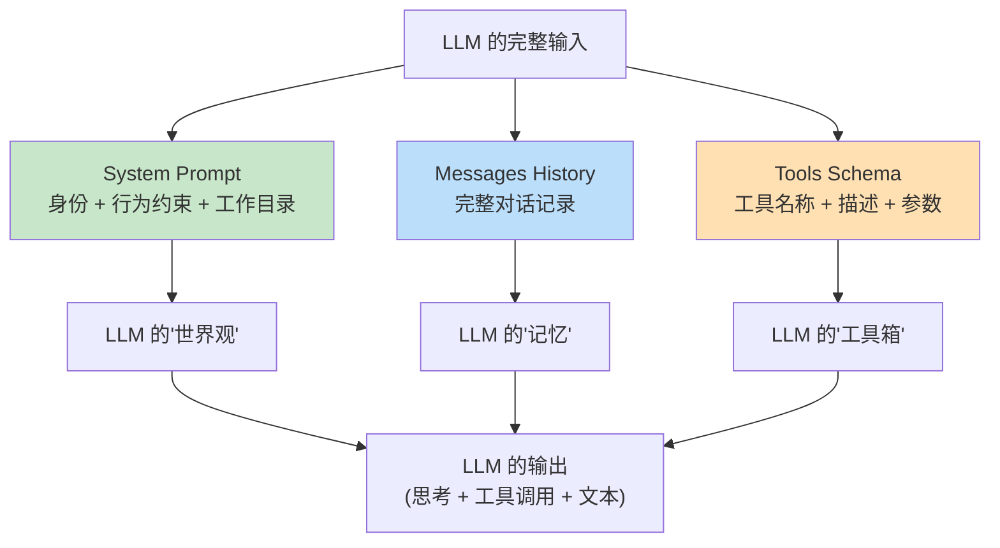

前两篇文章分别讲了 Agent 的 [Loop](https://mp.weixin.qq.com/s/dkdrwVlwe3IkH2hzSzy53A) 和 [Tools](https://mp.weixin.qq.com/s/xyX4_CF5cveezEDuzFT13g)。  
这篇讲 Agent 的 Prompts。  


注意，这篇的重点，其实不只是"怎么写提示词"。  
而是要回答一个更根本的问题：  


**LLM 是怎么知道它在干什么的？**  


不知道你是否知道，LLM 每次被调用，其实跟一个失忆的人一样。  
上一秒说了什么，它不知道。  
你之前跟它聊了三个小时，它也不知道。  


那它是怎么"记住"对话的？  


答案比你想的简单得多，也残酷得多。  


## 一、项目进度回顾


先简单交代一下背景。  


evo-agent 是我从零开始构建 Agent 的学习项目。  
https://github.com/tiankonguse/evo-agent


**第一篇**，搭了骨架：接入 Anthropic API，实现 ReAct Loop（思考 → 行动 → 观察 → 循环），提供了第一个工具 `bash`。  


**第二篇**，扩展了工具系统：新增 `read_file`、`write_file`、`edit_file` 三个文件操作工具，重构了工具注册机制。  


**这一篇**，来聊 Agent 最底层的"语言层"——Prompts 和 Messages History。  


当前项目的目录结构如下：  

```
src/
├── main.go                    # 入口：交互式 REPL
├── internal/
│   ├── agent/
│   │   ├── loop.go            # Agent 主循环 + REPL
│   │   └── state.go           # 对话状态（Messages + TurnCount）
│   ├── tools/
│   │   ├── tool.go            # 工具注册表 & Dispatch
│   │   ├── executor.go        # 工具执行器
│   │   ├── bash.go
│   │   ├── read_file.go
│   │   ├── write_file.go
│   │   └── edit_file.go
│   ├── config/
│   │   └── config.go          # 配置加载（SystemMsg 在这里生成）
│   └── ui/
│       └── terminal.go        # 终端彩色输出
```


## 二、LLM 没有记忆


这是理解一切的前提。  


**LLM 没有记忆。**  


每次你调用 API，对它来说都是全新的开始。  
上一轮说了什么，它完全不知道。  
你不告诉它，它就不记得。  


这和人完全不同。  
你跟朋友聊天，昨天说的话今天还记得。  
LLM 不行，每次调用，它的"记忆"都被清空了。  


那问题来了。  


ChatGPT 为什么看起来能"记住"上下文？  


答案很简单——ChatGPT 在每次请求里，把整个对话历史都塞给了 LLM。  
LLM 读完这些历史，才知道"哦，我们之前聊到这里了"。  


**本质上，LLM 的"记忆"，就是你塞给它的 messages 数组。**  


打个比方。  
你跟一个彻底失忆的人聊天，每次开口之前，你都得把之前所有的聊天记录念给他听一遍。  
他听完了，才知道"我们聊到哪了"。  


LLM 就是这个失忆的人。  





每一轮对话，messages 数组都在增长。  
LLM 每次都要读完整个历史，才能知道"我们聊到哪了"。  


就像滚雪球，越滚越大。  


## 三、Messages 长什么样


在搞清楚 messages 的结构之前，先抛两个你可能有过的疑问。  


**疑问一：思考模式。**  
你用过 Claude 的扩展思维（Extended Thinking）吗？开启之后，LLM 会先输出一段"内心戏"，再给出最终答案。  
那这段思考内容，是单独返回的，还是混在答案里的？它又是怎么存进 messages 的？  


**疑问二：工具调用。**  
LLM 想用工具，它怎么"告诉"我们它要用哪个工具、传什么参数？  
我们执行完工具，又怎么把结果"喂回"给 LLM？  


搞清楚 messages 的结构，这两个问题就迎刃而解了。  


好，那 messages 数组里到底装了些什么？  


Anthropic API 的 messages 是一个数组，每条消息有两个核心字段：  


**`role`**：这条消息是谁说的。  
只有两个值——`user`（用户）或 `assistant`（模型）。  


**`content`**：消息的内容。  
最简单就是一个字符串，但现代 LLM 支持了思考模式和工具调用之后，content 有时候是一个数组。  


具体来说：  


**用户消息**，普通对话直接用字符串就行。  
只有在需要把工具执行结果返回给 LLM 时，content 才变成数组（`tool_result` 类型）。  


**助手消息**，由于 LLM 可能同时输出思考过程、工具调用请求和普通文本，content 通常是一个数组，包含三种 block 类型：  

- `thinking` — 模型的内心戏（开启扩展思维时才有）  
- `tool_use` — "我要用这个工具"的请求，携带工具名、参数，以及一个唯一的 `id`  
- `text` — 最终的文本回答


这里有个关键细节：**LLM 每次发起工具调用，都会给它分配一个唯一的 `tool_use_id`**。  


为什么需要这个 ID？  


因为 LLM 可以在一次响应里同时请求多个工具。  
我们执行完之后，要把结果一一对应地还回去——用 `tool_use_id` 做锚点，LLM 才知道哪个结果对应哪个请求。  
就像你同时派出三个人去办事，每人手里拿一张编号的任务单，回来汇报时按编号核对。  


用 JSON 来直观感受一下：  

```json
[
  {
    "role": "user",
    "content": "帮我找出最大的文件"
  },
  {
    "role": "assistant",
    "content": [
      { "type": "thinking", "thinking": "用户想找最大的文件，我应该用 du 命令..." },
      { "type": "tool_use", "id": "tool_abc123", "name": "bash", "input": { "command": "du -sh * | sort -rh | head -1" } }
    ]
  },
  {
    "role": "user",
    "content": [
      { "type": "tool_result", "tool_use_id": "tool_abc123", "content": "128M  evo_agent" }
    ]
  },
  {
    "role": "assistant",
    "content": [
      { "type": "text", "text": "最大的文件是 evo_agent，占用 128M。" }
    ]
  }
]
```

注意两个细节。  


**第一，`tool_use_id` 贯穿请求和结果。**  
LLM 发出 `tool_use` 时带上 `id: "tool_abc123"`，我们返回结果时用 `tool_use_id: "tool_abc123"` 对应回去。  
ID 不匹配，LLM 就不知道这个结果是给谁的。  


**第二，工具调用的结果是以 user 角色发回去的。**  


为什么？  


因为从 API 的视角看，工具结果就是我们的程序"说"给 LLM 的话。  
执行工具的是我们的代码，不是 LLM 自己，所以自然是 user 角色。  


这个设计很合理。  
LLM 说"我想用 bash 执行这个命令"，我们的代码执行完了告诉它"结果是这个"——就像你让秘书去查个数据，秘书查完了回来跟你汇报。  


## 四、System Prompt：Agent 的"底色"


如果你用 Agent 写过代码，一定见过"上下文压缩"这个提示。  
对话太长了，Token 快撑不住了，Agent 会自动把历史消息压缩一遍。  


你有没有想过一个问题：  


**上下文压缩，会不会把系统提示词也一起压掉？**  


如果压掉了，那些强加给 Agent 的规则——"不准删文件"、"只能操作这个目录"——是不是就悄悄失效了？  


答案是：**不会。**  


因为系统提示词根本就不在 messages 里。  
它是一个独立的字段，压缩的是 messages 历史，System Prompt 每次调用都原封不动地带着。  


这就是为什么它重要。  


除了 messages 数组，还有一个独立的字段：`system`。  


这就是**系统提示词（System Prompt）**。  


它不在 messages 里，独立于对话历史之外。  
每次调用 API 都会带上它，但它不会随着对话增长。  


系统提示词的作用是什么？  


**给 Agent 设定身份和行为框架。**  


告诉它："你是谁，你在哪，你应该怎么做事。"  


打个比方。  
你去面试，面试官坐下来第一件事，不是直接问你问题，而是先告诉你"我是技术面试官，今天考察后端能力，时间 40 分钟"。  


这就是 System Prompt。  
它定义了整个对话的基调。  


在 evo-agent 里，系统提示词是在 `config.go` 里自动生成的：  

```go
// config.go
SystemMsg: fmt.Sprintf(
    "You are a coding agent at %s.",
    cwd,
),
```

非常简洁——你是一个代码助手，工作目录在这里。  


为什么要把工作目录注入进去？  


因为 LLM 在调用 `bash`、`read_file` 等工具时，需要知道相对路径从哪里算起。  
告诉它"你在 `/Users/tiankonguse/project/evo-agent`"，它构造文件路径时就不会迷失方向。  


在 `loop.go` 里，每次调用 API 时，系统提示词都会传进去：  

```go
// loop.go
resp, err := a.client.Messages.New(context.Background(), anthropic.MessageNewParams{
    Model: anthropic.Model(a.cfg.ModelID),
    System: []anthropic.TextBlockParam{
        {Text: a.cfg.SystemMsg},   // 系统提示词
    },
    Messages:  state.Messages,    // 对话历史
    Tools:     tools.Tools(),     // 工具列表
    MaxTokens: 8000,
})
```


## 五、System vs User：两种提示词的区别


有了 System Prompt，为什么还要有 User Prompt？  
它们各管什么？  


用一句话区分：  


**System Prompt 是角色设定，User Prompt 是任务指令。**  


还是用面试的比方。  


System Prompt 就是"我是技术面试官，考察后端，40 分钟"——整场面试不会变。  


User Prompt 就是每一道具体的面试题——"说说 Redis 的淘汰策略？"  


System Prompt 定义了 Agent 的"底色"：你是什么、能干什么、有什么约束。  
User Prompt 驱动 Agent 在当前这一轮做什么。  




两者合在一起，就是 LLM 每次"看到"的完整世界。  


## 六、对话历史的管理：两层循环


evo-agent 的对话历史管理有两层循环。  
这个设计其实挺巧妙的。  


**外层循环**：REPL 交互循环。  


负责读取用户输入、驱动一次完整的 Agent 任务、打印最终回答。  
`history` 在这一层跨多次用户查询累积——你问了第一个问题，LLM 的全部回答都会留在 history 里；你问第二个问题时，LLM 能看到第一轮的完整上下文。  

```go
// 外层：REPL 循环，每次读取一个用户问题
var history []anthropic.MessageParam

for { // 不断等待用户输入
    query := readUserInput()

    history = append(history, anthropic.NewUserMessage(query))
    state := &LoopState{Messages: history}

    a.Loop(state)          // 内层循环在这里运行

    history = state.Messages   // 把本轮所有对话（含工具调用）同步回来
    printFinalAnswer(history)
}
```

**内层循环**：ReAct 循环。  


负责驱动一次任务里的多轮 LLM 调用。  
每次 LLM 返回工具调用请求，就执行工具、把结果追加进 messages，再发起下一轮调用，直到 LLM 不再需要工具为止。  

```go
// 内层：ReAct 循环，每次调用一次 LLM
func (a *Agent) RunOneTurn(state *LoopState) bool {
    resp := callLLM(state.Messages)           // 调用 LLM

    state.Messages = append(state.Messages, resp.ToParam())   // 追加助手响应

    toolResults := tools.Execute(resp.Content)                // 执行工具
    if len(toolResults) == 0 {
        return false                          // 没有工具调用，结束循环
    }

    state.Messages = append(state.Messages,                   // 追加工具结果
        anthropic.NewUserMessage(toolResults...))
    return true                               // 继续下一轮
}

func (a *Agent) Loop(state *LoopState) {
    for a.RunOneTurn(state) {}
}
```

两层循环的关系怎么理解？  


外层循环是"会话"，内层循环是"一次任务的思考过程"。  


就像你跟助理说"帮我调研一下竞品"，这是外层的一个任务。  
助理在执行这个任务时，可能要查好几个网站、比对好几份数据，这是内层的多次操作。  


内层每轮都在往 messages 里追加新内容，外层循环结束时把整个膨胀后的 history 保留下来，供下一次用户提问继续使用。  


整个过程就像滚雪球——messages 只会越来越长，LLM 每次能看到的上下文也越来越完整。  


## 七、一次完整对话的消息流


从用户输入到最终回答，messages 数组是怎么演变的？  




看到了吧？  


每次 LLM 调用，它看到的 messages 都比上一次多几条。  
这就是为什么 LLM 能"记住"工具调用的结果——不是因为它有记忆，是因为我们把结果又喂回去了。  


## 八、LoopState：状态快照


对话历史被包装在 `LoopState` 里传递：  

```go
// state.go
type LoopState struct {
    Messages         []anthropic.MessageParam
    TurnCount        int
    TransitionReason string
}
```

三个字段，各有各的用处。  


`Messages` 是核心，就是前面说的 messages 数组。  


`TurnCount` 记录当前 Loop 经历了多少轮 LLM 调用。  
可以用来设置最大轮次限制——防止 Agent 陷入死循环，一直在那调工具停不下来。  


`TransitionReason` 记录每轮结束的原因。  
`"tool_result"` 表示因为有工具调用而继续，空字符串表示 LLM 选择结束。  


这个字段对调试特别有用。  
当 Agent 行为诡异的时候，你可以看看它到底是在哪一步"决定"停下来的。  


## 九、Prompts 是写给 LLM 看的


最后聊一个容易被忽视的事。  


evo-agent 目前的系统提示词很简单，只有一行：  

```
You are a coding agent at /path/to/project.
```

现阶段够用。  


但随着项目功能越来越多，这东西也得跟着演进。  
一个成熟的 Agent 的 System Prompt，通常还要告诉 LLM：遇到不确定的情况怎么办、文件操作有什么禁区、回答用什么语言和风格。  


这些不写进去，LLM 就只能靠猜。  
猜错了，就是一次莫名其妙的行为。  


等 evo-agent 功能足够完善之后，我会单独写一篇来深入聊系统提示词的设计。  
现阶段先把骨架搭好。  


另外还有一个经常被忽略的点——**工具的描述也是 Prompt 的一部分**。  


每次调用 API 时，工具的 Schema 和描述都会发给 LLM。  
LLM 靠这些描述来判断什么时候用哪个工具。  


描述写得清晰，LLM 选择就更准确。  
描述含糊，LLM 就容易用错工具。  


所以写工具描述的时候，你的读者不是人类开发者，是 LLM 本身。  




System Prompt、Messages History、Tools Schema。  
三者合一，才是 LLM 每次"看到的世界"。  


**写 Prompt，本质上就是在构建 LLM 的世界观。**  
这件事，比写代码更接近"沟通"，而不是"编程"。  


## 十、总结


回顾一下这篇的核心内容。  


**LLM 是无状态的。**  
它所知道的一切，都来自你每次传进去的 messages 数组。  
没有 messages，它就是一个失忆的人。  


**System Prompt 是 Agent 的底色。**  
告诉 LLM "你是谁、你在哪、你该怎么做"，每次调用都发，但不会随对话增长。  


**Messages 是 Agent 的短期记忆。**  
对话历史随每轮 Loop 滚动累积，LLM 通过读这段历史来"记住"之前的事。  


**工具描述也是 Prompt。**  
写给 LLM 看的，不是写给人看的。  
名字要直白，描述要具体。  


到这里，evo-agent 的三个核心要素都讲完了。  


Loop 驱动 Agent 不断行动。  
Tools 让 Agent 能操作真实世界。  
Prompts 和历史，则是 LLM 感知一切的唯一窗口。  


它只能通过你传进去的文字来理解世界。  
你不说的，它就不知道。  
你说错的，它就信以为真。  


下一篇，我们来看一个很实际的问题：当 messages 越滚越大，context window 撑不住了，怎么办？  


《完》


-EOF-

本文公众号：天空的代码世界  
个人微信号：tiankonguse  
公众号ID：tiankonguse-code
