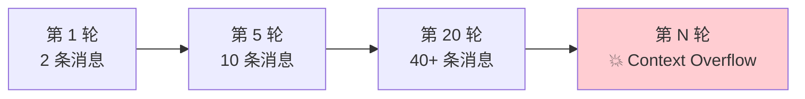
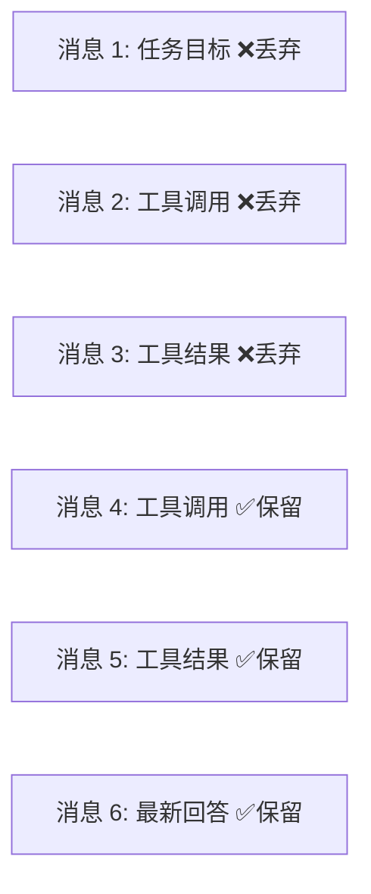
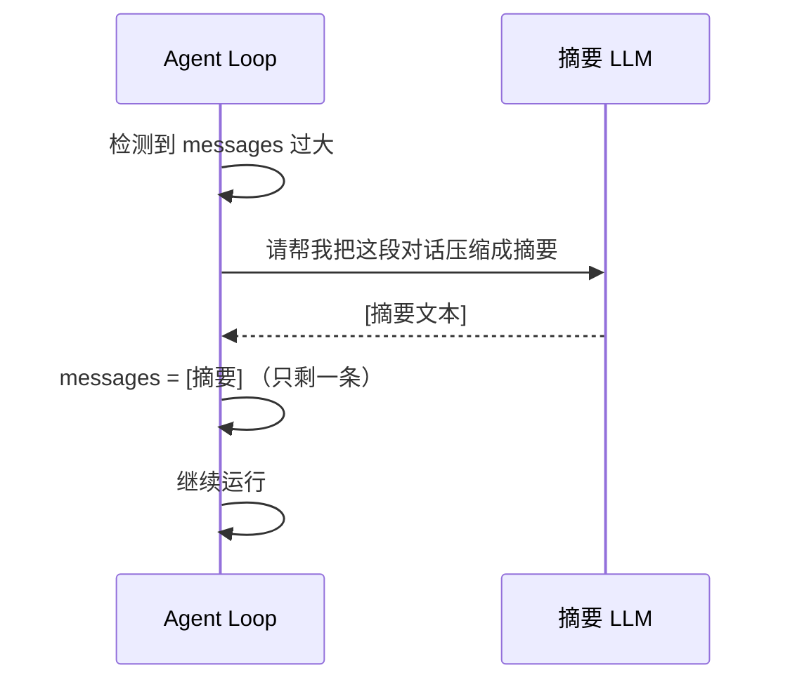
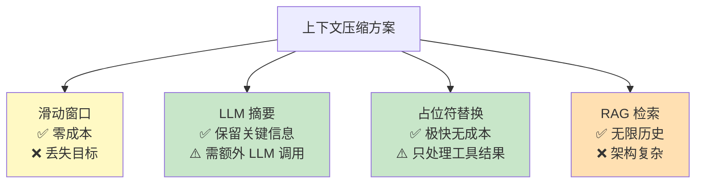
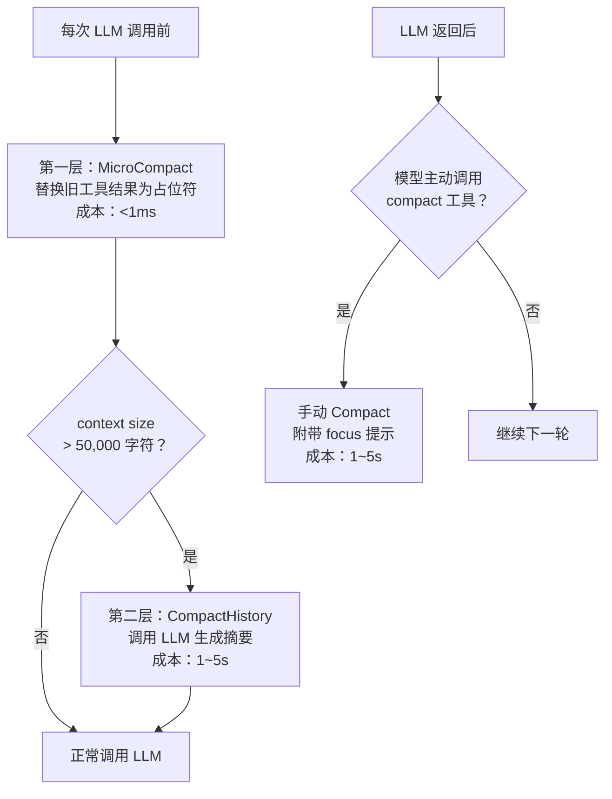
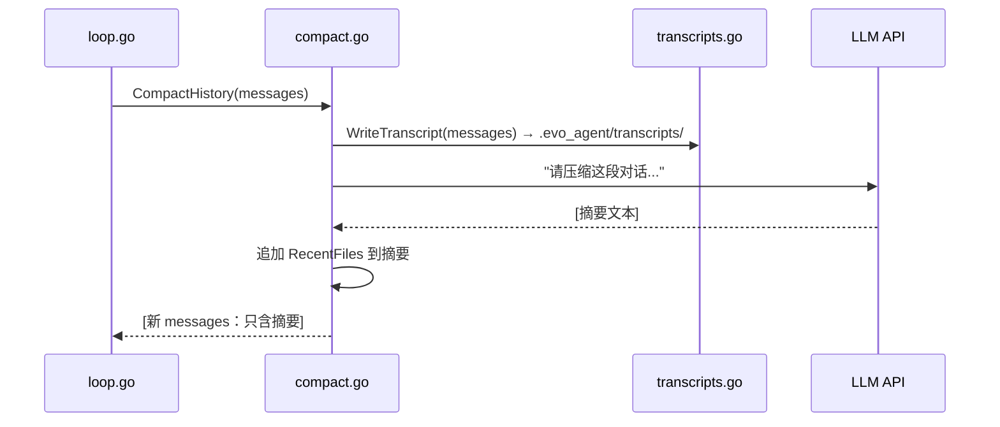

前三篇文章分别讲了 Agent 的 [Loop](https://mp.weixin.qq.com/s/dkdrwVlwe3IkH2hzSzy53A)、[Tools](https://mp.weixin.qq.com/s/xyX4_CF5cveezEDuzFT13g) 和 [Prompts](https://mp.weixin.qq.com/s/lguRAdxFoN22rqPyx3BIzw)。  


这篇聊一个迟早得正面面对的问题。  


Agent 跑着跑着，messages 越滚越大，context window 快撑不住了，怎么办？  


## 一、项目进度回顾


先简单回顾一下。  


evo-agent 是我从零构建 Agent 的学习项目。  
https://github.com/tiankonguse/evo-agent  


**第一篇**，搭骨架：接入 Anthropic API，实现 ReAct Loop，第一个工具 `bash`。  


**第二篇**，扩展工具系统：新增 `read_file`、`write_file`、`edit_file`，重构工具注册机制。  


**第三篇**，理解记忆层：System Prompt、Messages History、Tools Schema 三位一体。  


**这一篇**，解决一个绕不过去的工程问题——上下文压缩。  


当前项目的目录结构如下：  


```
src/
├── main.go
├── internal/
│   ├── agent/
│   │   ├── loop.go          # Agent 主循环
│   │   ├── state.go         # 对话状态（含 CompactState）
│   │   ├── compact.go       # 压缩核心引擎（新增）
│   │   └── transcripts.go   # 对话存档（新增）
│   ├── tools/
│   │   ├── tool.go
│   │   ├── executor.go
│   │   ├── bash.go
│   │   ├── read_file.go
│   │   ├── write_file.go
│   │   ├── edit_file.go
│   │   └── compact.go       # compact 工具（新增）
│   ├── config/
│   │   └── config.go
│   └── ui/
│       └── terminal.go
```


## 二、问题的根源：messages 是一个只增不减的雪球


上一篇说过，LLM 没有记忆，它的"记忆"就是每次传进去的 messages 数组。  


这就带来了一个很现实的问题。  


每完成一步操作，messages 就会追加几条：助手的 tool_use 请求、执行工具的 tool_result 返回。  
一个稍微复杂点的任务，跑个十几轮下来，messages 就能轻松膨胀到几万个字符。  


而 LLM 的上下文窗口是有限的。  


超出了，轻则截断历史导致 LLM "忘事"，重则 API 直接报错。  





打个比方。  


你让助理帮你做一个调研报告，他查了 20 个网站，每查一个网站就在笔记本上记一页。  
结果笔记本只有 30 页。  
还没调研完，笔记本就写满了。  


前面记的东西要么被撕掉，要么再也找不到了。  


这不是假设，这是任何跑长任务的 Agent 都**必然**会撞上的墙。  


解决这个问题的方案，就叫**上下文压缩（Context Compact）**。  


## 三、业界怎么做的


上下文压缩没有银弹。  


不同的方案各有各的取舍，我大致梳理了四类。  


### 3.1 滑动窗口（Sliding Window）


最简单粗暴的方案：直接丢弃最早的消息，保留最近的 N 条。  


实现成本极低，一行代码搞定。  


但它有个致命缺陷。  


你最开始交代的任务目标，很可能就在最早的消息里。  
丢掉了开头，Agent 就忘了自己在干什么。  





这就好比你让一个人帮你搬家，搬着搬着他忘了目的地在哪了。  
东西还在手上，但不知道往哪送了。  


适合闲聊场景，不适合需要长期记住目标的 Agent。  


### 3.2 LLM 摘要压缩（Summarization）


让 LLM 把旧的对话历史"读"一遍，浓缩成一段摘要，再把摘要作为新的"起点"注入到 messages 里。  


这样既能大幅压缩 token 数量，又保留了关键信息。  


代价是需要额外调用一次 LLM，有几秒的延迟和少量 token 开销。  


但这个代价完全可以接受。  


这也是目前主流 Agent 框架，比如 LangChain、Claude Code 等，普遍采用的方案。  





### 3.3 工具结果占位符（Placeholder Compaction）


工具调用的结果往往是最占空间的——读一个大文件返回了几千行，执行一个命令输出了几百行。  


但这些结果一旦被 LLM 处理过，后续几乎用不到了。  


一个很轻量的方案是：把旧的工具结果内容替换成一句话的占位符，只保留最近几条完整结果。  


几乎零成本，不需要调用 LLM，速度极快。  


### 3.4 RAG 检索增强（Retrieval-Augmented Generation）


更重量级的方案：把历史消息存进向量数据库，每次 LLM 调用前，根据当前问题检索最相关的历史片段注入进去。  


优点是灵活，理论上可以无限扩展历史。  
缺点是架构复杂，需要维护向量库，检索结果也不一定精准。  


对一般的 Agent 任务来说，属于过度设计了。  
适合那种对话轮次极多、需要跨会话记忆的场景。  


### 3.5 总结一下





没有哪个方案是万能的。  


滑动窗口零成本但会丢目标，LLM 摘要效果最好但需要额外调用，占位符替换极快但只处理工具结果，RAG 能力最强但架构太重。  


实际工程中，通常是几种策略**分层组合**使用。  


先拿最便宜的手段挡一挡，挡不住了再上重武器。  


这个思路其实也是 evo-agent 的设计思路。  


## 四、evo-agent 的压缩设计


evo-agent 采用了**三层压缩策略**，按照成本从低到高依次触发。  





就像三道防线。  


第一道，能在内存里解决的，绝不动网络。  
第二道，内存搞不定了，调 LLM 做摘要。  
第三道，LLM 自己觉得不行了，主动喊暂停。  


一层一层兜底。  


### 第一层：MicroCompact（微压缩）


每次调用 LLM 之前，先扫一遍 messages，把较旧的工具结果替换成一行占位符：  


```
[Earlier tool result compacted. Re-run the tool if you need full detail.]
```


只保留最近 3 条工具结果的完整内容，更早的全部折叠。  


这个操作在内存里完成，耗时不到 1ms，没有任何网络请求。  


这里有一个关键的保护逻辑：**最后一批工具结果永远不会被压缩**。  


为什么？  


因为 LLM 刚刚发起了工具调用，还没来得及"看"这批结果。  
如果此时就把它们折叠掉，LLM 就会拿到空结果，行为会出错。  


这就好比你刚派人去查资料，人还没回来呢，你就把他的工位清了。  
回来了没地方汇报，这活就白干了。  


### 第二层：CompactHistory（全量压缩）


微压缩之后，再测量一次 messages 的总体积。  
如果仍然超过 50,000 字符，就触发全量压缩。  


全量压缩的流程分三步。  


**第一步，存档。**  
先把当前完整的 messages 写入磁盘，存成 JSONL 格式的 transcript 文件。  
这是压缩前的"存档"，日后可以用来调试和回溯。  


**第二步，摘要。**  
调用 LLM，让它把整段对话浓缩成一份结构化摘要。  
要求保留五样东西：当前目标、重要发现与决策、读过和修改过的文件、剩余工作、用户约束。  


**第三步，替换。**  
用这条摘要替换掉所有 messages。  
messages 从几十条，瞬间变成 1 条。  


就像你写了 30 页的调研笔记，最后浓缩成一页纸的摘要。  
笔记本清空了，但关键信息都在那一页纸上。  





### 第三层：手动 Compact 工具


除了自动触发，LLM 自己也可以主动要求压缩。  


工具系统里注册了一个 `compact` 工具，LLM 可以调用它，还能传一个 `focus` 参数，告诉压缩引擎"这次特别要保留什么"：  


```go
// tools/compact.go
type CompactInput struct {
    Focus string `json:"focus,omitempty"`
}
```


比如 LLM 觉得自己快撑不住了，可以主动说：  
`compact(focus="当前正在重构的 loop.go 和相关接口")`  


摘要里会额外追加这段 focus 提示，确保下一轮不忘关键信息。  


这个设计挺有意思的。  


相当于 Agent 有了"自我管理记忆"的能力。  
它不只是被动等着系统来压缩，它可以自己判断什么时候该"忘"一些东西，同时告诉系统"但这些别忘"。  


## 五、CompactState：压缩也需要记忆


压缩这件事本身，也需要状态追踪。  


不然你都不知道压缩发生过几次，上次摘要长什么样。  


所以我把压缩相关的状态单独抽了出来，存在 `CompactState` 里：  


```go
// state.go
type CompactState struct {
    HasCompacted bool     // 是否已发生过压缩
    LastSummary  string   // 最后一次生成的摘要
    RecentFiles  []string // 最近访问的文件（FIFO，最多 5 个）
    CompactCount int      // 压缩次数计数
}
```


这里有一个细节设计，我觉得值得单独说一下——`RecentFiles`。  


每次 LLM 调用了 `read_file` 工具，loop.go 都会把这个文件路径记进去，保持最近 5 个，先进先出。  


压缩发生时，这份文件列表会附加到摘要末尾：  


```
Recent files to reopen if needed:
- src/internal/agent/loop.go
- src/internal/agent/compact.go
```


为什么要这么做？  


因为压缩之后，messages 里的旧内容都没了。  
LLM 读完摘要，知道"上次我在看这几个文件"，可以快速重新打开，不用重新摸索。  


就像你午睡醒了，桌上摆着你睡前打开的几份文件。  
你一看就知道："哦，我之前在做这个事"。  
不用从头回忆。  


`CompactState` 不随每次用户提问重置，而是在整个 REPL 会话中持久保持：  


```go
// loop.go - Run()
compactState := &CompactState{} // 整个会话只初始化一次

for { // REPL 循环
    state := &LoopState{
        Messages:     history,
        CompactState: compactState, // 每次查询复用同一个 state
    }
    a.Loop(state)
    compactState = state.CompactState // 同步回来
}
```


这样即使跨多次用户查询，压缩历史和文件追踪都不会丢失。  


## 六、几个关键的数字


聊完了设计，再看看具体的参数配置。  


`CONTEXT_LIMIT = 50,000 字符`，超过这个值就触发全量压缩。  
`KEEP_RECENT_RESULTS = 3`，微压缩保留最近 3 条工具结果。  
`maxConversationBytes = 80,000`，送给摘要 LLM 的最大对话长度。  
`max RecentFiles = 5`，追踪最近 5 个文件。  


各层操作的时间成本：  


微压缩在内存里完成，不到 1ms。  
全量压缩需要额外一次 LLM 调用，通常 1 到 5 秒。  
Transcript 落盘是异步的，约 100ms。  
文件追踪是纯内存操作，可以忽略不计。  


全量压缩的效果：messages 从几十条压缩到 1 条，token 节省通常超过 90%。  


这个数字还是很可观的。  


## 七、总结


回过头来看，上下文压缩这件事，其实本质上就是在回答一个问题：  


**当一个只有短期记忆的 AI 要干长期的活，你怎么让它不失忆？**  


答案说起来也简单——该忘的忘，该记的记。  


但"什么该忘、什么该记"，这里面的分寸拿捏，才是真正的工程活。  


evo-agent 的策略是三层叠加：  


**占位符微压缩作为第一道防线**——成本几乎为零，先把最占空间的工具结果折叠掉。  


**LLM 摘要作为第二道防线**——防线要破了，花几秒钟让 LLM 自己做个总结，浓缩成一页纸。  


**手动 Compact 工具作为第三道防线**——让 LLM 自己决定什么时候压缩、重点保留什么。  


再加上 CompactState 在会话内持久追踪文件路径，让 Agent 在压缩之后也能快速找回上下文。  


有了这套机制，理论上一个 Agent 可以无限续航，不再受 context window 限制。  


这话说起来轻巧，但真正实现出来，需要的就是上面这些一层一层的工程细节。  


下一篇，我们来看 Agent 的另一个核心话题。  


《完》  


-EOF-  

本文公众号：天空的代码世界  
个人微信号：tiankonguse  
公众号ID：tiankonguse-code  
