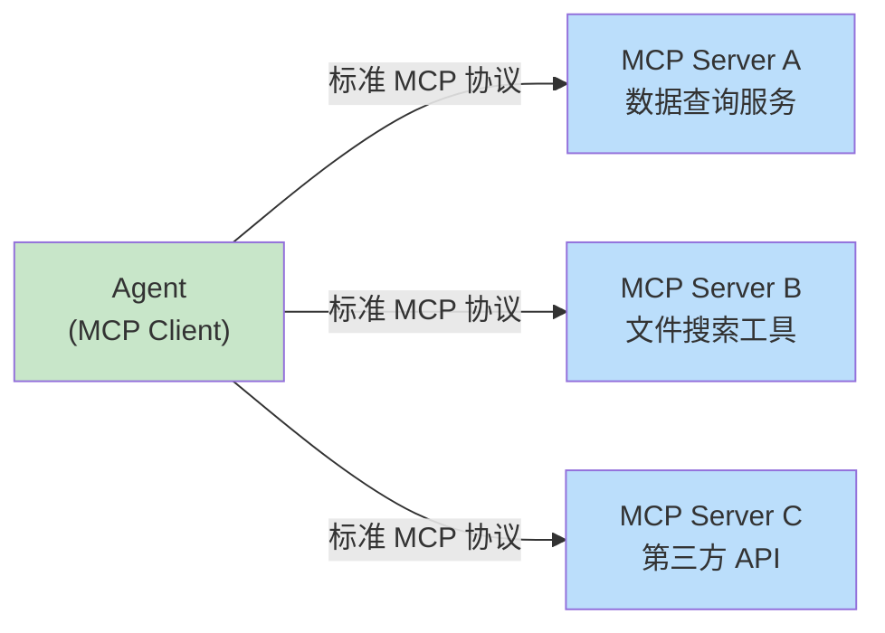
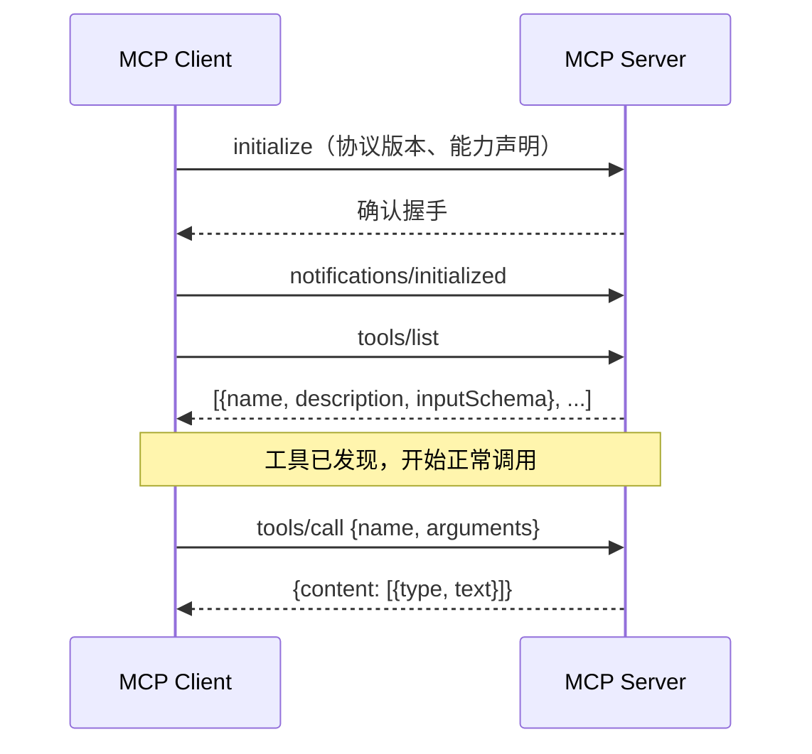
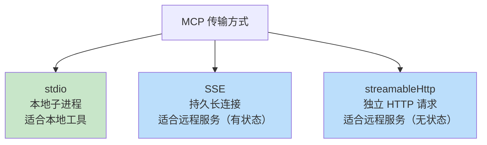
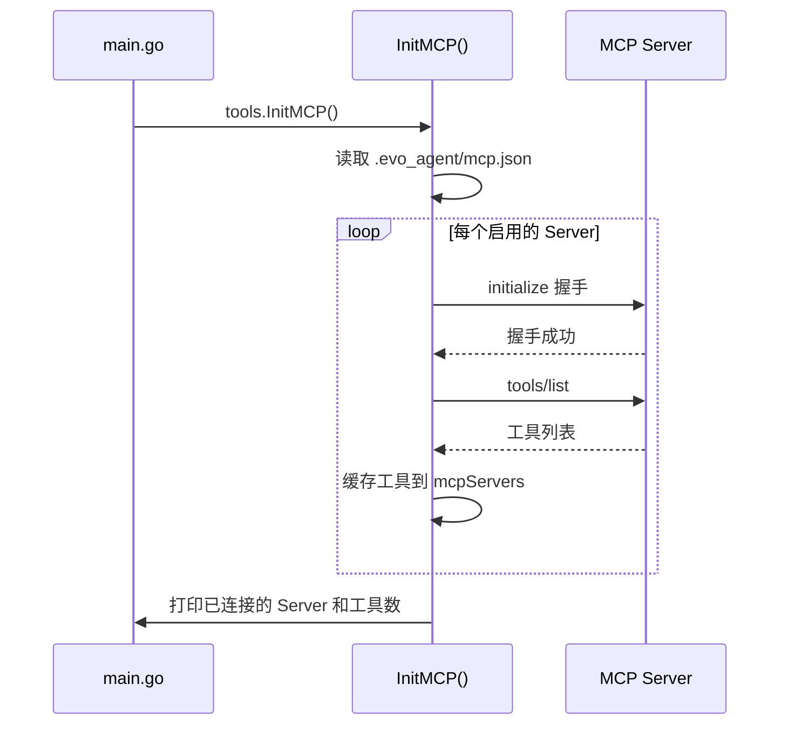
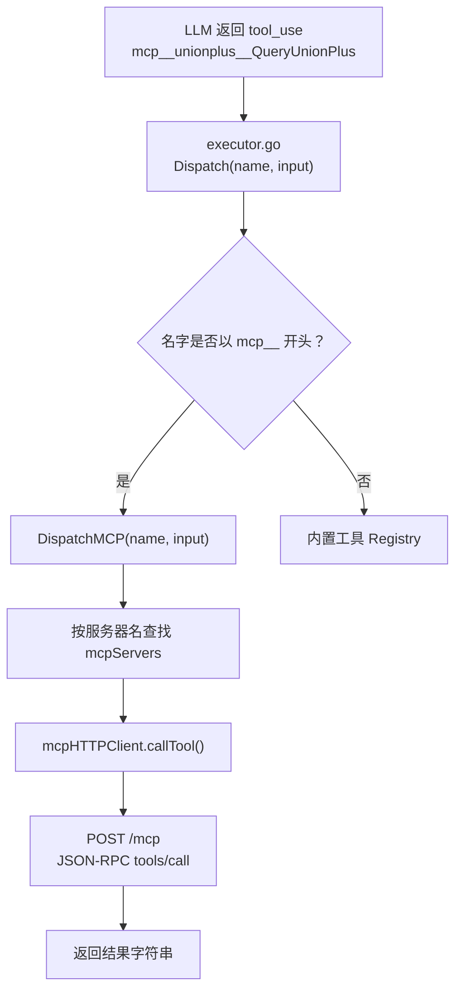

前四篇文章分别讲了 Agent 的 [Loop](https://mp.weixin.qq.com/s/dkdrwVlwe3IkH2hzSzy53A)、[Tools](https://mp.weixin.qq.com/s/xyX4_CF5cveezEDuzFT13g)、[Prompts](https://mp.weixin.qq.com/s/lguRAdxFoN22rqPyx3BIzw) 和 [Context Compact](https://mp.weixin.qq.com/s/YRS29wRckEmFgNb0eJrxrQ)。  


这篇聊一个工程上绕不过的问题——**工具**。  


Agent 的核心价值在于能调用工具。  
工具越多，Agent 能干的事就越多。  
但工具是谁来写的？  
谁来维护？  
怎么让 Agent 用上别人已经做好的工具？  


这就是今天要聊的东西，**MCP**。  


## 一、痛点：每个工具都要单独对接


先回顾一下。  


在第二篇里，我们实现了一套工具注册机制：每个工具写一个 Go 文件，通过 `init()` 自动注册，Agent 就能调用它。  


这套机制对内置工具来说，挺好用的。  


但现实里，工具的来源不只是你自己写的代码。  


比如你公司有一个数据查询服务，你想用某个开源的文件搜索工具，或者你想调用某个第三方的 API 封装。  


如果每接入一个外部工具，都要专门写一段 Go 代码来适配，这个成本会越来越高。  


更麻烦的是，这些外部服务的维护方不是你。  
服务升级了，你的适配代码也要跟着改。  


打个比方。  


这就好比你家的电器，每一种都需要专门定制的插头。  
换一台新电视，就得重新改一次墙上的插座。  


你说这事烦不烦？  


能不能有一个**统一的标准插座**，所有工具都按这个标准接入，Agent 就能直接用上？  


这就是 **MCP** 的出发点。  


## 二、MCP 是什么


MCP，全称 **Model Context Protocol**，是 Anthropic 在 2024 年底推出的一套开放协议。  


它的核心思路就一句话：  


**把"AI 调用外部能力"这件事，标准化成一套协议。**  


有了这套协议，工具的提供方只需要实现 MCP Server，遵守协议规范。  
Agent 只需要实现 MCP Client，学会跟任何遵守协议的 Server 通信。  


双方都不需要知道对方的内部实现细节。  


就像网页浏览器和 Web 服务器的关系。  
浏览器不需要知道服务器是用 Python 还是 Go 写的，只要服务器遵守 HTTP 协议，浏览器就能访问它。  





有了 MCP，Agent 的工具生态就从"自己写、自己维护"，变成了"任何人都可以发布 MCP Server，Agent 接入即用"。  


这是一个质的变化。  


## 三、底层通信：JSON-RPC 2.0


聊完了"是什么"，来看看它底下是怎么跑的。  


MCP 的底层通信协议是 **JSON-RPC 2.0**。  


这东西非常轻量。  
每条消息就是一个 JSON 对象，通过 `method` 字段声明调用什么方法，通过 `params` 字段传参数，通过 `result` 字段返回结果。  


长什么样呢？  
看一眼就明白了：  


```json
// 请求（Client → Server）
{
  "jsonrpc": "2.0",
  "id": 1,
  "method": "tools/call",
  "params": {
    "name": "QueryUnionPlus",
    "arguments": {
      "view_name": "2003",
      "key": "mzc002009g0nh88",
      "field_name": "title"
    }
  }
}

// 响应（Server → Client）
{
  "jsonrpc": "2.0",
  "id": 1,
  "result": {
    "content": [
      {
        "type": "text",
        "text": "Union value: {\"title\":\"主角\"}"
      }
    ]
  }
}
```


就这么简单，一来一回。  


MCP 在这套基础上，定义了三个核心方法：  


**`initialize`**，握手。  
Client 和 Server 互相确认协议版本和能力。  


**`tools/list`**，工具发现。  
Client 拉取 Server 提供的所有工具列表及参数格式。  


**`tools/call`**，工具调用。  
Client 发起具体的工具请求，Server 执行并返回结果。  


整个连接的生命周期，画出来是这样的：  





先握手，再拿工具列表，然后就可以按需调用了。  


逻辑非常清晰。  


## 四、三种传输方式


JSON-RPC 消息需要一个"管道"来传输。  


MCP 规范定义了三种传输方式，适用于不同的部署场景。  


**第一种，stdio（标准输入输出）。**  


最简单的方式。  
Client 把 Server 当作一个子进程启动，通过进程的标准输入和标准输出传递 JSON-RPC 消息。  

```
Client ──stdin──→ Server 子进程
Client ←─stdout── Server 子进程
```

适合本地工具，比如文件系统操作、代码执行等场景。  
Server 就是一个可执行文件。  


**第二种，SSE（Server-Sent Events）。**  


基于 HTTP 长连接。  
Client 向 Server 发起一个 GET 请求，建立一条持久的 SSE 推送流；同时通过 POST 发送请求消息；Server 的响应通过 SSE 流推回来。  

```
Client ──POST──→ Server（发请求）
Client ←─SSE─── Server（收响应，持久连接）
```

适合远程 Server，需要维护一条持久连接。  


**第三种，streamableHttp（可流式 HTTP）。**  


更简单的远程方案。  
每次调用都是一个独立的 HTTP POST 请求，Server 可以直接返回 JSON 响应，也可以用 SSE 格式返回流式内容。  

```
Client ──POST──→ Server（每次独立请求）
Client ←─JSON── Server（或 SSE 流）
```

适合无状态的远程服务，对 Server 部署要求最低。  





三种方式，覆盖了从本地到远程、从有状态到无状态的所有场景。  


按需选择就行。  


## 五、evo-agent 怎么实现的


了解了协议本身，来看看 evo-agent 是怎么落地的。  


evo-agent 目前已经实现了五个核心模块：**Loop**（Agent 主循环）、**Tools**（工具注册与调用）、**Prompts**（系统提示管理）、**Context Compact**（上下文压缩）、**MCP**（外部工具）。  


代码托管在 https://github.com/tiankonguse/evo-agent ，感兴趣可以配合代码一起看。  


先说配置。  


**配置文件。**  


MCP Server 的配置统一放在 `.evo_agent/mcp.json` 里：  


```json
{
  "mcpServers": {
    "unionplus_mcp_normal": {
      "type": "streamableHttp",
      "url": "https://example.com/mcp",
      "headers": {
        "Authorization": "Bearer <token>",
        "other_header": "xxx"
      },
      "disabled": false
    }
  }
}
```


每个 Server 有一个名字，配置里指定传输类型、连接地址和认证信息。  


`disabled: true` 可以临时关闭某个 Server，不用删配置。  


对应的 Go 结构体长这样：  


```go
type MCPServerConfig struct {
    Type     string            `json:"type"`
    Disabled bool              `json:"disabled"`
    Timeout  int               `json:"timeout"`

    // stdio 专用
    Command string            `json:"command"`
    Args    []string          `json:"args"`
    Env     map[string]string `json:"env"`

    // HTTP 传输专用
    URL     string            `json:"url"`
    Headers map[string]string `json:"headers"`
}
```


**统一接口。**  


三种传输方式的内部实现完全不同，但对外暴露的是同一套接口：  


```go
type mcpClient interface {
    getTools() []mcpToolSpec
    callTool(toolName string, arguments json.RawMessage) (string, error)
    stop()
}
```


`mcpProcess`（stdio）、`mcpHTTPClient`（streamableHttp）、`mcpSSEClient`（SSE）分别实现这个接口。  


上层代码完全不感知传输细节，只需要调 `callTool`。  


这个设计其实就是经典的策略模式——底层实现随便换，上层调用完全透明。  


**工具命名与路由。**  


这里有个小巧思。  


MCP 工具在 Agent 侧有一套固定的命名规则：  

```
mcp__{服务器名}__{工具名}
```

比如 `mcp__unionplus_mcp_normal__QueryUnionPlus`。  


这个前缀有两个用途。  


第一，让 Agent 知道这是一个 MCP 工具，跟内置工具区分开来。  


第二，携带了路由信息。  
调用时只需要按 `__` 分割，就能知道该把请求转发给哪个 Server。  


路由代码写出来就这几行：  


```go
func DispatchMCP(name string, input json.RawMessage) (string, error) {
    rest := strings.TrimPrefix(name, "mcp__")
    sep := strings.Index(rest, "__")
    serverName := rest[:sep]
    toolName := rest[sep+2:]

    client := mcpServers[serverName]
    return client.callTool(toolName, input)
}
```


信息藏在名字里，不需要额外的映射表。  


**启动流程。**  


程序启动时，`InitMCP()` 负责加载配置、连接所有 Server、拉取工具列表：  





工具列表在启动时就全部拉取并缓存在内存里。  


每次 Agent Loop 调用 `tools.Tools()` 时，MCP 工具会和内置工具合并，一起打包进 LLM 的请求里。  


整个调用链路画出来是这样的：  





从 LLM 的返回到最终拿到结果，整个链路一目了然。  


## 六、跑一次真实的看看


光看代码和架构图不够直观。  
来看一次真实的运行记录。  


接入的是之前我开发的 UnionPlus 数据 MCP 查询服务，通过 streamableHttp 方式连接。  
Server 提供了 9 个工具，涵盖视图查询、字段查询、枚举翻译等能力。  


启动时的输出：  

```
[MCP] Connected to "unionplus_mcp_normal" (9 tools)
Server: unionplus_mcp_normal
  - QueryUnionPlus: 查询Union数据，单key多字段，字段需要在appid上已授权
  - QueryViewList: 查询视图列表，支持按视图名搜索
  - QueryViewFields: 查询指定视图下的字段列表
  - QueryEnumValues: 按枚举库ID查询枚举值翻译列表
  ...（共9个工具）
```

9 个工具，全部自动发现，自动注册。  


**然后我试了第一次查询。**  


查视图 2003，主键 `mzc002009g0nh88`，字段 `title`。  


LLM 收到请求后，先判断"视图 ID 2003 对应的视图名是什么"，尝试调用 `QueryViewList` 搜索：  

```
$ mcp__unionplus_mcp_normal__QueryViewList({"view_name":""})
Error: bufio.Scanner: token too long
```

返回数据太多，报错了。  


但 LLM 并没有放弃。  


它调整了策略：直接把 "2003" 作为 `view_name` 传给 `QueryUnionPlus` 试一试：  

```
$ mcp__unionplus_mcp_normal__QueryUnionPlus({"view_name":"2003","field_name":"title","key":"mzc002009g0nh88"})
Union value: {"title":"主角"}
```

成了。  


LLM 凭借对工具的理解和错误反馈，自己找到了正确的调用方式。  


这正是 Agent Loop 的价值所在——遇到错误，观察，调整，再试。  
不需要人去干预，它自己就能摸索出路。  


**第二次查询就更有意思了。**  


同一个 key，这次查多个字段。  


LLM 直接复用了上一次探索出来的调用方式，用逗号分隔多个字段名：  

```
$ mcp__unionplus_mcp_normal__QueryUnionPlus({
  "view_name": "2003",
  "key": "mzc002009g0nh88",
  "field_name": "title,type_name,publish_date,second_title,description,stars"
})
Union value: {
  "title": "主角",
  "type_name": "电视剧",
  "publish_date": "2026-05-10",
  "second_title": "张艺谋监制！命运共振大剧",
  "description": "电视剧《主角》讲述了秦腔名伶忆秦娥..."
}
```


整个过程，Agent 没有用任何专门为 UnionPlus 写的适配代码。  


它只是拿到了工具的描述和参数格式，自己摸索出了正确的调用方式。  


这就是 MCP 的价值所在——**工具的接入和工具的使用，完全解耦了。**  


## 七、回到最初的问题


回到开头说的那个问题。  


工具越写越多，每个系统都要单独对接，怎么破？  


MCP 给出的答案很简单：**标准化**。  


在 MCP 之前，每个 Agent 框架有自己的工具格式，每个外部系统需要专门的适配层。  
工具越多，维护成本越高，生态越碎片化。  


MCP 之后，工具的提供方和消费方各自只需要遵守一套协议。  
任何实现了 MCP Server 的服务，任何实现了 MCP Client 的 Agent，都能直接对接。  


evo-agent 的 MCP 实现，说到底就做了三件事：  


**统一接口。**  
三种传输方式（stdio、SSE、streamableHttp）背后，对上层暴露同一套 `mcpClient` 接口，调用方完全透明。  


**统一命名。**  
`mcp__{服务器名}__{工具名}` 的命名规则，让工具路由信息直接藏在名字里，无需额外的映射表。  


**无缝融合。**  
MCP 工具和内置工具在 `tools.Tools()` 里合并，LLM 看不出区别，Agent Loop 也不需要做任何特殊处理。  


接入一个新的 MCP Server，只需要在 `.evo_agent/mcp.json` 里加几行配置，重启就生效。  


对 Agent 来说，工具的边界消失了。  


就像有了标准插座之后，你再也不用为每台电器定制插头了。  
买回来，插上，就能用。  


MCP 做的，就是这件事。  


《完》


-EOF-

本文公众号：天空的代码世界  
个人微信号：tiankonguse  
公众号ID：tiankonguse-code  
