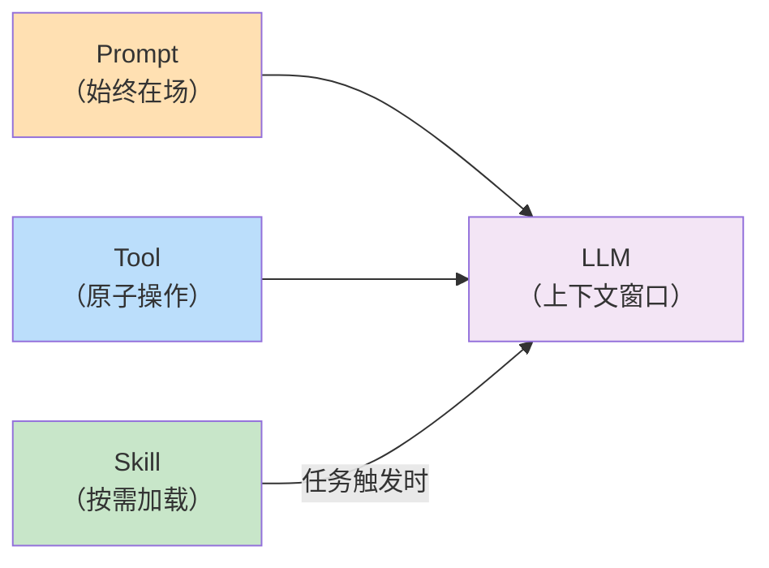
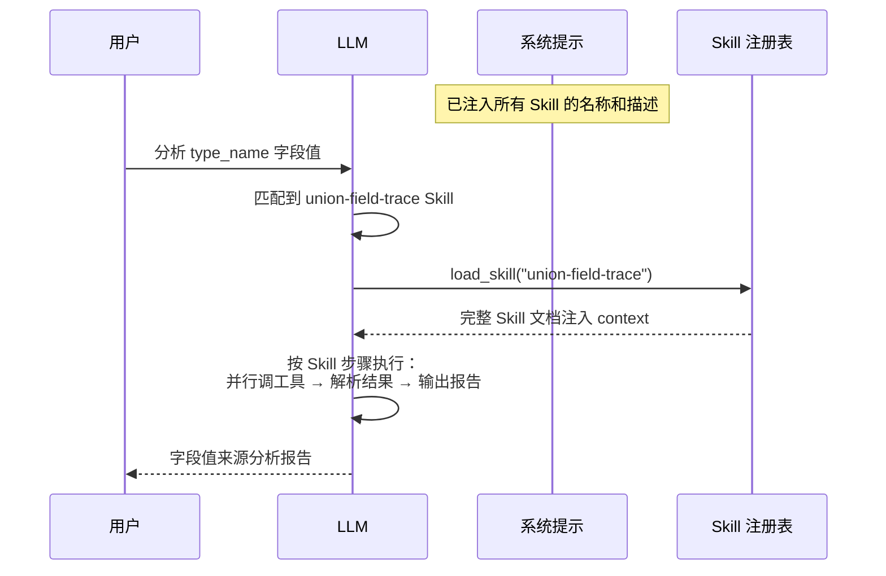

前五篇文章分别讲了 Agent 的 [Loop](https://mp.weixin.qq.com/s/dkdrwVlwe3IkH2hzSzy53A)、[Tools](https://mp.weixin.qq.com/s/xyX4_CF5cveezEDuzFT13g)、[记忆](https://mp.weixin.qq.com/s/lguRAdxFoN22rqPyx3BIzw)、[Context Compact](https://mp.weixin.qq.com/s/YRS29wRckEmFgNb0eJrxrQ) 和 [MCP](https://mp.weixin.qq.com/s/rCnGif8Ee7JhRI86-RoNWA)。  


这篇聊一个更贴近实用的话题——Skill。  


先说一个你大概率遇到过的问题。  


Agent 有了工具，有了 MCP，能干的事越来越多了。  
但你会发现一个很别扭的事：每次遇到复杂任务，LLM 都在从零开始摸索。  
该调哪些工具、按什么顺序、中间结果怎么处理，它得自己想。  


这就好比你公司来了个新人，聪明是真聪明，但每次接活都得自己重新摸索一遍流程。  
明明上次已经跑通了，这次又从头来。  


有没有办法把这套"经验"固化下来，让它下次直接复用？  


这就是 **Skill** 要解决的问题。  


## 先说说痛在哪里

说个我自己在项目里踩过的坑。  


我们内部有一个数据服务叫 UnionPlus，存着海量媒体内容的各种字段。  
字段的值来源很复杂——有的直接存在 Redis 里，有的要通过计算表达式从依赖字段推导，有的还得查枚举翻译表才能拿到最终的可读值。  


当时怎么做的呢？  
写了一个**专用 Agent**。  


说白了就是在系统提示里硬塞了一大段指令，手把手告诉 LLM：第一步查字段元数据、第二步解析表达式、第三步调 QuerySource、第四步查枚举……  


能跑吗？  
能跑。  


但跑着跑着，问题就来了。  


**首先是复用不了。**  
这套逻辑被锁死在那一个专用 Agent 里了。  
换个项目想用？  
得把系统提示整个搬过来，但系统提示里又掺杂了一堆别的配置，根本没法干净地摘出来。  


**其次是浪费 token。**  
不管用户问的是什么，那段专用指令始终占着 context window。  
哪怕当前任务跟字段溯源八竿子打不着，这些字节也一直在那白白消耗。  


**最后是维护痛苦。**  
业务逻辑一变，就得去翻那个专用 Agent 的系统提示，手动改。  
逻辑和运行环境耦合在一起，动一处怕影响别处。  


根本原因其实就一句话：**用静态配置驱动动态行为**，这条路走不远。  


而 Skill 的思路是反过来的——把这套逻辑从系统提示里抽出来，变成一份独立的文档。  
Agent 启动时只知道"有这么个 Skill 存在"，真正需要的时候才把它加载进 context。  


## 那 Skill 到底是个什么东西

Skill，直译就是"技能"。  


但在 Agent 这个语境下，它本质上是一份**可以按需加载的任务指导文档**。  


它告诉 Agent 的是：遇到这类任务，你应该按什么步骤走、调哪些工具、做什么决策。  


你可能会问，这跟 Prompt 有什么区别？  
跟 Tool 又有什么区别？  


其实很好理解。  


**Prompt 是一直在场的。**  
不管 Agent 在干什么，Prompt 始终在 context 里。  
它是背景板，是底色。  


**Tool 是单次的原子操作。**  
调一次，干一件事，返回一个结果。  
就像螺丝刀、扳手，一次拧一个螺丝。  


**Skill 是按需加载的专项手册。**  
平时不占空间，需要的时候才召唤出来。  
它描述的不是一个操作，而是一整套工作流——先干什么、再干什么、中间结果怎么流转。  





打个比方。  


你去医院看病，挂号、问诊、开检查单、拿报告、开药——这是一整套流程。  


Tool 相当于每一个具体的动作：量血压、抽血、拍 CT。  
Prompt 相当于医院的基本规章制度，一直贴在墙上。  
Skill 相当于某个科室的诊疗指南——只有你挂了这个科，医生才会拿出来参考。  


一个 Skill 通常包含三部分：  

**声明**——我是干什么的，一句话描述，让 Agent 知道什么时候该用我。  
**输入规范**——需要哪些参数，怎么从用户输入里提取，提取不到怎么追问。  
**执行步骤**——具体的工作流，哪些步骤可以并行，中间结果怎么传递，最终怎么输出。  


说到底，Skill 就是把"一个有经验的人是怎么干这件事的"写成了 LLM 能理解和执行的文档。  


## Skill 的核心机制：需要时才加载

理解了 Skill 是什么，再来看它是怎么工作的。  


核心就四个字：**延迟加载**。  


Agent 启动的时候，把所有 Skill 的名称和一句话描述注入到系统提示里。  
注意，只有名称和描述，几行文字而已，代价极小。  


然后 LLM 在处理任务时，如果判断当前任务需要某个 Skill，它会主动调用一个特殊工具 `load_skill`，把完整的 Skill 内容加载进 context。  


加载完成后，LLM 就按照 Skill 里描述的步骤去执行，一步一步推进任务。  





这里有两个关键的设计。  


**第一个是目录与内容分离。**  
系统提示只放"目录"——名称加一句话描述，正文在需要时才加载。  
用不到的 Skill，它的 token 消耗是零。  
这很重要，因为 context window 是稀缺资源。  


**第二个是 LLM 自己决定什么时候加载。**  
不需要调用方显式指定"用哪个 Skill"，LLM 根据任务语义自己判断。  
这就意味着，一个通用 Agent 可以根据不同的任务，自动切换成不同的"专家模式"。  


## 来看看代码怎么写的

原理说完了，来看 evo-agent 里是怎么落地的。  


代码在 https://github.com/tiankonguse/evo-agent ，感兴趣可以对着看。  


**先说 Skill 文件长什么样。**  


每个 Skill 就是一个 `SKILL.md` 文件，放在 `.evo_agent/skill/<技能名>/` 目录下。  


文件头是 YAML frontmatter，声明元数据：  


```yaml
---
name: union-field-trace
description: 分析 Union 字段值的来源。用户输入视图名-主键-字段名，逐层溯源：字段配置 → 计算表达式解析 → QuerySource 取值 → 代入计算，最终给出完整的"值是怎么来的"分析报告。
compatibility: Requires unionplus mcp.
---

分析一个 Union 字段值的完整来源链路，包含计算表达式解析和依赖字段值获取。

## 步骤 0：解析用户输入
...
## 步骤 1：并行获取字段元数据和当前字段值
...
```


frontmatter 下面就是完整的执行指导——每一步该调什么工具、参数怎么填、结果怎么处理。  
全写在这一个 Markdown 文件里。  


**再看注册和加载的逻辑。**  


程序启动时，`skills.Init()` 扫描目录，把所有 `SKILL.md` 读进来：  


```go
func Init() {
    skillsDir := filepath.Join(".evo_agent", "skill")
    filepath.WalkDir(skillsDir, func(path string, d os.DirEntry, err error) error {
        if d.Name() != "SKILL.md" {
            return nil
        }
        data, _ := os.ReadFile(path)
        meta, body := parseFrontmatter(string(data))
        name := meta["name"]
        documents[name] = skillDocument{
            Manifest: SkillManifest{Name: name, Description: meta["description"]},
            Body:     strings.TrimSpace(body),
        }
        return nil
    })
}
```


然后 `Catalog()` 把所有 Skill 的名称和描述拼成一段文本，塞进系统提示：  


```go
skills.Init()
if catalog := skills.Catalog(); catalog != "" {
    cfg.SystemMsg += "\nSkills available:\n" + catalog +
        "\nUse load_skill when a task needs specialized instructions before you act."
}
```


LLM 看到的系统提示末尾会多出这么几行：  


```
Skills available:
- union-field-trace: 分析 Union 字段值的来源。用户输入视图名-主键-字段名，逐层溯源...
- git-commit: Best practices for writing git commit messages
Use load_skill when a task needs specialized instructions before you act.
```


就这么几行，占不了多少 token，但 LLM 已经知道有哪些 Skill 可用了。  


**最后是 `load_skill` 这个工具本身。**  


它就是一个普通的内置工具，跟 `bash`、`read_file` 并列注册：  


```go
func init() {
    Register(ToolDef{
        Schema: anthropic.ToolParam{
            Name: "load_skill",
            Description: anthropic.String(
                "Load the full body of a named skill into the current context. " +
                    "Call this before acting on a task that needs specialized instructions.",
            ),
            InputSchema: GenerateSchema[loadSkillInput](),
        },
        Handler: func(input json.RawMessage) (string, error) {
            var in loadSkillInput
            json.Unmarshal(input, &in)
            return skills.Load(in.Name), nil
        },
    })
}
```


`skills.Load()` 做的事也很简单——把完整的 Skill 文档包在 XML 标签里返回：  


```go
func Load(name string) string {
    doc, ok := documents[name]
    if !ok {
        return fmt.Sprintf("Error: Unknown skill %q. Available skills: %s", name, knownNames())
    }
    return fmt.Sprintf("<skill name=%q path=%q>\n%s\n</skill>",
        doc.Manifest.Name, doc.Path, doc.Body)
}
```


整个实现没有什么魔法。  
就是一个"按名字查文档，包装后返回"的工具。  
真正的复杂度，全在 Skill 文档本身的内容质量上。  


## 跑一次真实的看看

光看代码不够直观，来看一次真实的运行过程。  


这次用的是 `union-field-trace` Skill——分析 Union 字段值的完整来源链路。  
在此之前，这套逻辑是写死在一个专用 Agent 的系统提示里的。  
用了 Skill 之后，通用 Agent 直接按需加载，行为完全一致。  


用户的输入是这样的：  


```
>> 分析 Union 字段值, 视图ID 2003, 主键key mzc002009g0nh88, 字段 type_name
```


然后来看 Agent 是怎么一步一步走的。  


**首先，LLM 识别任务，加载 Skill。**  


LLM 看了一眼任务描述，结合系统提示里的 Skill 目录，判断出这是一个字段溯源任务。  
它没有自己硬想，而是先把 Skill 加载进来：  


```
THINKING: 根据任务要求，我需要使用 union-field-trace 技能来分析字段值的来源。
Tool called: load_skill
$ load_skill({"name":"union-field-trace"})
→ <skill name="union-field-trace"> ... 完整步骤文档 ... </skill>
```


Skill 文档加载完毕，LLM 现在手里有了完整的作战手册。  


**接下来，按 Skill 指导，并行发起两个查询。**  


Skill 第一步要求同时获取字段元数据和当前字段值。  
注意是并行，不是串行，这也是 Skill 里写好的：  


```
THINKING: 需要并行获取字段元数据（QueryViewFieldInfo）和当前字段值（QueryUnionPlus）。

$ mcp__unionplus_mcp_normal__QueryViewFieldInfo({"view_name":"2003","field_name":"type_name"})
→ {"c_rule":"DICT_ENUM(2, type_name)", "c_lib_id":"media_80009", ...}

$ mcp__unionplus_mcp_normal__QueryUnionPlus({"view_name":"2003","key":"mzc002009g0nh88","field_name":"type_name"})
→ Union value: {"type_name":"电视剧"}
```


`c_rule` 是 `DICT_ENUM(2, type_name)`，这说明这是一个计算字段，依赖枚举翻译。  


**然后，查底层原始值。**  


Skill 的步骤 2 告诉 LLM：碰到计算表达式，要调 `QuerySource` 获取依赖字段在 Redis 里的原始值：  


```
$ mcp__unionplus_mcp_normal__QuerySource({"view_name":"2003","key":"mzc002009g0nh88","field_name":"type_name"})
→ Data source value: 2 | Redis command: HGET xxx
```


原始值是整数 `2`。  
Redis 里存的不是"电视剧"这三个字，而是一个枚举 ID。  


**最后，查枚举翻译，验证推导。**  


Skill 步骤 3 要求：有 `c_lib_id` 时，调 `QueryEnumValueInfo` 做精确验证：  


```
$ mcp__unionplus_mcp_normal__QueryEnumValueInfo({"lib_id":"media_80009","value":"2"})
→ {"c_value":"2","c_name":"2|电视剧","c_status":1}
```


枚举值 `2` 对应"电视剧"，跟前面 `QueryUnionPlus` 返回的最终值完全吻合。  
整条链路通了。  


**最终输出的分析报告长这样：**  


```
## Union 字段值来源分析

字段 type_name（大分类名）的值通过计算表达式 DICT_ENUM(2, type_name) 得出。

底层 Redis 命令：HGET xxx
存储原始值：2
枚举库（media_80009）翻译：2 → 电视剧

完整链路：
Redis 存储枚举值 2 → 按 media_80009 枚举库翻译 → 最终展示值"电视剧"
```


整个过程，LLM 严格按照 Skill 文档描述的步骤在走。  
并行查询、解析表达式、溯源原始值、验证枚举翻译——每一步该调什么工具、参数怎么填、结果怎么判断，都是从 Skill 文档里读来的，不是临时发挥的。  


这就是 Skill 的价值。  
**把摸索出来的经验固化成可复用的工作流，下次直接用，不用重新探索。**  


## 最后说两句

回过头来看，Skill 解决的问题，说到底就是 **Agent 的知识沉淀**。  


没有 Skill 的时候，每次遇到复杂任务，LLM 靠自身知识临时推理该怎么干。  
结果好不好，全看模型当下的发挥。  
运气好跑通了，运气不好就跑偏了。  


有了 Skill，经过验证的执行路径被固化下来，按需注入，每次都能稳定复用。  


evo-agent 的实现抓住了三个点：  


**目录与内容分离。**  
系统提示只放 Skill 的名称和一句话描述，完整内容需要时才加载。  
空闲时零 token 消耗。  


**LLM 自主决策。**  
由 LLM 根据任务语义判断要不要加载、加载哪个。  
调用方不需要显式指定，通用 Agent 自动适配不同任务。  


**文件即 Skill。**  
每个 Skill 就是一个 Markdown 文件，放进指定目录就自动生效。  
增删改都不需要动一行代码。  


用 Skill 重写了专用 Agent 之后，那套字段溯源逻辑从系统提示里彻底消失了。  
它变成了一份独立的文档，任何接入了 UnionPlus MCP 的 Agent 都能加载和使用。  


一个 Agent，装上不同的 Skill，就能胜任不同的专项任务。  
这是通用 Agent 走向实用的关键一步。  


《完》  


-EOF-

本文公众号：天空的代码世界  
个人微信号：tiankonguse  
公众号ID：tiankonguse-code  
