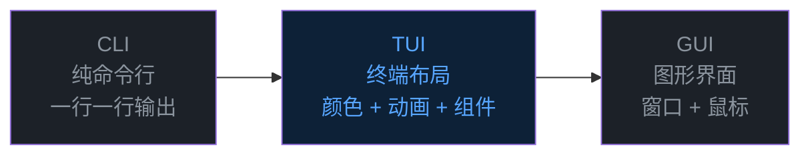
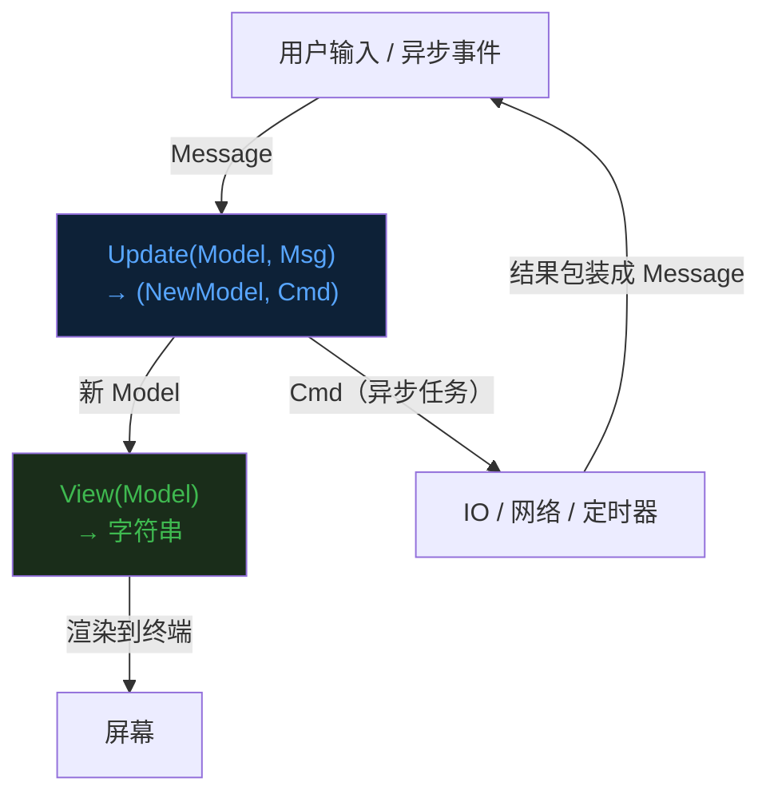
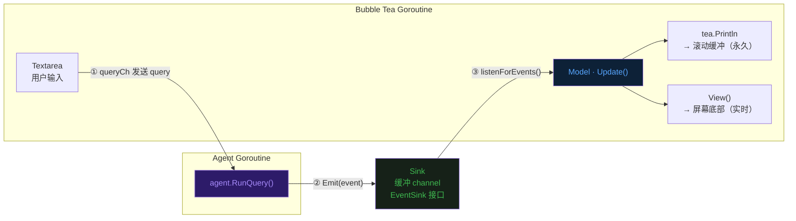
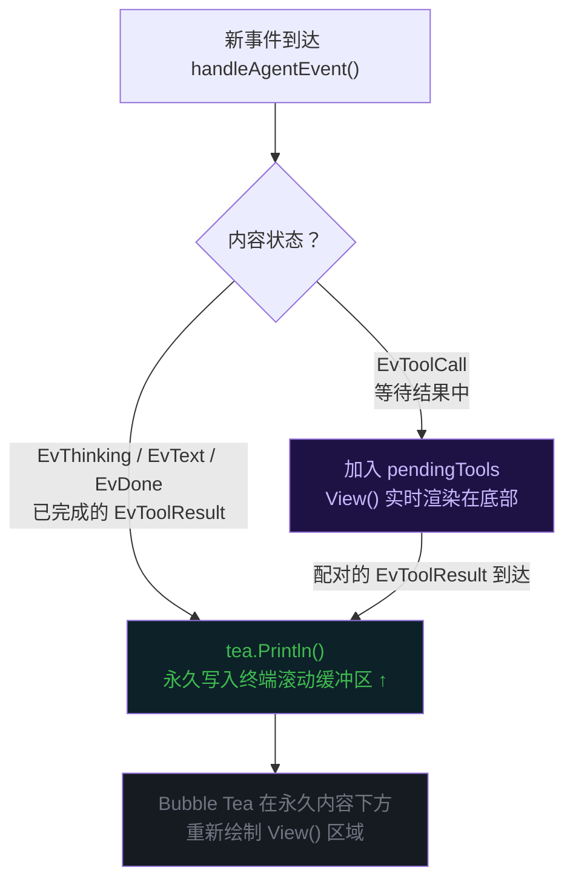
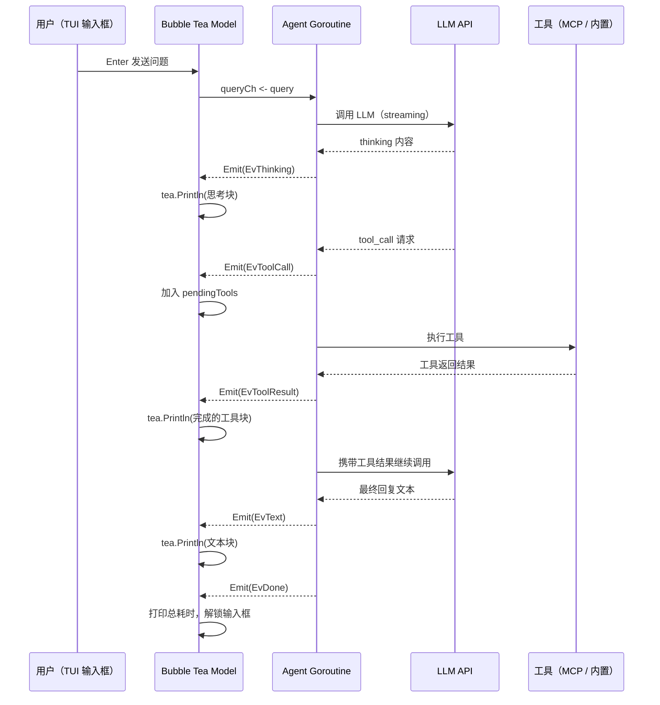

前六篇文章分别讲了 Agent 的 [Loop](https://mp.weixin.qq.com/s/dkdrwVlwe3IkH2hzSzy53A)、[Tools](https://mp.weixin.qq.com/s/xyX4_CF5cveezEDuzFT13g)、[记忆](https://mp.weixin.qq.com/s/lguRAdxFoN22rqPyx3BIzw)、[Context Compact](https://mp.weixin.qq.com/s/YRS29wRckEmFgNb0eJrxrQ)、[MCP](https://mp.weixin.qq.com/s/rCnGif8Ee7JhRI86-RoNWA) 和 [Skill](https://mp.weixin.qq.com/s/X2ie0aQ2vMtddAQrkbOG5g)。  


今天聊一个跟前面几篇完全不同的东西——TUI，终端用户界面。  


## 为什么需要 TUI


先说个我自己写 evo-agent 的真实体感。  


前面几版的 Agent，交互方式是最原始的那种——终端里打几个字，回车，然后等着 Agent 一行一行往下吐文字。  


能用，但也仅仅是能用。  


用多了你就会觉得别扭。  


思考过程、工具调用、返回结果，所有东西全部平铺着往屏幕上刷，像一条没有格式的日志流。  
你根本不知道 Agent 现在在干什么，不知道它调了哪个工具，不知道 context 还剩多少 token。  
屏幕一满，往上翻都翻不到头。  


这就好比你在现实中雇了一个非常能干的助理，但他做事的时候从来不跟你汇报进度，你只能在他做完之后看到一个最终结果。  


这体验不对。  


Agent 本质上是一个异步的、多阶段的任务执行过程。  
它有思考环节、有工具调用环节、有等待返回的环节。  
这些阶段需要在界面上实时反映出来，而不是把所有东西堆在一条时间线上。  


所以我需要给 evo-agent 做一个 TUI。  


不是因为好看，是因为看不到过程，你就没法调试 Agent。  


## TUI 是什么


TUI，全称 **Terminal User Interface**，终端用户界面。  


它处于 CLI 和 GUI 中间。  


打个比方你就懂了。  


**CLI** 就是最原始的命令行，输入命令、回车、看输出、再输入下一条。  
交互是线性的，一次一行，没有布局概念，像发短信一样，一条接一条。  


**GUI** 是我们最熟悉的桌面应用——窗口、按钮、滚动条，鼠标点来点去。  
功能最强，但最重，也没法在 SSH 里跑。  


**TUI** 选了中间的路——不离开终端，但在终端里做出布局、颜色、动画。  


Vim 是 TUI，htop 是 TUI，lazygit 也是 TUI。  
你日常用的那些"看起来比较高级的命令行工具"，大概率都是 TUI。  





对 Agent 来说，TUI 是个非常自然的选择。  
不用引入浏览器，不用写前端代码，SSH 远程连上照样能用，但又能比 CLI 给用户多得多的实时反馈。  


## Bubble Tea：一个让人写 TUI 上瘾的框架


实现 TUI 需要框架。  


在 Go 生态里，**Bubble Tea** 是目前最主流的选择。  
来自 [Charm](https://charm.sh/) 团队，GitHub 上四万多星。  


它的设计思想很有意思，直接借鉴了前端的 **Elm 架构**。  


如果你没听说过 Elm，没关系，它的核心思想其实就三个关键词：**Model、Update、View。**  


**Model** 是应用的全部状态。  
界面上展示什么、用户输入了什么、有哪些数据在加载——全部放在 Model 里。  
它是一个不可变的快照，描述的是"此刻这个应用长什么样"。  


**Update** 是状态的唯一更新入口。  
所有外部事件——键盘按键、窗口大小变化、网络请求返回——都以消息（Message）的形式进入 Update 函数。  
Update 接收旧 Model 和消息，返回新 Model。  
没有副作用，没有全局状态，行为完全可预测。  


**View** 是纯渲染。  
它接收 Model，返回一个字符串，这就是屏幕上应该显示的内容。  
每次状态更新，View 重新计算，框架负责把差异刷到终端上。  


就这么简单。  





这个模式好在哪？  


业务逻辑和渲染完全分离。  
你在 Update 里写逻辑，在 View 里写样式，两者互不干扰（很像 MVC 架构）。  
测试也方便——直接构造 Model 和 Message，断言返回的新 Model 就行。  


Bubble Tea 的生态里还有两个常用库。  


**Lipgloss** 负责样式——颜色、背景、边框、内边距。  
API 设计得很像 CSS，比直接拼 ANSI 转义码舒服得多。  


**Bubbles** 是官方组件库——textarea、spinner、progress bar，现成的交互组件。  


三个库配合，就能写出功能完整的 TUI 应用。  


## evo-agent 的 TUI 是怎么设计的


了解了框架，来看 evo-agent 的 TUI 具体怎么做的。  


首先要面对一个核心矛盾：**Agent 是在另一个 goroutine 里跑的。**  


用户在 TUI 里输入问题，TUI 把问题发给 Agent goroutine，Agent 去调 LLM、调工具，产生一系列事件。  
这些事件需要实时反映在 TUI 上。  


但 Bubble Tea 的更新只能通过消息驱动，不能直接操作 UI。  


怎么办？  


答案是一个事件总线：`ui.EventSink`。  





`EventSink` 是一个接口，极简，就一个方法：

```go
type EventSink interface {
    Emit(e Event)
}
```

Agent goroutine 只知道"有个 EventSink 可以发事件"，完全不知道 TUI 长什么样。  
TUI 侧的 `Sink` 实现了这个接口，内部维护一个带缓冲的 channel：  


```go
type Sink struct {
    ch chan ui.Event
}

func (s *Sink) Emit(e ui.Event) {
    select {
    case s.ch <- e:
    default: // 缓冲满了就丢弃，不阻塞 Agent
    }
}
```

Agent 调 `Emit`，Sink 把事件塞进 channel，TUI 通过 `listenForEvents()` 从 channel 里读。  


整条链路是异步的，双方完全解耦。  


这个设计有一个额外的好处——如果用户不想用 TUI，Agent 照样跑，只需把 EventSink 换成直接打印文字的实现就行。  
Agent 的逻辑一行都不用改。  


这就是事件总线的力量。  


## 事件类型与 Block 系统


Agent 跑起来之后会产生各种事件。  


我定义了这些类型：  


```go
const (
    EvThinking  EventKind = iota // LLM 思考块
    EvText                       // 助手回复文本
    EvToolCall                   // 工具被调用
    EvToolResult                 // 工具返回结果
    EvSystem                     // 系统提示信息
    EvTokens                     // token 用量更新
    EvDone                       // 本轮结束
)
```

TUI 收到这些事件后，会把它们映射成屏幕上的 **Block**（块）。  


这个 Block 的概念很重要。  


以前的纯文本输出，所有内容都是一行一行的字符串，没有结构可言。  
而 Block 系统把每种内容都打了标签——思考块、文本块、工具调用块、系统消息块——然后由统一的渲染函数根据类型来决定怎么画。  


工具调用块还有三种状态：

```go
StatusPending  // ● 等待结果中（黄色）
StatusSuccess  // ✓ 执行成功（绿色）
StatusFailed   // ✗ 执行失败（红色）
```

当 `EvToolCall` 事件到达时，TUI 创建一个 `StatusPending` 的工具块，先挂着。  
当配对的 `EvToolResult` 到达时，找到对应的块，更新状态、填入结果、记录耗时。  


这个"先挂起、等结果、再完成"的机制，让工具调用在视觉上是一个整体。  
用户能同时看到调用和结果，而不是两条分散的文字。  


就像你看一个人做菜，不是看到一堆零散的动作，而是看到"切菜→颠锅→出锅"这样一个完整的流程。  


## 渲染策略：永久区和实时区


Bubble Tea 有一个非常有意思的机制：`tea.Println`。  


常规的 TUI 渲染是"全量刷新"——每次 View() 返回新内容，框架把整个终端重绘一遍。  
静态布局没问题，但 Agent 这种会持续产出大量内容的场景，历史内容会随着界面更新而消失。  


`tea.Println` 解决了这个问题。  
它把内容**永久写入终端的滚动缓冲区**——就像普通的 `fmt.Println` 一样，只是写完之后，Bubble Tea 会在它下方重新绘制 View() 的内容。  


evo-agent 利用这个机制做了一个清晰的分层：  


**上方是永久区。**  
所有已完成的内容——思考块、文本回复、完成的工具调用——通过 `tea.Println` 写入终端。  
用户可以往上翻，历史记录一直都在。  


**下方是实时区。**  
输入框、进行中的工具调用、状态栏，由 `View()` 渲染，始终钉在屏幕底部。  





这个设计让 TUI 在视觉上"自然地向下流动"。  
新内容源源不断地追加在上方的历史里，底部的交互区域始终稳定。  


不会抖，不会跳，不会丢失历史。  


你可能觉得这是个小事，但用起来体感差异巨大。  


## 样式：配色这事不能将就


所有颜色和排版都用 Lipgloss 定义在 `styles.go` 里，统一管理。  


思考块用紫色系，一眼就能跟最终回复区分开——"这是 Agent 内部的推理，不是给你的答案"：  


```go
thinkingHeaderStyle = lipgloss.NewStyle().
    Background(lipgloss.Color("#2d1b69")).
    Foreground(lipgloss.Color("#a78bfa")).
    Bold(true)

thinkingBodyStyle = lipgloss.NewStyle().
    Background(lipgloss.Color("#1e1244")).
    Foreground(lipgloss.Color("#c8b8ff"))
```

工具调用用 GitHub 暗色主题的配色——绿色成功，红色失败，蓝色工具名：  


```go
toolSuccessStyle = lipgloss.NewStyle().Foreground(lipgloss.Color("#3fb950")) // ✓
toolErrorStyle   = lipgloss.NewStyle().Foreground(lipgloss.Color("#f85149")) // ✗
toolNameStyle    = lipgloss.NewStyle().Foreground(lipgloss.Color("#58a6ff")).Bold(true)
```

状态栏用深灰背景，在视觉上跟内容区拉开层次：  


```go
statusBarStyle = lipgloss.NewStyle().
    Background(lipgloss.Color("#161b22")).
    Foreground(lipgloss.Color("#8b949e"))
```

整套配色参考了 GitHub 的暗色主题。  


为什么选它？  
因为程序员每天看得最多的页面就是 GitHub，这套颜色眼熟、不刺眼、长时间看也不累。  


## 状态栏：一眼看清 Agent 的"血条"


状态栏是整个 TUI 里信息密度最高的一行。  


```
tokens:5471/200000(2.7%)  │  model:gemma4:26b  │  agent:evo-agent  │  skills:4  │  tools:6  │  mcp:1
```

我给你翻译一下这些数字的意思。  


`tokens` 就是 Agent 的"血条"——当前 context 用了多少 token、总量多少、百分比多少。  
这个数字让你随时知道离上限还有多远，该不该手动压缩。  


`model` 是当前使用的模型名，一眼确认配置有没有生效。  


`skills`、`tools`、`mcp` 分别是已加载的 Skill 数、内置工具数、MCP Server 数。  


启动时扫一眼，就知道这次 Agent 的"装备"情况。  


就像打游戏，屏幕左上角永远有血条、蓝条和装备栏。  
你不需要每次都打开菜单去查，信息就在那里。  


状态栏的数据由 `EvTokens` 事件驱动。  
每次 LLM 返回响应，Agent 会 Emit 一个携带最新 token 用量的事件，TUI 收到后刷新，下一帧就更新了。  


## 跑一次真实的看看


光看设计不够直观。  


来看一次真实的运行记录，和上一篇 Skill 那篇是同一个任务——分析 Union 字段值。  


**Agent 启动**

```
[MCP] Connected to "unionplus_mcp_normal" (9 tools)
[Skills] Loaded 4 skill(s)
```

简洁，连上了 MCP，加载了 Skill，准备好了。  


**用户输入问题**

```
 You: 分析 Union 字段值, 视图ID 2003, 主键key mzc002009g0nh88, 字段 type_name
```

用户消息蓝色加粗，跟后续 Agent 内容一眼就能区分。  


**思考块出现**


```
 ▸ Thinking  🕐 20.0s
 The user wants to analyze the value of a Union field `type_name`...
 Looking at the available tools, I see `union-field-trace`...
 I'll start by loading the `union-field-trace` skill...
```

紫色背景整块呈现，标题行带着耗时。  
LLM 的推理过程完整可见——它在判断该调哪个工具，决定先加载 Skill。  


这种可见性太重要了。  
以前 Agent 思考的过程是黑盒，现在你能一行一行看到它在想什么。  


**加载 Skill**

```
 ✓ load_skill {"name":"union-field-trace"}  🕐 0ms
   Result:
 <skill name="union-field-trace" ...>
 分析一个 Union 字段值的完整来源链路...
  … 298 more lines
```

工具调用块的格式很紧凑：状态图标 + 工具名 + 参数 + 耗时。  
结果超出 10 行的部分折叠成 `… N more lines`，保持屏幕整洁。  


**并行发起两个查询**


```
 ✓ mcp__unionplus_mcp_normal__QueryViewFieldInfo {"field_name":"type_name","view_name":"2003"}  🕐 292ms
   Result:
 {"c_rule":"DICT_ENUM(2, type_name)", "c_lib_id":"media_80009", ...}

 ✓ mcp__unionplus_mcp_normal__QueryUnionPlus {"field_name":"type_name","key":"mzc002009g0nh88","view_name":"2003"}  🕐 316ms
   Result:
 Union value: {"type_name":"电视剧"}
```

两个工具并行调用，各自的耗时和结果独立展示。  
双 ✓ 绿色，都成功了。  


**继续溯源，最终完成**

```
 ✓ mcp__unionplus_mcp_normal__QuerySource {"field_name":"type_name","key":"mzc002009g0nh88","view_name":"2003"}  🕐 225ms
 ✓ mcp__unionplus_mcp_normal__QueryEnumValueInfo {"lib_id":"2","value":"2"}  🕐 200ms
```

每一步都有完整记录。  


**底部状态栏始终可见**


```
tokens:5471/200000(2.7%)  │  model:gemma4:26b  │  agent:evo-agent  │  skills:4  │  tools:6  │  mcp:1
```

整个过程中，状态栏一直钉在屏幕底部。  
5471 token，2.7%，离压缩触发还远得很。  





## 最后


TUI 这事，表面上是给 Agent 换了一张"脸"。  


但本质上，它是把 Agent 的运行过程可视化了。  


没有 TUI 之前，Agent 在干什么是黑盒。  
你只能在最后看到一个结果，中间发生了什么一无所知。  


有了 TUI，推理过程、工具调用、耗时分布，全部在屏幕上实时展开。  


这不只是好看的问题，它让调试 Agent 的体验从"瞎猜"变成了"直观感受"。  


回头看 evo-agent 这个 TUI 的设计，我觉得值得记住的就三点。  


**第一，事件驱动解耦。**  
Agent 和 TUI 之间只有一个 `EventSink` 接口。  
Agent 不知道 TUI 存在，TUI 不知道 Agent 怎么实现。  
换掉任何一方，另一方完全不受影响。  


**第二，永久区与实时区分层。**  
历史内容沉入滚动缓冲，输入框和状态栏固定在底部。  
TUI 的布局是稳定的，不会因为内容增加而抖动或跳来跳去。  


**第三，Block 系统统一渲染。**  
所有内容都抽象成 Block——思考、文字、工具调用、系统消息。  
加新的内容类型只需加一种 Block，不动其他地方。  


说到底，一个 Agent，光有脑子不够。  


你得给它配一双眼睛，让使用者能看到它在想什么、在做什么。  


TUI 就是那双眼睛。  


《完》  


-EOF-  

本文公众号：天空的代码世界  
个人微信号：tiankonguse  
公众号ID：tiankonguse-code  
