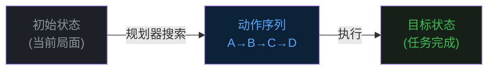
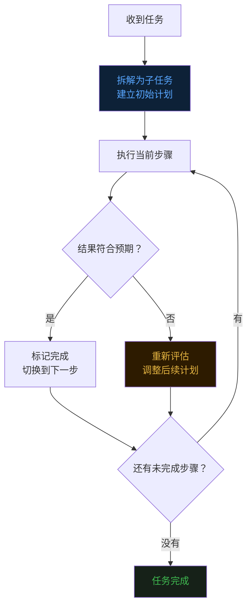
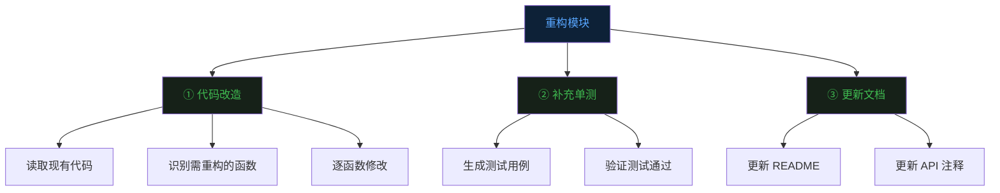
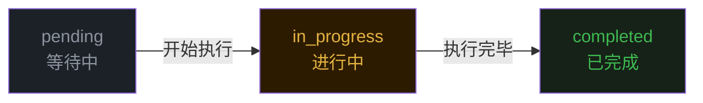
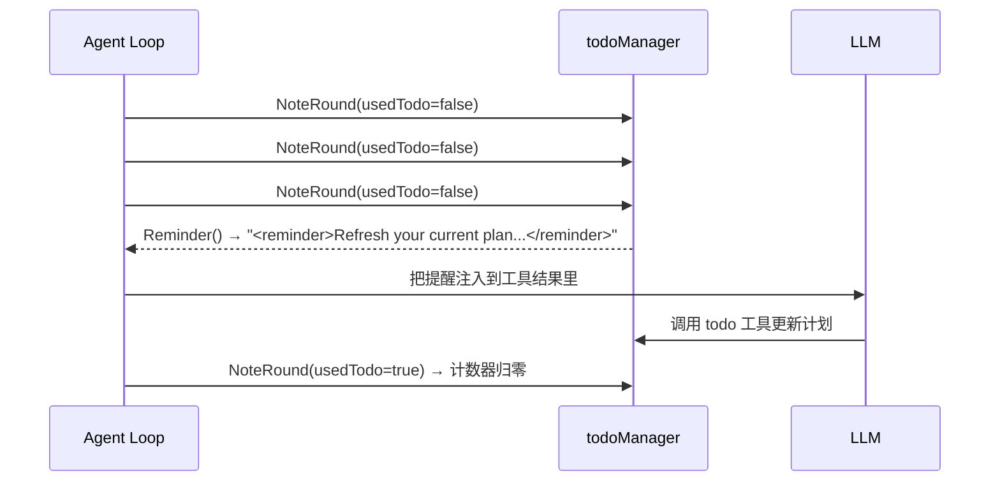
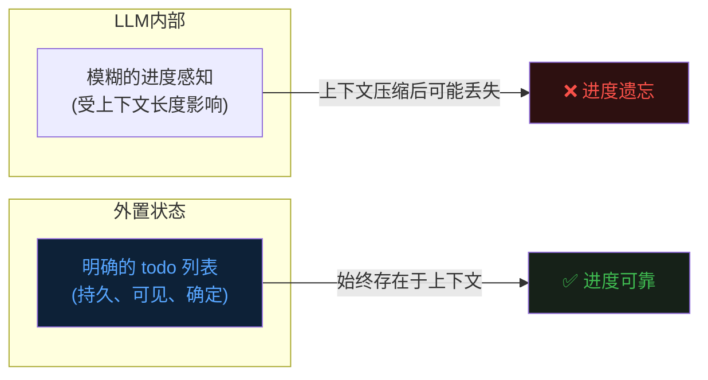

前七篇文章分别讲了 Agent 的 [Loop](https://mp.weixin.qq.com/s/dkdrwVlwe3IkH2hzSzy53A)、[Tools](https://mp.weixin.qq.com/s/xyX4_CF5cveezEDuzFT13g)、[记忆](https://mp.weixin.qq.com/s/lguRAdxFoN22rqPyx3BIzw)、[Context Compact](https://mp.weixin.qq.com/s/YRS29wRckEmFgNb0eJrxrQ)、[MCP](https://mp.weixin.qq.com/s/rCnGif8Ee7JhRI86-RoNWA)、[Skill](https://mp.weixin.qq.com/s/X2ie0aQ2vMtddAQrkbOG5g) 和 [TUI](https://mp.weixin.qq.com/s/fBNFZvOOpwCPT7yysh5YkQ)。  


这篇聊一个常常被忽视、但非常关键的问题——任务规划。  


## 一、Agent 的迷路问题


先说一个真实的场景。  


你让 Agent 做一件稍微复杂点的事：帮我重构这个模块，要求加单测、更新文档、检查有没有循环依赖。  


Agent 开始干活了。  
它调了几个工具，读了几个文件，思考了一会儿，改了几行代码。  


然后问题来了。  


到了第五轮、第六轮循环，它已经不知道自己做到哪一步了。  
有时候它会重复去读已经读过的文件。  
有时候它会把已经完成的事情又做一遍。  
有时候它干到一半，突然忘了"更新文档"这件事，直接跳到下一个话题去了。  


这不是模型不够聪明，而是一个结构性问题：**LLM 没有持久化的任务状态。**  


每一轮 Loop，它都是根据当前上下文重新推断"接下来该干什么"。  
上下文一长，早期的任务目标就自然而然地被稀释了。  


打个比方，这就像一个人拿了一张购物清单，但没有笔。  
买了一样，用脑子记一下"这个买了"。  
买到第七、第八样的时候，前面买没买过就开始混了。  


**需要的不是更强的记忆力，而是一支笔，把进度划出来。**  


这就是任务规划要解决的问题。  


## 二、任务规划是什么


任务规划（Task Planning），在 AI 领域有很长的研究历史。  


经典的规划系统，比如 STRIPS 和 PDDL，是这么工作的：  
给定一个"初始状态"和一个"目标状态"，系统会自动搜索一条从初始到目标的动作序列。  


就像棋盘上的走法推算——从当前局面出发，推算出几步之后能赢，把这条路径规划出来。  





这套经典方法有个致命问题：**它假设世界是完全可预测的。**  


规划之前，你得把所有可能的动作、前提条件、效果全部定义清楚。  
但真实的 Agent 任务不是这样的——工具可能报错、中间结果可能出乎意料、用户可能中途改需求。  


现实世界是动态的，计划必须随时跟着变。  


## 三、动态规划：边做边调


现代 Agent 更常用的思路叫**动态规划**，或者叫 Plan-then-Execute 的变体。  


核心思想很简单：不要一次性把所有步骤全规划好，而是维护一张活的计划表，边做边更新。  





这个模型有几个关键特征。  


**计划是实时可见的。**  
Agent 始终维护一张当前的任务列表，知道哪些做完了、哪些在进行、哪些还没开始。  


**计划是可修正的。**  
中途发现前面的判断有误，可以修改后续步骤，甚至删掉不必要的环节。  


**计划本身是上下文的一部分。**  
每次 LLM 思考"接下来干什么"的时候，它能看到这张计划表，不需要靠"记忆"来推断进度。  


这最后一点是关键。  


与其让 LLM 去记住"第三步已经做了"，不如直接把这个事实写下来，放在上下文里。  


**把状态外置，比让大脑记住状态，可靠得多。**  


## 四、再难一点：多层级任务


现实任务往往不是简单的线性清单，而是有层级的。  


比如"重构这个模块"可能拆成三个大步骤，每个大步骤又有若干小步骤。  


这就是 **HTN（Hierarchical Task Network，层级任务网络）** 的思想。  
一个高层目标可以被分解成子目标，子目标再继续分解，直到每一步都是可以直接执行的原子操作为止。  





但对于一个实际运行的 Agent 来说，全量的层级树维护起来太重了。  


一个轻量的替代方案是：**扁平化清单 + 按需拆解**。  
开始时只列出顶层任务，当进入某个任务时，再把它细化为更小的步骤，写进清单。  


本质上还是 HTN 的思想，只是实现更轻，更适合在 LLM 的 token 预算里运转。  


## 五、evo-agent 的 todo 工具


了解了原理，来看 evo-agent 是怎么落地的。  


evo-agent 给 LLM 提供了一个内置工具叫 `todo`。  
它的作用很直接——让 LLM 随时可以更新当前的会话计划。  


每一条任务有三种状态：  


```
pending     → 还没开始
in_progress → 当前正在做
completed   → 已经完成
```


状态转换是单向的，就像一条流水线：  





计划表有两个硬约束。  


**第一，最多 12 条。**  
超过 12 条的计划不允许提交。  
这不是技术限制，而是设计取舍——计划太长本身就是一个信号，说明任务边界没想清楚，需要先对齐目标再动手。  


**第二，同一时刻只允许一条 `in_progress`。**  
这是防止 Agent 同时"在做"很多事情，最后每件事都做了一半，没有一件真正做完。  


这两个约束放在一起，强制 LLM 在任何时刻保持清晰的焦点：**我现在在做哪件事，这件事完成了吗？**  


## 六、提醒机制：别忘了更新你的计划


有了 todo 工具，还有一个实际问题。  


LLM 在执行过程中，可能一头扎进调工具、分析结果的循环里，连续好几轮都忘了更新计划。  
计划停在原地不动，实际进展和计划状态就脱节了。  


evo-agent 的解法是一个简单的提醒机制。  


Agent 的 Loop 里会追踪：**距上次使用 `todo` 工具，已经过了几轮？**  





连续三轮没有更新计划，就在下一轮的工具返回结果里注入一条提醒：  


```xml
<reminder>Refresh your current plan before continuing.</reminder>
```


LLM 收到这条提醒，会重新审视当前计划，把已完成的步骤标记上，再继续推进。  


这个机制不打断任何东西，不强制 LLM 做任何事，只是在合适的时机给它一个提示。  
就像你在专注工作时，旁边贴着一张便签：**"别忘了更新进度"。**  


## 七、TUI 里的计划面板


有了 todo 工具，计划的状态需要在界面上体现出来。  


evo-agent 的 TUI 里有一个实时的计划面板，始终显示在屏幕底部。  
每次 `todo` 工具被调用，Agent 会 emit 一个 `EvTodo` 事件，TUI 收到后立刻重绘这个面板：  


```
[x] 读取现有模块代码
[>] 识别需重构的函数  (Analyzing functions)
[ ] 逐函数修改
[ ] 补充单测
[ ] 更新文档
(0/5 completed)
```


`[ ]` 是等待中，`[>]` 是当前在做，`[x]` 是完成了。  


这个面板让使用者能实时看到 Agent 在任务里走到哪一步了，不用猜，不用翻历史记录。  


配上 TUI 的永久区与实时区分层策略——每一条完成的任务会随着其他内容一起沉入滚动缓冲，面板只展示活跃状态——整体体感非常流畅。  


## 八、为什么不直接让 LLM 自己追踪进度


你可能会问：LLM 这么聪明，为什么不直接让它自己在思考中维护进度，非要搞一个外置的工具？  


原因有三点。  


**第一，上下文是有限的。**  
Context window 就那么大，随着任务推进，早期的目标会被稀释。  
外置状态不占用 token 配额，始终都在。  


**第二，外置状态是确定的。**  
LLM 的"记忆"是概率推断，不是精确存储。  
一个写进 todo 工具的 `completed` 状态，是确定的事实，不会因为上下文太长而"忘掉"。  


**第三，外置状态是可观测的。**  
调试 Agent 的时候，你能直接看到当前的任务列表，而不是去猜 LLM 的内部状态。  
可见性直接影响可调试性。  





把状态外置，这是 Agent 工程里一个反复出现的原则。  


记忆要外置（上一篇 Context Compact 做的事），进度也要外置。  


**LLM 负责推理，状态交给系统来管。**  


## 最后


任务规划这件事，说复杂也复杂——学术界研究了几十年，STRIPS、HTN、各种规划算法。  
说简单也简单——在 Agent 的实际工程里，一张结构化的待办清单，配上合理的状态约束和提醒机制，就能解决大多数问题。  


evo-agent 的 todo 工具就是这个思路的轻量实现。  
三个状态，两个约束，一个提醒。  


但它背后解决的问题是真实的：**让 Agent 在复杂的多步骤任务里，始终知道自己在哪、做到哪、下一步要去哪。**  


有了这张地图，Agent 才不会迷路。  


《完》


-EOF-

本文公众号：天空的代码世界  
个人微信号：tiankonguse  
公众号ID：tiankonguse-code  
