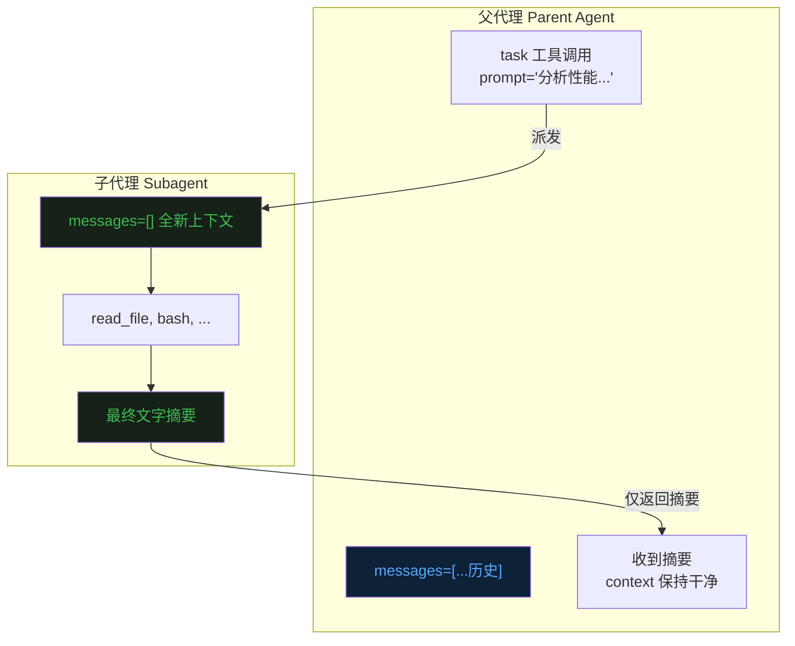
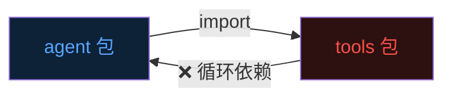
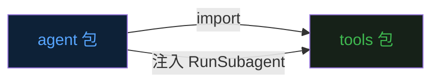
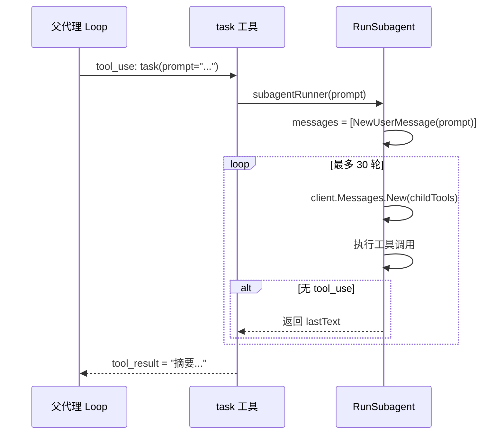
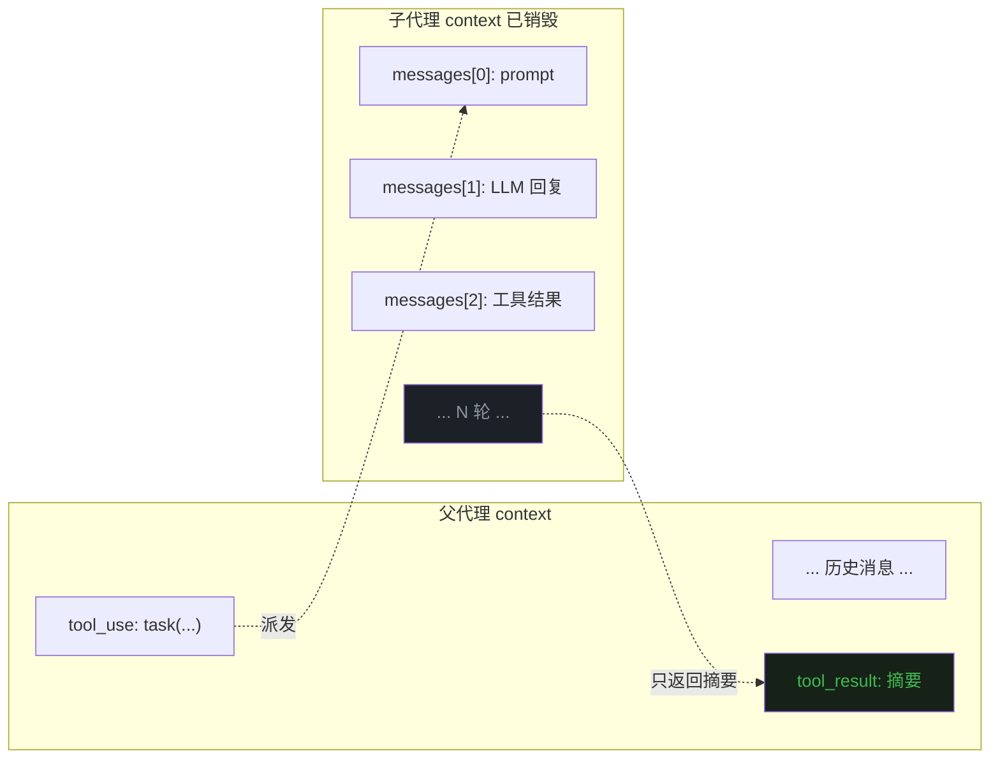

前八篇文章分别讲了 Agent 的 [Loop](https://mp.weixin.qq.com/s/dkdrwVlwe3IkH2hzSzy53A)、[Tools](https://mp.weixin.qq.com/s/xyX4_CF5cveezEDuzFT13g)、[记忆](https://mp.weixin.qq.com/s/lguRAdxFoN22rqPyx3BIzw)、[Context Compact](https://mp.weixin.qq.com/s/YRS29wRckEmFgNb0eJrxrQ)、[MCP](https://mp.weixin.qq.com/s/rCnGif8Ee7JhRI86-RoNWA)、[Skill](https://mp.weixin.qq.com/s/X2ie0aQ2vMtddAQrkbOG5g)、[TUI](https://mp.weixin.qq.com/s/fBNFZvOOpwCPT7yysh5YkQ) 和 [TODO](https://mp.weixin.qq.com/s/UIlEXIuQdacowdrIg1nrDQ)。  


这篇聊一个让 Agent 能做更复杂任务的关键机制——**子代理（Subagent）**。  


## 一、主 Agent 的上下文污染问题

先看一个场景。  


你让 Agent 做一个比较大的任务：分析整个代码库，找出性能瓶颈，给出改进建议。  


Agent 开始干活。  
它一路读文件、分析代码、调工具。  
读了几十个文件之后，context 里已经全是密密麻麻的代码内容。  


问题来了。  


主线任务是"分析性能瓶颈"，但现在 context 里塞满了大量中间过程——各个文件的原始内容、工具调用结果、中间分析结论。  
这些"探索过程"本身不重要，重要的是最终结论。  
但它们都已经牢牢占据了宝贵的 context 空间。  


这是 Agent 工程里一个很典型的问题：**探索性子任务会污染主 Agent 的上下文。**  


解决思路也很自然：**把探索任务交给一个独立的 Agent 去做，完成后只把结论汇报回来。**  


这就是子代理模式。  


## 二、子代理模式：上下文隔离

子代理（Subagent）模式的核心思想是：父代理通过一个工具派发子任务，子代理在**全新的、独立的上下文**里完成任务，完成后只把文字摘要返回给父代理。  
子代理的整个探索过程——工具调用、中间结果、所有临时状态——全部丢弃，不会污染父代理。  





父代理的 context 只增加了一条"子任务完成，摘要如下"，几十个工具调用的过程对父代理完全不可见。  


## 三、设计约束

子代理设计里有几个关键约束，值得单独说。  


**约束一：子代理不能再派生子代理。**  
如果子代理也能调 `task` 工具，就会形成递归派生，深度难以控制，计费和调试都会变得非常麻烦。  
evo-agent 的解法是：子代理使用的工具列表里，直接排除了 `task` 工具。  


**约束二：上下文完全隔离。**  
子代理从空的 `messages=[]` 开始，看不到父代理的历史对话。  
它只知道当前这个子任务的 prompt，不知道父代理正在做什么大任务。  
这是有意为之——子代理只需要做好自己的一件事。  


**约束三：共享文件系统，不共享 LLM 上下文。**  
子代理可以读写文件、执行命令，对文件系统的操作是真实的。  
但对话历史是完全独立的两份。  


**约束四：只返回摘要。**  
子代理的工具调用结果、中间 text block，都只在子代理内部流转。  
父代理只收到子代理最后输出的那段文字。  
这是"上下文不污染"的核心保证。  


## 四、工程难点：如何避免循环依赖

在实现上，子代理有一个工程层面的挑战。  


evo-agent 的代码结构是这样的：  


```
main.go
  └── agent 包（Loop, RunSubagent）
        └── tools 包（Register, Dispatch, Execute）
```


`agent` 包 import 了 `tools` 包。  
`task` 工具的逻辑是：收到调用 → 派发给子代理。  
但子代理的实现在 `agent` 包里，不在 `tools` 包里。  


如果 `tools` 包要调用 `agent.RunSubagent()`，就需要 import `agent` 包。  
这就形成了循环依赖：`agent` → `tools` → `agent`，Go 编译器直接拒绝。  





解法是**注册回调函数**，把依赖方向彻底反转。  


`tools` 包只持有一个函数变量，具体实现由外部注入：  


```go
// tools/task.go
var subagentRunner func(prompt string) string

func RegisterSubagentRunner(fn func(prompt string) string) {
    subagentRunner = fn
}
```


`agent` 包在初始化时，把自己的 `RunSubagent` 方法注入进去：  


```go
// agent/loop.go
func New(client *anthropic.Client, cfg *config.Config) *Agent {
    a := &Agent{client: client, cfg: cfg}
    tools.RegisterSubagentRunner(func(prompt string) string {
        return a.RunSubagent(prompt)
    })
    return a
}
```


依赖方向现在是：`agent` → `tools`（单向），循环消除。  





这个模式在 evo-agent 里不是第一次用了。  
`GlobalTodo`（上一篇 TODO 工具）也是同样的包级变量 + 外部初始化模式。  
Go 语言里这是解决循环依赖的常规手段，和标准库的 `http.HandleFunc` 是一个思路。  


## 五、task 工具的实现

`task` 工具的接口设计很简洁：  


```go
type TaskInput struct {
    Prompt      string `json:"prompt"`      // 完整的子任务描述
    Description string `json:"description"` // 单行摘要，显示在 UI 里
}
```


父代理调用 `task` 时，只需要告诉子代理"去做什么"。  
`description` 字段是给用户看的，显示在 UI 的工具调用面板里，让用户知道当前派发的是什么任务。  


工具处理函数非常简单，直接把 `prompt` 转发给注册的 runner：  


```go
Handler: func(input json.RawMessage) (string, error) {
    var in TaskInput
    if err := json.Unmarshal(input, &in); err != nil {
        return "", err
    }
    if subagentRunner == nil {
        return "Error: subagent runner not initialized", nil
    }
    return subagentRunner(in.Prompt), nil
},
```


## 六、RunSubagent：子代理的执行流程

子代理的核心逻辑在 `agent/subagent.go` 的 `RunSubagent` 方法里。  





几个关键实现细节。  


**全新的 messages。**  
子代理从 `[]anthropic.MessageParam{{prompt}}` 开始，和父代理的历史完全无关。  


**排除 task 工具。**  
子代理使用 `tools.ToolsExcept("task")` 获取工具列表，`task` 工具不在其中，彻底切断递归派生的可能。  


**最多 30 轮。**  
防止子代理陷入死循环。  
30 轮足够完成大多数探索型任务。  


**返回最后一个 text block。**  
子代理的所有 text 输出都只显示在日志里（带 `[subagent]` 前缀），最终返回给父代理的只有最后一段文字。  
如果子代理没有输出任何文字，返回 `"(no summary)"`。  


子代理的 UI 输出有专门的 `[sub]` 前缀，方便在 TUI 日志里区分哪些是主代理的、哪些是子代理的：  


```
[subagent turn 1 | tool_use]
[sub] read_file({"path": "src/main.go"})
[subagent turn 2 | end_turn]
[subagent] 分析完成：main.go 中的瓶颈在于...
```


## 七、父代理的 context 为什么能保持干净

整个流程走完，父代理的 `messages` 里只多了两条记录：  


```
[assistant]: tool_use { name: "task", input: { prompt: "...", description: "..." } }
[user]:      tool_result { id: "...", content: "摘要：..." }
```


子代理探索过程中产生的几十条 messages——所有的文件读取、命令执行、中间分析——全部在 `RunSubagent` 函数栈里，函数返回后直接被 GC 回收。  


父代理的 context 增量是固定的：一条 tool_use + 一条 tool_result（摘要文字）。  
不管子代理跑了多少轮、读了多少文件，对父代理的影响都是一样的。  





## 八、什么时候用 task 工具

子代理不是万能的，有它适合的场景和不适合的场景。  


**适合：**  
- 大范围的探索性任务（扫描整个代码库、分析日志文件）  
- 需要调用大量工具、产生大量中间结果的子任务  
- 结论重要、过程不重要的任务  


**不适合：**  
- 需要访问主代理上下文的任务（子代理看不到父代理的历史）  
- 需要多次交互、反复确认的任务（子代理只能返回一次摘要）  
- 简单的单步操作（直接调工具更快）  


判断标准很简单：**如果这个子任务的"探索过程"对父代理没有价值、只有结论有价值，就可以用 task 工具。**  


## 九、最后

子代理模式解决的是一个核心矛盾：Agent 越强大，它想做的任务就越复杂；任务越复杂，探索过程产生的上下文就越多；上下文越多，性能和可靠性就越差。  


解法不是"让 LLM 更聪明地管理上下文"，而是**在架构层面把探索过程和主线上下文隔离开**。  


子代理是这个思路的一个自然实现：用新上下文做探索，用摘要传递结论，主 Agent 保持干净。  


evo-agent 的 `task` 工具加上之前实现的 `todo` 工具，让 Agent 在复杂任务里既能规划进度，又能隔离子任务的上下文干扰。  
这是从单一 Loop 到真正可用的复杂任务 Agent 的重要一步。  


《完》  


-EOF-

本文公众号：天空的代码世界  
个人微信号：tiankonguse  
公众号ID：tiankonguse-code  
