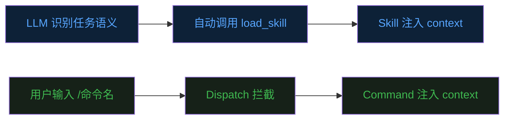
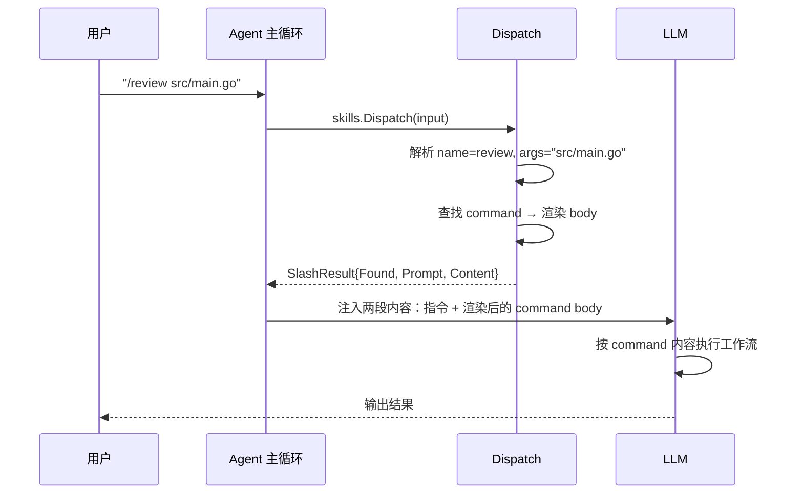
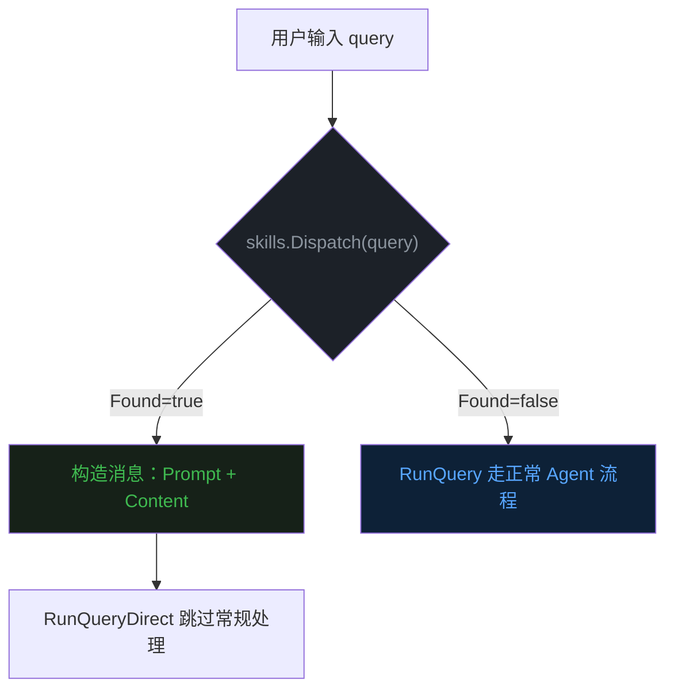

前九篇文章分别讲了 Agent 的 [Loop](https://mp.weixin.qq.com/s/dkdrwVlwe3IkH2hzSzy53A)、[Tools](https://mp.weixin.qq.com/s/xyX4_CF5cveezEDuzFT13g)、[记忆](https://mp.weixin.qq.com/s/lguRAdxFoN22rqPyx3BIzw)、[Context Compact](https://mp.weixin.qq.com/s/YRS29wRckEmFgNb0eJrxrQ)、[MCP](https://mp.weixin.qq.com/s/rCnGif8Ee7JhRI86-RoNWA)、[Skill](https://mp.weixin.qq.com/s/X2ie0aQ2vMtddAQrkbOG5g)、[TUI](https://mp.weixin.qq.com/s/fBNFZvOOpwCPT7yysh5YkQ)、[TODO](https://mp.weixin.qq.com/s/UIlEXIuQdacowdrIg1nrDQ) 和 [Subagent](https://mp.weixin.qq.com/s/LfgDcv27vjlmLZ9NfvQ9LA)。  


这篇聊一个和 Skill 一脉相承、但定位截然不同的机制——**Command（斜杠命令）**。  


## 一、为什么有了 Skill 还要 Command


上一篇 Skill 文章里说过，Skill 是"按需加载的专项手册"。  
LLM 看到任务语义，自己判断要不要加载某个 Skill，加载之后按步骤执行。  
全程是 LLM 在做决策。  


这在大多数场景下没问题。  
但有些时候，用户比 LLM 更清楚自己要什么。  


比如你想让 Agent 跑一套固定的代码审查流程，不想等 LLM 自己判断"哦这次需要 code-review skill"。  
你想直接敲一个 `/review`，Agent 立刻按那套流程走，不多废话。  


再比如部署。  
你不希望 LLM 在分析你的意图之后"聪明地"决定要不要执行部署脚本。  
你就想一个 `/deploy staging`，干净利落。  


这就是 Command 的定位：**用户显式触发，不经过 LLM 的语义判断。**  


Skill 和 Command 的关系，可以类比遥控器和声控。  
Skill 是声控——你说一句话，系统自己判断该调哪个功能。  
Command 是遥控器——你按哪个键，就执行哪个功能，确定性是百分之百的。  


## 二、Command 和 Skill 的核心区别


它们在底层机制上几乎一样——都是 Markdown 文件、都有 frontmatter 元数据、都能接受参数、都最终注入到 LLM 的上下文里。  


但在设计意图上，它们走了两条不同的路。  





**触发方式不同。**  
Skill 由 LLM 通过 `load_skill` 工具自主加载。  
Command 由用户在输入框里敲 `/name` 直接触发。  


**可见性不同。**  
Skill 的名称和描述会出现在系统提示里，LLM 知道有哪些 Skill 可用。  
Command 不进系统提示的 Skill Catalog，LLM 对它们完全无感知。  


**适用场景不同。**  
Skill 适合 LLM 能根据语义自动匹配的通用工作流——比如字段溯源、代码分析。  
Command 适合用户明确知道自己要干什么的场景——比如部署、发布、固定格式的报告生成。  


**确定性不同。**  
用 Skill，LLM 有可能判断错——任务描述模糊时，它可能选错 Skill 或者干脆不加载。  
用 Command，用户主动输入 `/deploy`，不存在"该不该加载"的判断，必定执行。  


一句话总结：**Skill 是给 LLM 的自动挡，Command 是给用户的手动挡。**  


## 三、斜杠命令的交互流程


从用户敲下 `/review` 到 Agent 开始执行，中间经过了什么？  





关键在于：**Command 的内容不是直接展示给用户的，而是注入到 LLM 的上下文里，让 LLM 按照其中描述的步骤去执行。**  


这和传统 CLI 工具的 command 不太一样。  
传统 CLI 里，`/help` 是程序自己处理，直接打印帮助文本。  
Agent 里的 `/help` 是把"帮助文档的生成指令"交给 LLM，让 LLM 根据当前状态生成定制化的帮助。  


这意味着 Command 本质上是一种**对 LLM 行为的确定性调度**——用户确定要执行这个工作流，但工作流的具体执行仍然由 LLM 驱动。  


## 四、evo-agent 的实现思路


evo-agent 的做法很巧妙：Command 和 Skill 共用同一套基础设施，只在注册来源和可见性上做区分。  


**文件存放位置不同。**  
Skill 放在 `.evo-agent/skill/<名称>/SKILL.md`，带子目录结构。  
Command 放在 `.evo-agent/command/<名称>.md`，扁平的单文件。  


Command 文件的结构和 Skill 完全一致，同样是 YAML frontmatter 加 Markdown 正文：  


```yaml
---
name: hello
argument-hint: [name]
arguments: name
user-invocable: true
---

Say hello to $name in a friendly way.
```


启动时，`Init()` 先加载所有 Skill，然后调用 `InitCommands()` 扫描 command 目录。  
两者分别存入独立的 map，互不干扰。  


**Dispatch 是整个机制的入口。**  
它做的事情很简单：判断用户输入是否以 `/` 加字母开头，如果是就当作斜杠命令处理。  
为了避免误伤文件路径（比如 `/usr/bin/env`），它还检查名称里是否包含 `/`。  


查找顺序是 Command 优先于 Skill。  
如果同名的 Command 和 Skill 都存在，斜杠调用走 Command 的版本。  
这让用户可以用 Command "覆盖"某个 Skill 的行为，实现个性化定制。  


**参数替换是锦上添花。**  
Command 的正文里可以使用 `$name`、`$0`、`$ARGUMENTS` 这样的占位符。  
用户输入 `/hello World` 时，`$name` 被替换为 `World`，最终注入 LLM 的内容就是渲染后的完整指令。  


整个流程在 main.go 的 agent 协程里，只有几行代码：  





如果 Dispatch 命中了，直接把渲染好的 Command 内容组装成一条消息，送入 `RunQueryDirect`——跳过正常的用户输入处理，直接进 LLM 调用。  
如果没命中，走正常的 Agent Loop 流程，什么都不影响。  


## 五、为什么不把 Command 也放进系统提示


可能有人会问：既然 Command 和 Skill 结构一样，为什么不把 Command 也放进系统提示的 Catalog 里，让 LLM 也能自动识别和调用？  


答案是**设计意图不同**。  


Command 的核心价值是**用户主权**。  
有些操作——比如部署、发布、数据库迁移——你不希望 LLM 自作主张。  
它们应该是"用户按下按钮才执行"，不是"LLM 觉得该执行就执行"。  


如果把 Command 也放进 Catalog，LLM 理论上可以在任何时候"判断"需要执行某个 Command，这就丧失了确定性。  


另外，不放进 Catalog 也有实际好处：**节省 token**。  
有些项目可能有十几个 Command，都是用户自定义的快捷流程。  
把它们全塞进系统提示，对 LLM 来说是纯噪音——它永远不需要主动选择这些 Command，何必让它知道？  


## 六、Command 的典型用法


理解了机制之后，来看几个典型场景。  


**固定流程的快捷入口。**  
比如 `/review` 触发代码审查流程，`/deploy staging` 触发部署。  
这些流程步骤固定、参数明确，用户不想每次都用自然语言描述一遍。  


**个性化的 Agent 行为切换。**  
比如 `/concise` 切换到简洁回答模式，`/verbose` 切换到详细模式。  
Command 的正文可以是一段对 LLM 行为的指令，效果等于动态修改了 system prompt。  


**带参数的模板化任务。**  
比如 `/ticket PROJ-123` 自动拉取某个 issue 的信息并生成分析报告。  
参数替换机制让一个 Command 可以服务于同类型的所有任务。  


这些场景有一个共同特点：**用户知道自己要什么，不需要 LLM 帮忙决策"要不要做"，只需要 LLM 帮忙"做好"。**  


## 七、最后


回头看，Command 和 Skill 其实是同一个问题的两面。  


Skill 解决的是"LLM 怎么自动找到合适的工作流"。  
Command 解决的是"用户怎么确定性地触发指定的工作流"。  


它们的底层是同一套东西——Markdown 文档、参数替换、上下文注入。  
区别只在于"谁来决定什么时候用"。  


evo-agent 把这两者统一在一套机制里，用存放目录和 Catalog 可见性来区分身份。  
加一个 Command，就是在 `.evo-agent/command/` 下放一个 `.md` 文件，不用动任何代码。  
加一个 Skill，就是在 `.evo-agent/skill/` 下放一个 `SKILL.md`，同样零代码。  


对用户来说，斜杠命令是最符合直觉的交互方式——敲 `/`，Tab 补全，回车执行。  
对 Agent 来说，Command 只是另一种形式的上下文注入，和工具调用、Skill 加载没有本质区别。  


设计的优雅之处在于：**同一套底层机制，通过一个 `IsCommand` 标志位，就区分出了"机器自主"和"用户主导"两种调度模式。**  


《完》  


-EOF-  


本文公众号：天空的代码世界  
个人微信号：tiankonguse  
公众号ID：tiankonguse-code  
