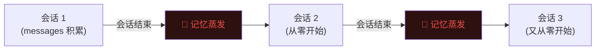
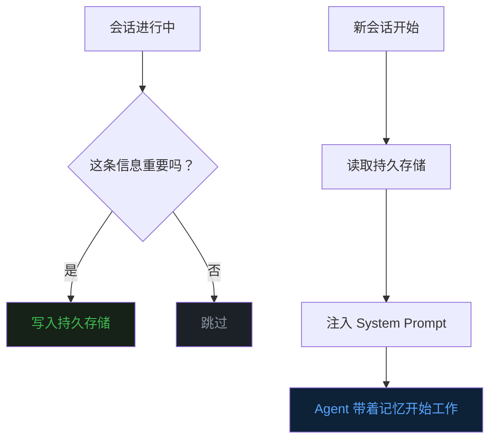
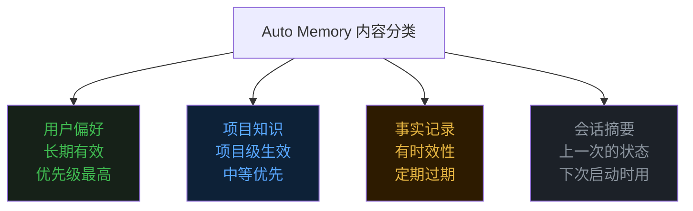
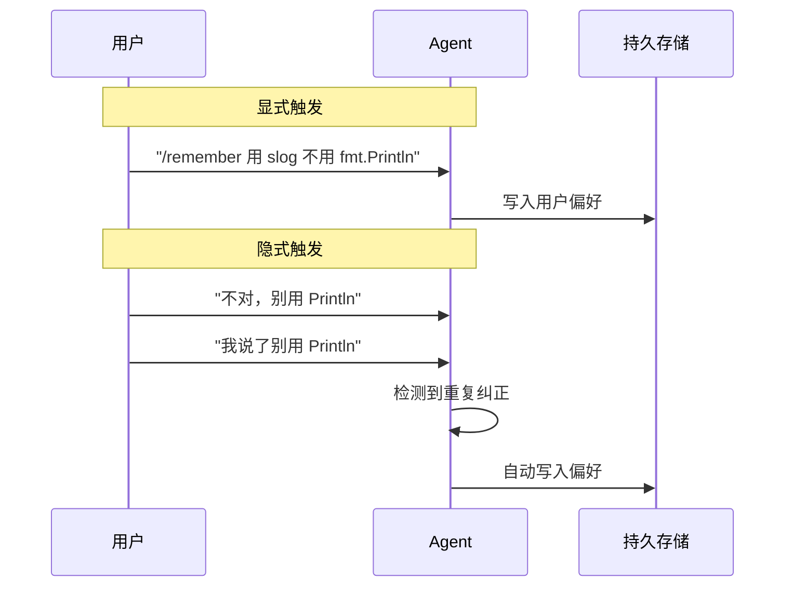
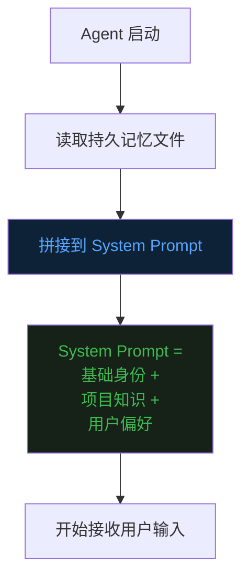
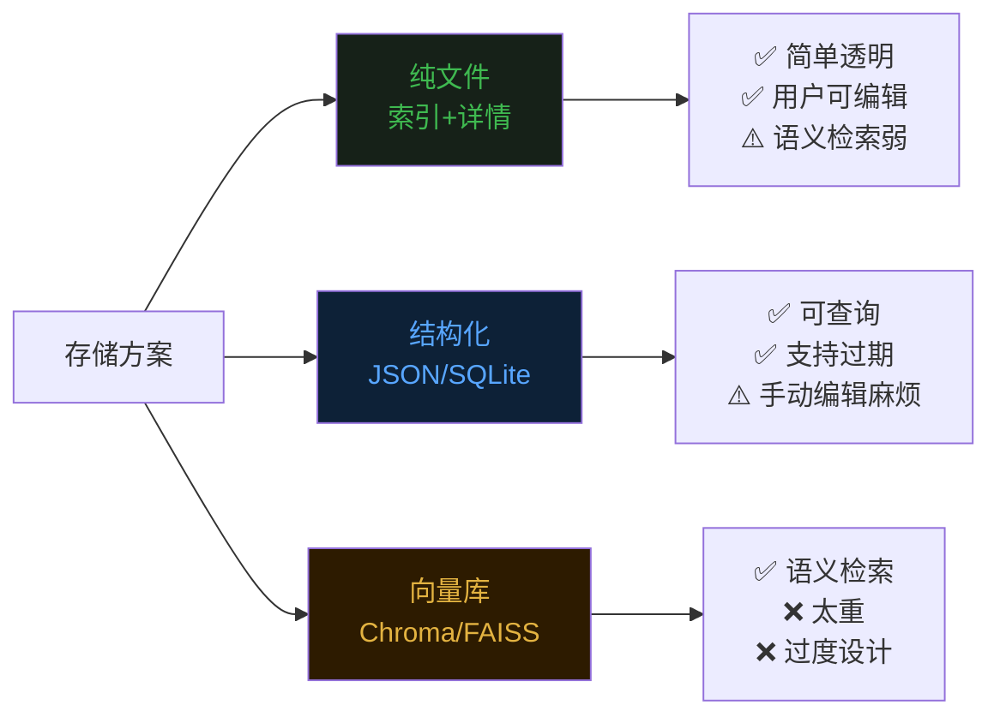
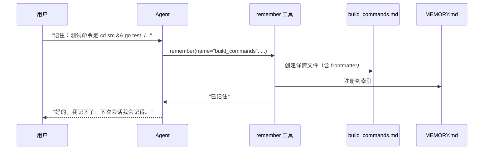
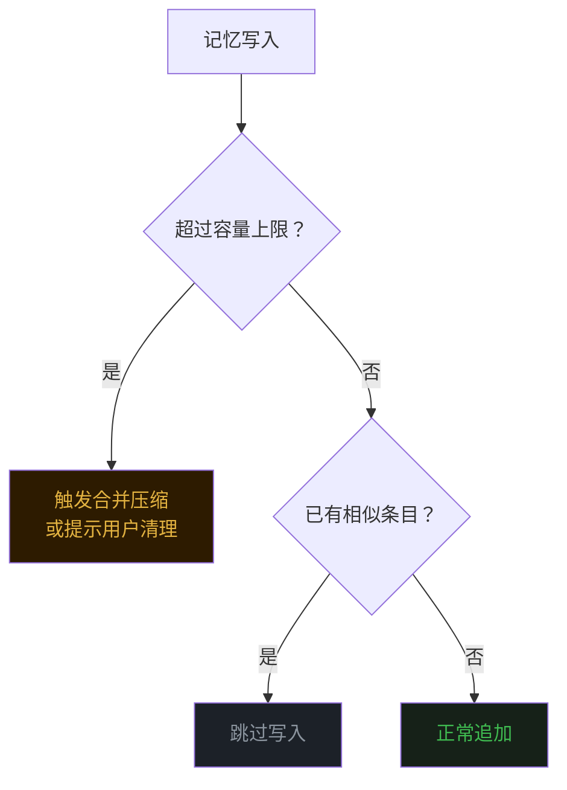
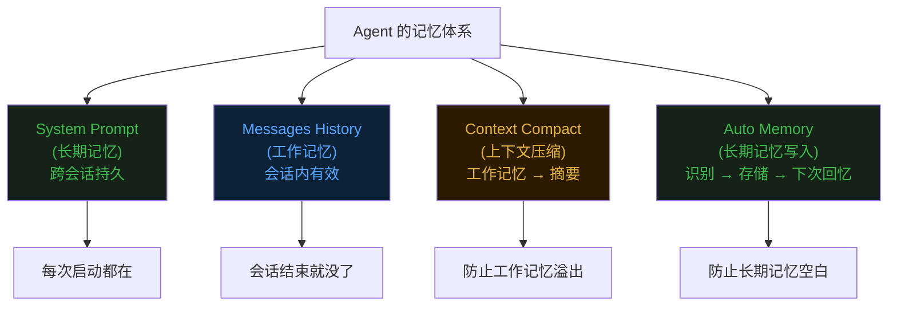

前十篇文章分别讲了 Agent 的 [Loop](https://mp.weixin.qq.com/s/dkdrwVlwe3IkH2hzSzy53A)、[Tools](https://mp.weixin.qq.com/s/xyX4_CF5cveezEDuzFT13g)、[上下文记忆](https://mp.weixin.qq.com/s/lguRAdxFoN22rqPyx3BIzw)、[Context Compact](https://mp.weixin.qq.com/s/YRS29wRckEmFgNb0eJrxrQ)、[MCP](https://mp.weixin.qq.com/s/rCnGif8Ee7JhRI86-RoNWA)、[Skill](https://mp.weixin.qq.com/s/X2ie0aQ2vMtddAQrkbOG5g)、[TUI](https://mp.weixin.qq.com/s/fBNFZvOOpwCPT7yysh5YkQ)、[TODO](https://mp.weixin.qq.com/s/UIlEXIuQdacowdrIg1nrDQ)、[Subagent](https://mp.weixin.qq.com/s/LfgDcv27vjlmLZ9NfvQ9LA) 和 [Command](https://mp.weixin.qq.com/s/M1jxdA4BysQkaN7p4hwneQ)。  


这篇聊一个很多人用 Agent 时都会抱怨的问题——**跨会话失忆**。  


## 一、Agent 的失忆症


第三篇文章说过，LLM 的"记忆"本质上就是你每次塞给它的 messages 数组。  


会话内，messages 一直在滚动积累，Agent 记得你前面说过什么。  

但问题是，**会话一结束，messages 就清零了。**  


下一次你打开 Agent，它就像一个崭新的实习生，对你项目里的一切一无所知。  


你上次跟它说"我的项目用 Go 写的，构建命令是 make build"，它忘了。  

你前天反复纠正它"别用 fmt.Println 打日志，用 slog"，它还是忘了。  

你上周让它"commit message 用英文"，它照样忘了。  


每次新会话都要重复同样的话，像是在反复训练一个金鱼。  


这种体验的根源在于：第三篇讲的 messages 历史，本质上是**短期记忆**——活在单次会话里，会话结束就蒸发。  





而一个真正好用的 Agent，需要的是**长期记忆**——能跨越会话边界，持久保存，下次自动想起来。  


这就是 Auto Memory 要解决的问题。  


## 二、什么是 Auto Memory


Auto Memory，直译是"自动记忆"。  

核心思想用一句话概括：**让 Agent 自动识别、持久保存、按需回忆重要信息，跨越会话边界。**  


拆开来看，有三个关键动作。  


**识别。** 不是所有对话内容都值得记住。你问 Agent"今天几号"，这不需要记住。但你说"我们项目的 API 前缀统一用 /api/v2"，这需要记住。Agent 要能区分"临时信息"和"持久知识"。  


**保存。** 识别出来的重要信息，要落盘。不管存成文件还是数据库，关键是断电不丢。  


**回忆。** 下次新会话开始时，Agent 要能把之前存下的信息取出来，注入到当前上下文里。这样它就"记得"了。  


打个比方。  


你有一个助理，每天下班前会把今天工作中学到的重要信息写到笔记本上。第二天上班，先翻一遍笔记本，然后再开始工作。  

笔记本里记的不是每句话的流水账，而是浓缩后的关键知识。  


Auto Memory 就是这个笔记本。  





## 三、记什么：信息的分类


并不是所有信息都适合塞进长期记忆。  

记太多，System Prompt 膨胀，浪费 token，还会干扰 LLM 的判断。  

记太少，Agent 又频繁失忆。  


业界的普遍做法是把信息分成几个层次。  


**用户偏好。** 比如"回答用中文"、"代码风格偏好 4 空格缩进"、"commit message 用英文"。这类信息一旦确定，几乎不会变，优先级最高。  


**项目知识。** 比如"构建命令是 make build"、"测试用 go test ./..."、"主入口在 src/main.go"。和具体项目绑定，换了项目就不适用。  


**事实记录。** 比如"上次我们把 API 从 v1 迁移到了 v2"、"昨天修了一个并发 bug，根因是缺少互斥锁"。这类信息有时效性，可能过一段时间就过期了。  


**会话摘要。** 上一次会话的浓缩总结，帮 Agent 快速找回上次的工作状态。  


这几类信息的特征不同，存储和过期策略也应该不同。  





用户偏好是"宪法"，轻易不改；项目知识是"工作手册"，跟着项目走；事实记录是"工作日志"，定期归档；会话摘要是"交接备忘"，用完即弃。  


## 四、怎么记：两种触发方式


记忆的写入有两种触发模式。  


**显式触发。** 用户明确告诉 Agent"记住这个"。比如输入 `/remember 构建命令是 make build`，Agent 就把这条信息存下来。这是最确定的方式，用户完全掌控。  


**隐式触发。** Agent 在对话过程中自动判断"这条信息似乎值得记住"，不需要用户主动说。比如用户反复纠正同一个错误，Agent 就自动把正确做法记下来。  


显式触发实现简单，用户体验也直观。  

隐式触发更智能，但难度也更大——判断"什么值得记"是一个开放性问题，可能记了一堆垃圾，也可能遗漏了关键信息。  





两种方式不是互斥的，最好的设计是两者并存。  

显式触发保证用户有最终控制权，隐式触发减少用户的心智负担。  


## 五、怎么想起来：记忆的注入时机


光存下来还不够。  

存了一堆信息，如果 Agent 启动时不去读，等于没存。  


记忆的回忆（注入）有两个关键决策点。  


**什么时候注入？**  

最常见的做法是在会话启动时，把所有持久记忆一次性注入到 System Prompt 里。Agent 每次启动，先"回忆"一遍，然后再开始工作。  

这是 Claude Code 的做法——每次启动，自动把 `memory.md` 的内容拼进系统提示词。  


另一种做法是按需注入。只有当对话内容和某条记忆相关时，才把它取出来。这更省 token，但实现复杂度也更高，通常需要向量检索。  


**注入到哪里？**  

最直接的做法是追加到 System Prompt 尾部。System Prompt 本身就是"Agent 每次都能看到"的内容，把长期记忆放在这里，天然不会被对话增长冲掉，也不会被上下文压缩误删。  





回顾第三篇的内容，System Prompt 是独立于 messages 的，不会被 Context Compact 压缩掉。  


这意味着注入到 System Prompt 的长期记忆，在整个会话生命周期内始终可见。  


这正是我们想要的——**长期记忆不会因为对话变长而"被遗忘"。**  


## 六、存在哪里：存储方案的选择


持久记忆最终要落盘。  

存储方案的选择，取决于你对"记忆"的定位。  


**纯文件方案。** 在项目目录下建一个 `memory/` 目录，里面有一个 `MEMORY.md` 作为索引文件，其他文件是具体的记忆内容。Agent 启动时只读取索引文件 `MEMORY.md`，索引里记录了每条记忆的摘要和它对应的详情文件路径。需要深入了解某条记忆时，再去读具体文件。  

这种"索引 + 详情"的结构，既控制了启动时注入的 token 量（只注入索引），又保留了完整信息的可追溯性（详情文件随时可读）。  

优点是实现简洁，用户可以直接用编辑器查看和修改，也方便随项目一起版本控制。  

缺点是语义检索能力弱，需要靠文件命名和索引摘要来定位信息。  


**结构化存储方案。** 用 JSON 或 SQLite 存储，每条记忆带上元数据：类别、时间戳、优先级、过期时间。启动时按条件筛选，只注入相关的那些。  

优点是灵活、可查询、支持过期清理。  

缺点是实现成本更高，用户手动编辑不方便。  


**向量数据库方案。** 把每条记忆做 embedding，存进向量库。对话时根据当前话题检索最相关的记忆注入。  

优点是可以做到语义级别的"按需回忆"。  

缺点是太重了，对一个本地 Agent 来说是过度设计。  





对大多数本地 Agent 来说，**纯文件方案是起步的最优选**。  

简单、透明、用户可控。等真正遇到瓶颈了，再往结构化方向演进也不迟。  


## 七、evo-agent 的设计思路


evo-agent 的 Auto Memory 采用**文件存储 + 索引注入**的方案。  


**存储结构。** 在项目目录下的 `.evo-agent/` 里，新建一个 `memory/` 子目录。核心是一个 `MEMORY.md` 索引文件，加上若干具体的记忆详情文件：  


```
.evo-agent/
├── memory/
│   ├── MEMORY.md              # 索引文件（启动时注入）
│   ├── user.md                # 详情：用户信息
│   └── current_year.md        # 详情：当前年份
├── mcp.json
├── skill/
└── command/
```


`MEMORY.md` 是索引，记录每个详情文件的名称和一句话描述。启动时只注入这个文件的内容，控制 token 用量。  


其他 `.md` 文件是具体的记忆详情，带有 YAML frontmatter 元数据和正文内容。当 Agent 在工作中需要深入了解某条记忆时，可以通过 `read_file` 工具去读取对应的详情文件。  


索引文件大致长这样：  


```markdown
- [User](user.md) — Information about the user's name, interests, and birth year.
- [Current Year](current_year.md) — The current year is 2026.
```


每个条目是一个 Markdown 链接加上一句话描述。Agent 看到索引就知道有哪些知识可用，需要具体内容时再去读对应文件。  


详情文件的结构是 YAML frontmatter 加正文：  


```markdown
---
name: user
description: Information about the user, including name, interests, and birth year.
type: user
---

### User Name
The user's name is 天空柚子.

### User Interests
The user enjoys rock climbing.

### User Birth Year
The user was born in 1990.

```


frontmatter 里的 `type` 字段区分记忆类别：`project` 是项目知识，`user` 是用户偏好。  


所有文件都是纯 Markdown，用户可以随时打开编辑器查看和修改。  


**写入方式。** 通过一个 `remember` 工具触发，也支持 `/remember` 命令。  

用户对 Agent 说"记住：构建命令是 make build"，Agent 调用 `remember` 工具。工具会做两件事：创建一个带 frontmatter 的详情文件，然后在 `MEMORY.md` 索引里注册这条记忆。  





**读取时机。** 在 `config.Load()` 阶段，自动检查 `.evo-agent/memory/MEMORY.md` 是否存在。如果存在，就把索引文件的内容拼接到 System Prompt 尾部。  


```go
// config.go 伪代码
func Load() *Config {
    cfg := &Config{
        SystemMsg: fmt.Sprintf("You are a coding agent at %s.", cwd),
    }

    // 加载持久记忆索引
    memIndex := filepath.Join(cwd, ".evo-agent", "memory", "MEMORY.md")
    if content, err := os.ReadFile(memIndex); err == nil && len(content) > 0 {
        cfg.SystemMsg += "\n\n<memory>\n" + string(content) + "\n</memory>"
    }

    return cfg
}
```


用 `<memory>` 标签包裹，让 LLM 明确知道这是"之前记住的信息"，和系统指令区分开。  

注意只注入索引文件，不注入所有详情文件。Agent 工作时如果需要详情，可以自己用 `read_file` 去读。  


**这样做的好处。** 项目知识可能很庞大——构建流程、部署步骤、API 设计文档，加起来可能有几千行。如果全量注入 System Prompt，直接占满 token 预算。而索引文件只有每个分类的一句话描述，通常不超过十几行，极其轻量。  


## 八、remember 工具的实现


和其他工具一样，`remember` 遵循 evo-agent 的自注册模式。  


在 `tools/` 目录下新增一个 `remember.go`，`init()` 里调用 `Register()`，完成注册。  


工具接收三个参数：`name`（记忆名称）、`description`（一句话描述）、`content`（要记住的内容）。  


执行逻辑分两步：先创建带 frontmatter 的详情文件，再把这条记忆注册到 `MEMORY.md` 索引里。  


```go
// tools/remember.go 伪代码
func handleRemember(input json.RawMessage) (string, error) {
    memDir := filepath.Join(".evo-agent", "memory")
    os.MkdirAll(memDir, 0755)

    // 1. 创建详情文件（带 frontmatter）
    detailPath := filepath.Join(memDir, params.Name+".md")
    detail := fmt.Sprintf("---\nname: %s\ndescription: %s\ntype: project\n---\n\n%s\n",
        params.Name, params.Description, params.Content)
    os.WriteFile(detailPath, []byte(detail), 0644)

    // 2. 在索引文件中注册
    indexPath := filepath.Join(memDir, "MEMORY.md")
    entry := fmt.Sprintf("- [%s](%s.md) — %s\n", params.Name, params.Name, params.Description)
    appendIfNotExists(indexPath, entry)

    return "Remembered: " + params.Description, nil
}
```


这个实现足够简单，但已经能覆盖绝大多数场景。  

用户说"记住 X"，Agent 调 remember 工具，创建详情文件并注册到索引。  

下次启动，索引出现在 System Prompt 里，Agent 知道有哪些知识可用，需要时自己去读对应文件。  


## 九、防膨胀：记忆不是越多越好


一个容易踩的坑是：记忆无限增长，最后 System Prompt 塞了几千行，反而拖累了 Agent 的表现。  


这里需要一些约束机制。  


**总量限制。** 设定一个上限，比如 MEMORY.md 索引最多 2000 字符。快要超的时候，提示用户清理或者 Agent 自动做一次合并压缩。  


**去重。** 写入前检查是否已经存在语义相近的条目。用户说了两次"用 slog 不用 fmt.Println"，只需要记一条。  


**过期清理。** 事实类记忆带上时间戳，超过一定天数自动标记为过期，不再注入。  


**分级注入。** 不是每次都把所有记忆全塞进去。用户偏好每次都注入（量小、重要），会话摘要只在首次启动时注入（用完就丢），项目知识按需注入。  





记忆系统和上下文压缩面临同样的核心矛盾：**有限的空间 vs 无限的信息。**  

解法也是同一个思路——**该忘的忘，该记的记，重要的留在最前面。**  


## 十、和第三篇的关系


回到开头提到的第三篇——"Agent 的记忆：提示词与对话历史"。  


那篇讲的是 Agent 在**一次会话内**怎么"记住"事情。  

答案是靠 messages 数组——每次把整段对话历史塞给 LLM，它就"想起来"了。  


这篇讲的是 Agent **跨会话**怎么"记住"事情。  

答案是靠持久化的文件——启动时自动读取，注入到 System Prompt。  


两者的关系，可以类比人的记忆系统。  


messages 是**工作记忆**（working memory）——当前你正在思考的东西，容量有限，用完就丢。  


Auto Memory 是**长期记忆**（long-term memory）——沉淀下来的知识和经验，持久保存，需要时调出来。  


Context Compact（第四篇）则是**工作记忆内部的压缩整理过程**——把即将溢出的工作记忆，压缩成摘要存起来。  





四者合在一起，才构成了 Agent 完整的记忆架构。  


## 十一、最后


Auto Memory 要解决的问题其实很朴素：**让 Agent 像人一样，记得住跨天的事。**  


实现也不需要多复杂。  

一个索引文件做摘要，若干详情文件存完整知识，一个工具负责写入，启动时读取索引注入 System Prompt。  

加上基本的去重和容量管理，就已经能覆盖 80% 的场景。  


evo-agent 的做法就是这么直接。  

`.evo-agent/memory/MEMORY.md` 作为索引注入 System Prompt，详情文件按分类存放供按需读取。  

一个 `remember` 工具负责写入，一个 `/remember` 命令负责用户主动触发。  


没有向量库，没有复杂的检索管线，没有 embedding 模型。  

纯文件、纯文本、纯 System Prompt 注入。  


这不是说那些高级方案没用。  

而是说**对一个本地 Agent 来说，先把最简单的事做对，比堆砌架构更重要。**  


用户需要的不是一个拥有完美记忆力的 AI，而是一个能记住"构建命令是 make build"这种基本事实的助手。  


先做到这一步，就已经比"每次从零开始"的体验好太多了。  


《完》  


-EOF-  


本文公众号：天空的代码世界  
个人微信号：tiankonguse  
公众号ID：tiankonguse-code  
