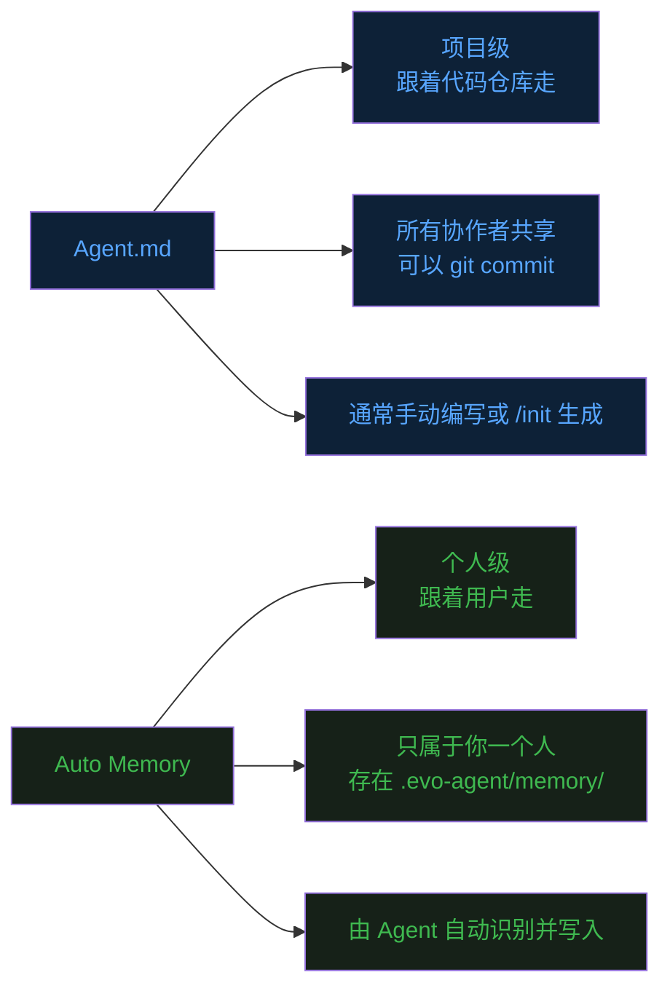
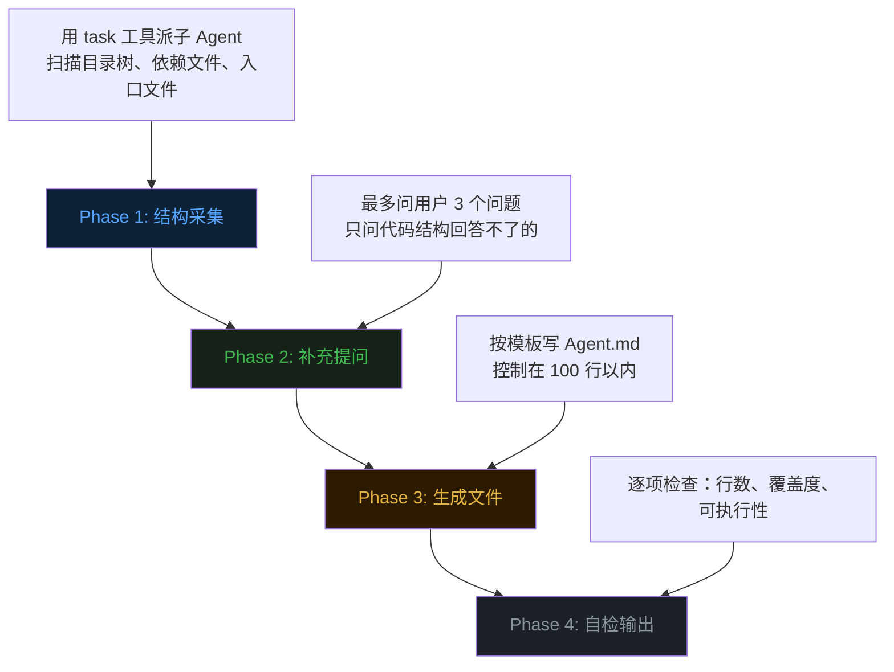
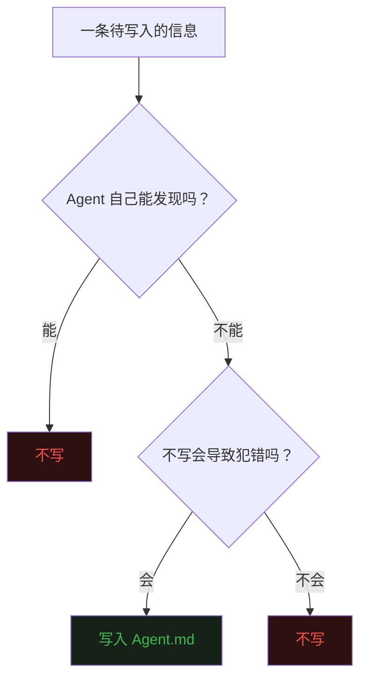

前十一篇文章分别讲了 Agent 的 [Loop](https://mp.weixin.qq.com/s/dkdrwVlwe3IkH2hzSzy53A)、[Tools](https://mp.weixin.qq.com/s/xyX4_CF5cveezEDuzFT13g)、[上下文记忆](https://mp.weixin.qq.com/s/lguRAdxFoN22rqPyx3BIzw)、[Context Compact](https://mp.weixin.qq.com/s/YRS29wRckEmFgNb0eJrxrQ)、[MCP](https://mp.weixin.qq.com/s/rCnGif8Ee7JhRI86-RoNWA)、[Skill](https://mp.weixin.qq.com/s/X2ie0aQ2vMtddAQrkbOG5g)、[TUI](https://mp.weixin.qq.com/s/fBNFZvOOpwCPT7yysh5YkQ)、[TODO](https://mp.weixin.qq.com/s/UIlEXIuQdacowdrIg1nrDQ)、[Subagent](https://mp.weixin.qq.com/s/LfgDcv27vjlmLZ9NfvQ9LA)、[Command](https://mp.weixin.qq.com/s/M1jxdA4BysQkaN7p4hwneQ) 和 [Auto Memory](https://mp.weixin.qq.com/s/wEQwMadb84ixfVXteNfESA)。  


这篇聊一个看似简单、但对 Agent 实际表现影响极大的东西——**Agent.md**。  


## 一、一个常见的崩溃场景


你第一次在一个新项目里启动 Agent。  

你说"帮我跑一下测试"。  

Agent 自信地执行了 `npm test`。  

然后报错了——因为这是一个 Go 项目，测试命令是 `cd src && go test ./...`。  


你纠正它，它改过来了。  

然后你说"帮我构建"。  

它执行了 `go build`。  

又错了——构建命令是 `make build`，因为有交叉编译配置。  


类似的错误会反复出现：用了错的包管理器、在错的目录执行命令、不知道项目的禁区在哪里。  


问题的根源很清楚：**Agent 对你的项目一无所知。**  


它只有一个通用身份——"You are a coding agent"。  
它不知道你的项目用什么语言，不知道构建系统怎么配置，不知道哪些目录不能乱动。  


上一篇的 Auto Memory 能部分解决这个问题——你可以用 `/remember` 让它记住构建命令。  

但 Auto Memory 是**个人向**的。它记的是"你"的偏好和经验，存在你本地的 `.evo-agent/memory/` 里。  


如果换一个同事来用同一个项目的 Agent，他需要从头再来一遍。  


我们需要的，是一种**项目级别**的知识文件——跟着项目走，不跟着人走。  

任何人在这个项目里启动 Agent，都能自动获得这份知识。  


这就是 Agent.md 的定位。  


## 二、Agent.md 是什么


定义：**Agent.md 是一份放在项目根目录的 Markdown 文件，启动时自动注入到 Agent 的 System Prompt，为 Agent 提供项目级别的工作指南。**  


如果你用过 Claude Code，那你对 CLAUDE.md 一定不陌生——它就是 Claude Code 版本的 Agent.md。  

Cursor 有 `.cursorrules`，Copilot 有 `.github/copilot-instructions.md`。  

本质上是同一个东西：**给 AI 助手一份项目说明书。**  


它不是 README。  

README 是给人类开发者看的，可以很长、很详细、图文并茂。  

Agent.md 是给 LLM 看的，必须精简、直接、只包含"没有它 Agent 就会犯错"的信息。  


打个比方。  

README 是新员工入职时领到的那本《员工手册》——公司历史、组织架构、福利制度，洋洋洒洒几十页。  

Agent.md 是带你的师兄第一天拉着你说的那几句话——"构建用 make build"、"别碰 prod 目录"、"commit message 用英文"。  


师兄说的那几句话，信息密度极高，每一句都能帮你避免一个坑。  

Agent.md 追求的就是这种效果。  


## 三、Agent.md vs Auto Memory


这两者看起来功能相近——都是给 Agent 注入额外知识，都持久化，都在启动时加载。  

但它们的定位完全不同。  





**Agent.md 是"项目的公共知识"。** 它告诉 Agent：这个项目用什么技术栈、怎么构建、有什么约定。这些信息对所有使用该项目的开发者都一样，可以随代码仓库一起版本控制。  


**Auto Memory 是"你的个人偏好"。** 它告诉 Agent：你喜欢什么样的代码风格、你上次做到哪了、你反复纠正过什么错误。这些信息因人而异，不适合提交到代码仓库。  


两者不是替代关系，而是互补关系。  

Agent 启动时，先读 Agent.md 获取项目知识，再读 Auto Memory 获取个人偏好。  

两层知识叠加，Agent 才能既懂项目，又懂你。  


## 四、Agent.md 里该写什么


核心原则：**如果没有这行信息，Agent 会犯错吗？如果不会，就别写。**  


Agent.md 不是文档，不是教程，不是项目介绍。  

它是一份"防错清单"。  


以 evo-agent 自身的 Agent.md 为例：  


```markdown
# Agent.md

This file provides guidance to evo-agent when working with code in this repository.

## Build and Run
- Build: `make build`
- Add dependencies: `make deps`
- Run (TUI): `make run`
- Run (Plain REPL): `./build/evo-agent --plain`

## Testing
- Test all: `cd src && go test ./...`

## Environment Variables
- Required: `ANTHROPIC_API_KEY`, `MODEL_ID`

## Architectural Notes & Gotchas
- **Tool Registration**: Add new tools in `src/internal/tools/` using the `init()` pattern.
- **Large Outputs**: Outputs >30,000 chars are truncated and saved to `.evo-agent/tool-results/<id>.txt`.
- **Subagent Recursion**: The `task` tool strips itself from child agents.
```


总共 20 行。没有废话。每一行都在回答一个具体的问题：怎么构建？怎么测试？有什么坑？  


一个好的 Agent.md 通常包含这几类信息。  


**命令。** 构建、测试、部署的实际命令。不是"请参考 Makefile"，而是可以直接复制粘贴执行的完整命令。Agent 遇到最多的错误就是执行了错误的命令，把正确命令写在这里能避免大量无效尝试。  


**架构约定。** 项目的核心架构约束——比如 evo-agent 里"新工具必须用 init() 自注册模式"。如果 Agent 不知道这个约定，它加新工具时可能会在 main.go 里手动注册，破坏整个代码风格的一致性。  


**禁区。** 不能做什么，比"能做什么"更重要。比如"不要直接修改 generated/ 目录下的文件"、"不要在 main 分支直接 push"。Agent 没有人类的"常识"，你不明确禁止的事，它都可能去做。  


**环境依赖。** 必须设置的环境变量、必须安装的工具。Agent 不会猜测你的环境配置，告诉它需要什么，它才能正确判断报错原因。  


## 五、evo-agent 的加载机制


Agent.md 的加载逻辑极其简单。  

在 `main.go` 里，`config.Load()` 之后，有这样一段代码：  


```go
// Load Agent.md into system prompt (if present in project root)
if agentMd, err := os.ReadFile(filepath.Join(cfg.ProjectDir, "Agent.md")); err == nil {
    cfg.SystemMsg += "\n\n# Project Guidance (Agent.md)\n\n" + string(agentMd)
}
```


就这么三行。读文件，拼进 System Prompt，完事。  


Agent 启动时就已经"知道"了它需要知道的一切。  


## 六、/init 命令：自动生成 Agent.md


手动写 Agent.md 当然可以。  

但如果项目结构复杂，一条一条梳理太费时间。  


evo-agent 提供了一个 `/init` 命令，让 Agent 自动分析项目结构并生成 Agent.md。  


这个命令的工作流分四个阶段。  





**Phase 1** 是全自动的信息收集。Agent 会派一个 Subagent 去扫描项目的目录结构、依赖文件（package.json、go.mod 等）、入口文件、README。注意它只看结构，不读全文件内容——这样既快又省 token。  


**Phase 2** 是有选择性的提问。如果 Phase 1 的信息足够回答所有问题，这一步直接跳过。只有当代码结构无法回答的信息——比如特殊的环境变量、非标准的分支策略——才会问用户，并且最多三个问题。  


**Phase 3** 是生成文件。按照一个精心设计的模板，把收集到的信息整理成结构化的 Agent.md。模板覆盖了项目概览、架构地图、开发约定和常用命令四个板块。  


**Phase 4** 是自我检查。生成之后，Agent 会用一套标准来审计自己写的 Agent.md：总行数是否超 100 行？命令是否真实可执行？是否有"禁止事项"？不通过就自己修正。  


这个设计体现了一个理念：**Agent.md 的生成本身就是 Agent 工作的绝佳场景。** 它需要读文件、分析结构、做判断、和用户交互——这些正是 Agent 擅长的事。  


## 七、设计原则：少即是多


Agent.md 最容易犯的错是写太多。  


新手的典型做法是把 README 复制一份，或者把所有文件的功能列一遍。  

结果 Agent.md 变成了几百行的文档，Agent 反而更难从中找到关键信息。  


evo-agent 的 `/init` 命令内置了一个自检标准，其中最重要的一条是：  


**"Would removing this line cause the agent to make mistakes? If no, cut it."**  


每一行都要过这个筛子。  


"项目用 Go 写的"——如果 go.mod 文件存在，Agent 自己能发现，不需要写。  

"src/main.go 是入口"——Agent 会自己找 main 函数，不需要写。  

"构建命令是 make build"——Agent 不一定知道你有 Makefile 且构建走 make，需要写。  

"工具注册必须用 init() 模式"——Agent 看不出这个约定，需要写。  





这个原则的好处是双重的。  

一方面，Agent.md 保持精简，不浪费 token 预算。  

另一方面，Agent.md 里留下的每一行都是高价值信息，Agent 会更加"重视"它们。  


## 八、最后


Agent.md 解决的问题很朴素：**让 Agent 在第一次进入一个项目时，就知道不该犯的错。**  


不需要花哨的实现。读一个文件，拼进 System Prompt，三行代码。  

重要的不是代码怎么写，而是文件里**该写什么**。  


好的 Agent.md 像一位经验丰富的师兄，用最少的话告诉你最关键的几件事。  

坏的 Agent.md 像一本没人看的操作手册，什么都写了等于什么都没写。  


evo-agent 的做法是：提供 `/init` 命令做自动生成，内置自检标准做质量把关，控制总量在 100 行以内。  

生成之后，用户可以随时手动编辑——毕竟你比 Agent 更清楚什么信息对这个项目最重要。  


从整个系列的视角看，Agent.md 是 Agent 知识体系的最后一块拼图。  


System Prompt 给了 Agent 通用身份。  

Agent.md 给了它项目知识。  

Auto Memory 给了它个人偏好。  

Skill 给了它专项能力。  


四者合一，一个既懂项目、又懂你、还有专业技能的 Agent，就齐活了。  


《完》  


-EOF-  


本文公众号：天空的代码世界  
个人微信号：tiankonguse  
公众号 ID：tiankonguse-code  
