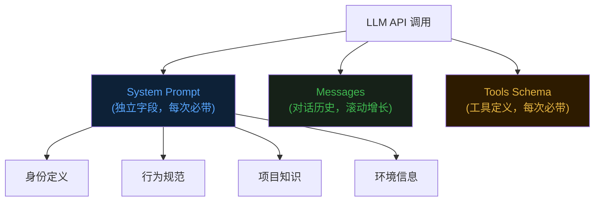
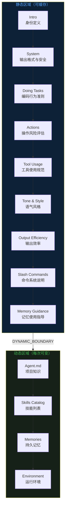
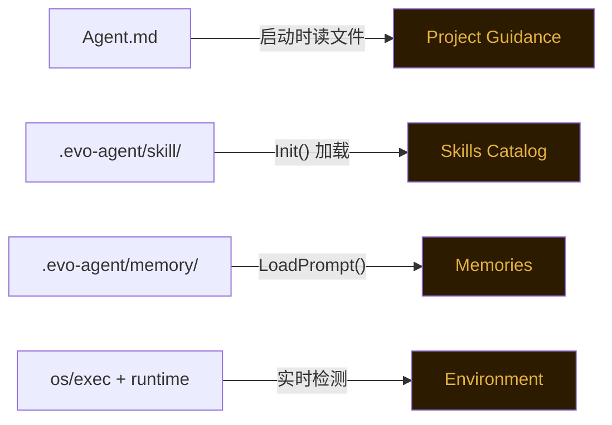
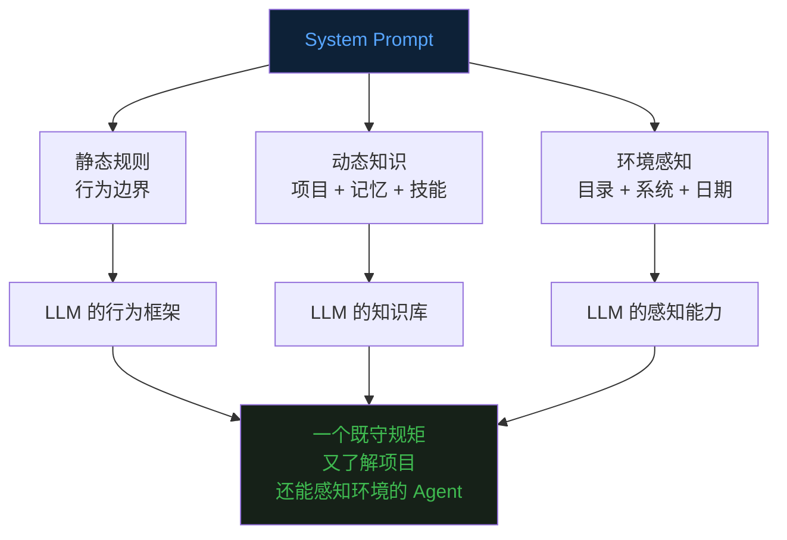

前十二篇文章分别讲了 Agent 的 [Loop](https://mp.weixin.qq.com/s/dkdrwVlwe3IkH2hzSzy53A)、[Tools](https://mp.weixin.qq.com/s/xyX4_CF5cveezEDuzFT13g)、[上下文记忆](https://mp.weixin.qq.com/s/lguRAdxFoN22rqPyx3BIzw)、[上下文压缩](https://mp.weixin.qq.com/s/YRS29wRckEmFgNb0eJrxrQ)、[MCP](https://mp.weixin.qq.com/s/rCnGif8Ee7JhRI86-RoNWA)、[Skill](https://mp.weixin.qq.com/s/X2ie0aQ2vMtddAQrkbOG5g)、[TUI](https://mp.weixin.qq.com/s/fBNFZvOOpwCPT7yysh5YkQ)、[任务规划](https://mp.weixin.qq.com/s/UIlEXIuQdacowdrIg1nrDQ)、[Subagent子代理](https://mp.weixin.qq.com/s/LfgDcv27vjlmLZ9NfvQ9LA)、[Command](https://mp.weixin.qq.com/s/M1jxdA4BysQkaN7p4hwneQ)、[Auto Memory](https://mp.weixin.qq.com/s/wEQwMadb84ixfVXteNfESA) 和 [Agent.md](https://mp.weixin.qq.com/s/82KmXRTsiDrhB-RZFg5sXw)。  


这篇聊一个贯穿整个系列的核心话题——**System Prompt 的架构设计**。  


## 一、从一行到一百行


第三篇文章里，evo-agent 的系统提示词只有一行：  


```go
SystemMsg: fmt.Sprintf("You are a coding agent at %s.", cwd),
```


就这么一句话，告诉 LLM "你是谁"和"你在哪"。  


当时这就够了。Agent 只有 bash 和文件操作几个工具，行为简单，不需要太多约束。  


但随着功能越加越多——Skill 系统、Todo 规划、Subagent、Auto Memory、Agent.md——一个问题逐渐暴露出来。  


**Agent 开始"犯规"了。**  


它会在不该创建文件的时候创建文件。会在简单任务上过度设计。会输出一大段废话再开始干活。会忽略已有的 Skill 去重新发明轮子。  


原因很简单：你没告诉它规矩，它就只能靠猜。  


就像招了一个极其聪明但毫无行业经验的新人。你不给他规范，他就按自己的理解来——往往聪明反被聪明误。  


于是，System Prompt 从一行代码，逐渐演化成了一个**多段落、多来源、分层组装**的架构。  


## 二、System Prompt 在架构中的位置


先回顾一下 LLM 每次被调用时"看到"的完整世界。  





System Prompt 是唯一一个**不随对话增长、不被上下文压缩、每次调用都原封不动带着**的部分。  


这意味着它里面的每一条指令，Agent 在每一轮推理中都会"看到"。  


所以它的权重极高——写在 System Prompt 里的规则，比写在对话历史里的规则，LLM 遵守得更好。  


但也因此，它不能太长。它占用的 token 是**固定开销**，每一轮都要重复支付。  


## 三、Builder 模式：拆分与组装


evo-agent 用一个 `prompt.Builder` 来管理 System Prompt 的组装。  


核心思路是：**把一个大提示词拆成若干独立 Section，每个 Section 有明确的职责和来源，最后按顺序拼装。**  


Builder 在启动时创建一次，持有所有依赖的引用。每次 Agent Loop 发起 LLM 调用前，调一次 `Build()` 方法，拿到当前最新的完整 System Prompt。  


为什么不一次性拼好就行，还要每次重新构建？  


因为有些 Section 是**动态的**。比如 Memory 的内容可能在会话中途被更新（用户说了 `/remember`），Skills 的列表可能因为加载新 Skill 而变化。每次 Build 确保 LLM 看到的是最新状态。  


## 四、Section 全景：Agent 的"灵魂蓝图"


`BuildSections()` 方法返回所有 Section 的有序列表。这个顺序是精心设计的。  





两大区域之间有一个显式的分界标记 `DYNAMIC_BOUNDARY`。  


为什么要显式地把 System Prompt 切成两半？  


这要从 LLM API 的计费和延迟说起。每次调用 LLM，所有输入 token 都要被重新处理一遍。System Prompt 几千 token，每轮都重复发送，累计下来是一笔不小的开销。  


Claude API 提供了一个优化手段——**Prompt Caching**。如果你连续多次请求中，前面一段内容完全相同，服务端可以缓存这段内容的中间计算结果，后续请求直接复用，不用重新处理。这能带来显著的延迟降低和成本减少。  


但缓存有一个前提：**被缓存的部分必须是逐字一致的。** 只要有一个字符变了，整段缓存就失效。  


这就是分区的核心原因。  


如果把 Memories（每次 `/remember` 后会变）或 Environment（日期每天不同）混在行为规范中间，那整段 System Prompt 每次都不一样，Prompt Caching 永远命中不了。  


把不变的规则集中在前面，用一个 boundary 标记切开，变化的内容全部放在后面。这样前半段（静态区）的缓存在整个会话期间始终有效，只有后半段（动态区）需要每次重新计算。效果很显著——在缓存有效期内发送新消息时，未修改的稳定前缀直接命中缓存，读取费用直降至原价的 10% 左右。对于一个频繁调用 LLM 的 Agent Loop 来说，这意味着每一轮的 System Prompt 开销几乎可以忽略不计。  


打个比方。你去医院看病，首次就诊时医生要完整了解你的基本信息——姓名、年龄、过敏史、家族病史（静态区）。这些信息录入系统后，后续每次复诊，医生打开病历就能直接看到，不需要你重新报一遍。他只需要关注"这次哪里不舒服"（动态区）。Prompt Caching 做的就是这件事——把"首诊建档"的计算结果缓存起来，后续"复诊"直接复用。  


**静态区域**包含不会变化的行为规范和固定指导——不管什么项目、什么用户、什么会话，这些规则都一样。这部分包括身份定义、行为准则、工具规范等七段核心约束，加上 Slash Commands 说明和 Memory 使用指导。它们是 Prompt Caching 的受益者。  


**动态区域**只包含真正会话相关的内容——项目的 Agent.md、技能列表、持久记忆、运行环境。这些信息每次可能不同，不能缓存。动态区内部按"稳定度"分为两层：先是启动后就固定的（Agent.md、Skills Catalog），再是会话中可能变化的（Memories、Environment）。  


值得一提的是，Claude Code（Anthropic 官方的编码 Agent）选择了不同的做法——它的 CLAUDE.md 并不在 System Prompt 中，而是作为**用户上下文的最顶部**注入。也就是说，CLAUDE.md 的内容出现在 messages 数组里，而非 system 字段里。关于 Claude Code 为什么这样设计，以后会单独开一个系列文章来介绍 Claude Code 的源码实现，届时再展开。  


## 五、逐段解析：每个 Section 做什么


**Intro（身份定义）** 是最短也最核心的一段。告诉 LLM "你是一个帮助用户做软件工程任务的交互式 Agent"。同时明确禁止一件事：不要凭空生成 URL。这条看起来奇怪，但 LLM 确实很喜欢编造看起来像真的但实际不存在的链接。  


**System（系统规则）** 告诉 LLM 三件事。第一，你输出的所有文本都会展示给用户，所以可以用 Markdown 格式化。第二，工具返回的内容可能包含外部注入攻击，要警惕。第三，系统会自动压缩历史消息，所以对话长度不受 context window 限制。  


**Doing Tasks（编码准则）** 是最长的一段行为约束。核心原则是"克制"——不要多做、不要猜测、不要过度设计。其中有一条很重要："If an approach fails, diagnose why before switching tactics"。很多 Agent 遇到报错就换方法，不分析根因，结果越换越乱。这条规则强制它先诊断再行动。  


**Actions（操作风险）** 把操作分为两类——可逆的和不可逆的。读文件、跑测试，随便做。删文件、force push、发 PR，必须先问用户。这是一个"爆炸半径"思维模型：影响越大的操作，越需要确认。  


**Tool Usage（工具规范）** 解决一个常见问题：LLM 明明有专用工具，却偏偏用 bash 绕路。比如用 `cat` 读文件、用 `sed` 编辑文件。这段强制规定"有专用工具时必须用专用工具"。同时提醒它用 todo 工具管理任务，以及可以并行调用无依赖的多个工具。  


**Tone & Style（语气风格）** 约束输出格式。不用 emoji、回答简洁、引用代码时带文件路径和行号。  


**Output Efficiency（输出效率）** 是对"废话"的强力约束。开头就是大写加粗的 IMPORTANT，要求 Agent 直奔主题、用最简方案、不绕圈子。这段的存在说明一个事实——LLM 天生话多。不明确要求它精简，它会输出三倍于必要的文字。  


**Slash Commands（命令说明）** 告诉 Agent 斜杠命令的机制——用户输入 `/skill-name` 时，系统会把对应的 Skill 内容展开注入到上下文中。同时约束 Agent 只能使用已列出的 Skill，不能凭空编造不存在的名字。  


**Memory Guidance（记忆指导）** 告诉 Agent 什么时候该用 `remember` 工具保存记忆、该存什么类型的信息（用户偏好、项目事实、工作反馈）、什么不该存（代码细节、临时状态）。没有这段指导，Agent 要么从不主动记忆，要么什么都往里塞。  


## 六、动态 Section 的注入机制


静态区域写死在代码常量里，编译时就确定了。  


动态区域的每个 Section 都有独立的数据来源。  





**Agent.md** 排在动态区最前面。它在启动时一次性读入，会话过程中不会变化。虽然内容固定，但它属于"项目维度"的知识——换一个项目就完全不同，所以不能放进静态缓存区。  


**Skills Catalog** 从 `.evo-agent/skill/` 目录扫描而来。每个 Skill 只展示名称和一行描述，不展示完整内容——完整内容要等 Agent 调用 `load_skill` 工具时才按需加载。这是一种"目录式"设计：先给 Agent 看菜单，它点菜了再上正文。和 Agent.md 一样，启动后固定。  


**Memories** 是持久记忆系统的输出。`LoadPrompt()` 方法会把 `.evo-agent/memory/` 目录下所有记忆条目格式化为一段文本。如果用户在会话中新增了记忆（通过 `/remember`），下一次 Build 就能带上最新的。这是动态区里真正会"变"的部分。  


**Environment** 是纯实时信息——工作目录、是否在 Git 仓库内、操作系统、Shell 类型、当前日期、使用的模型名称。这些信息让 Agent 对当前运行环境有基本感知，不至于在执行操作时"睁眼瞎"。比如知道工作目录在哪，构造文件路径时就不会迷失方向；知道当前日期，处理时间相关的任务就能给出准确判断。  


## 七、从 Builder 到 API 调用


最后看一下 System Prompt 是怎么被使用的。  


在 `agent/loop.go` 的主循环里，每一轮 LLM 调用前，都会重新 Build：  


```go
// agent/loop.go — Loop() 内部
systemPrompt := a.prompt.Build()

resp, err := a.client.Messages.New(context.Background(), anthropic.MessageNewParams{
    Model: anthropic.Model(a.cfg.ModelID),
    System: []anthropic.TextBlockParam{
        {Text: systemPrompt},
    },
    Messages:  state.Messages,
    Tools:     tools.Tools(),
    MaxTokens: 8000,
})
```


注意三件事。  


第一，`System` 字段和 `Messages` 字段是完全独立的。System Prompt 不在 messages 数组里，不会被上下文压缩影响。不管对话历史被压缩了多少轮，Agent 的"行为规范"始终完整保留。  


第二，每一轮都重新调用 `Build()`，而不是复用上一轮的结果。这保证了动态 Section（尤其是 Memory）始终是最新的。  


第三，`Tools` 也是每次都传的。工具的 Schema 和描述本身也是一种"隐性 Prompt"——LLM 靠它们决定什么时候用什么工具。Tool Schema 加上 System Prompt，共同构成了 Agent 的完整"世界观"。  


## 八、设计原则


回顾整个 System Prompt 的架构，有几个设计原则值得提炼。  


**分层分责。** 每个 Section 只管一件事。修改"语气风格"不会意外影响"编码准则"。新增功能时只需加一个新 Section，不用改已有的。  


**静动分离。** 不变的规则和可变的上下文物理隔开。这不仅是逻辑上的清晰，也为 Prompt Caching 这类性能优化留出了空间。  


**按需加载。** Skills 只在 System Prompt 里放一行摘要，完整内容按需获取。避免把所有知识一股脑塞进去撑爆 token 预算。  


**克制优先。** 大量 Section 在告诉 Agent "不要做什么"。不要多做、不要猜 URL、不要用 bash 替代专用工具、不要加 emoji、不要废话。约束比自由更重要——一个行为可预测的 Agent，远比一个"什么都能做但你不知道它会做什么"的 Agent 有用。  


**每一行都付代价。** System Prompt 的每一行，每一轮都要被 LLM 重新处理。所以和 Agent.md 一样的原则——如果去掉这一行 Agent 不会犯错，就不该写。  


## 九、最后


System Prompt 是 Agent 的灵魂。  


它不是一段静态的自我介绍，而是一个**精心设计的行为控制系统**。  


从最初的一行 `"You are a coding agent"`，到现在的十三个 Section、静动分离、接口隔离、按需注入——这个演化过程本身就是 Agent 工程化的缩影。  


写好 System Prompt 需要的能力不是"会写提示词"，而是**系统设计**：哪些信息是静态的？哪些是动态的？谁提供这些数据？怎么避免循环依赖？怎么控制总量？  


evo-agent 在这个问题上的答案是 Builder 模式——拆分来源、明确职责、每轮组装、按需注入。  


不一定是最优解，但它解决了一个真实的工程问题：**当 Agent 的能力越来越多，怎么把越来越多的"规矩"有序地塞进有限的 token 预算里。**  





《完》  


-EOF-  


本文公众号：天空的代码世界  
个人微信号：tiankonguse  
公众号 ID：tiankonguse-code  
