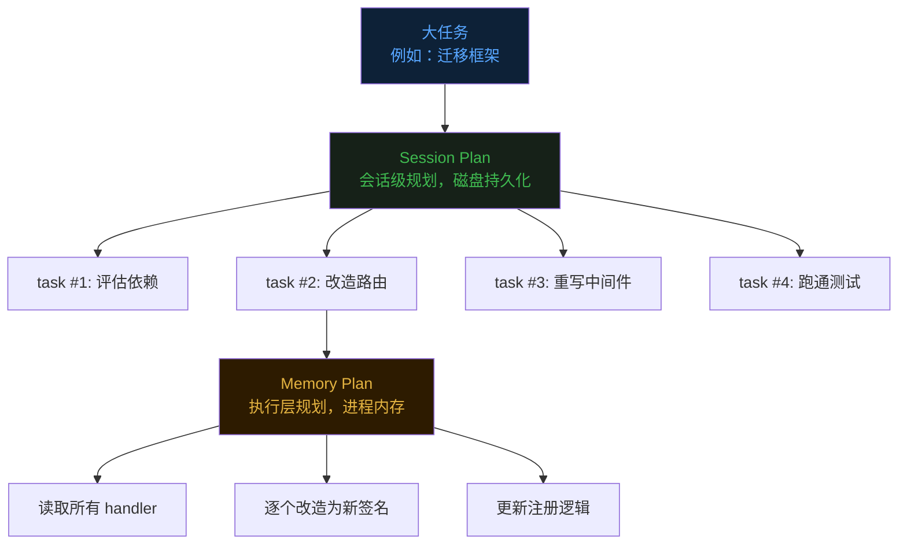
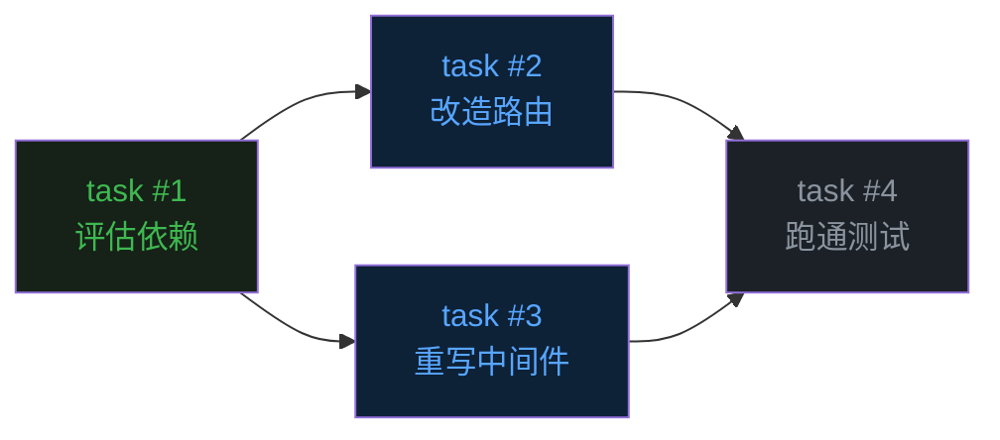
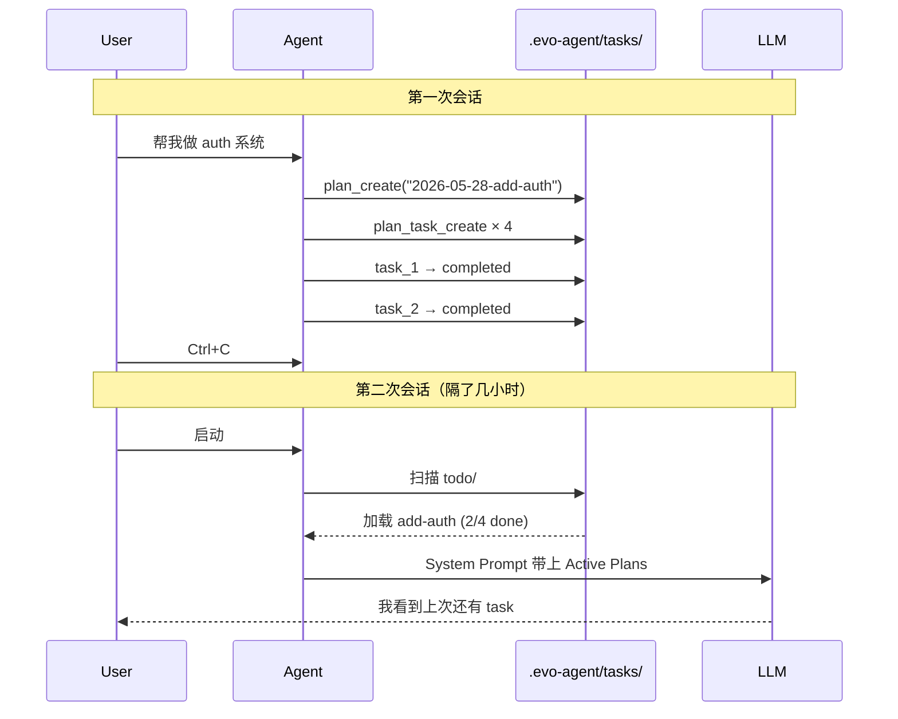
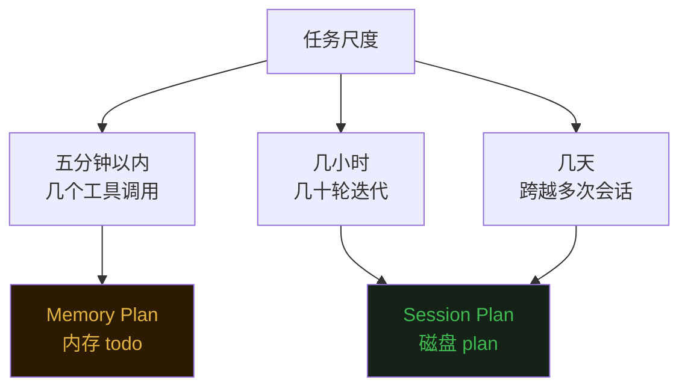

## 零、背景


前十三篇文章分别讲了 Agent 的 [Loop](https://mp.weixin.qq.com/s/dkdrwVlwe3IkH2hzSzy53A)、[Tools](https://mp.weixin.qq.com/s/xyX4_CF5cveezEDuzFT13g)、[上下文记忆](https://mp.weixin.qq.com/s/lguRAdxFoN22rqPyx3BIzw)、[上下文压缩](https://mp.weixin.qq.com/s/YRS29wRckEmFgNb0eJrxrQ)、[MCP](https://mp.weixin.qq.com/s/rCnGif8Ee7JhRI86-RoNWA)、[Skill](https://mp.weixin.qq.com/s/X2ie0aQ2vMtddAQrkbOG5g)、[TUI](https://mp.weixin.qq.com/s/fBNFZvOOpwCPT7yysh5YkQ)、[TODO 任务规划](https://mp.weixin.qq.com/s/UIlEXIuQdacowdrIg1nrDQ)、[Subagent 子代理](https://mp.weixin.qq.com/s/LfgDcv27vjlmLZ9NfvQ9LA)、[Command](https://mp.weixin.qq.com/s/M1jxdA4BysQkaN7p4hwneQ)、[Auto Memory](https://mp.weixin.qq.com/s/wEQwMadb84ixfVXteNfESA)、[Agent.md](https://mp.weixin.qq.com/s/82KmXRTsiDrhB-RZFg5sXw) 和 [System Prompt 架构](https://mp.weixin.qq.com/s/15mxhcDs1oWBwguF_IIZDg)。  


这篇聊一个第八篇 todo 工具留下的尾巴——**任务的持久化**。  


## 一、todo 工具的天花板


第八篇文章里，evo-agent 给 LLM 加了一个 `todo` 工具：每条任务有 pending、in_progress、completed 三种状态，最多 12 条，同一时刻只允许一条进行中。  


这套机制解决了"短任务里的迷路问题"——Agent 调几次工具不会忘了自己原本要做什么。  


但它有一个根本性的限制：**整张清单都活在进程内存里。**  


```go
// internal/tools/todo.go
type todoManager struct {
    mu                sync.RWMutex
    topic             string
    items             []todoItem  // ← 内存切片
    nextID            int
    roundsSinceUpdate int
}

var GlobalTodo = &todoManager{nextID: 1}
```


这意味着两件事会让计划"凭空消失"。  


第一种情况是**上下文压缩**。  


第四篇讲过，evo-agent 在历史接近 5 万字符时会触发 full compact——LLM 被请去把整段对话总结成一段摘要，然后用这段摘要重建消息列表。新的对话从一段总结开始，前面的工具调用记录都被收进了那段摘要里。  


todo 列表本身在内存里还在，但 LLM 已经看不到它"是怎么变成现在这样"的过程了。摘要里如果忘了带上"这一步还没做"这条信息，Agent 就真的不知道下一步该干啥了。  


第二种情况更直接——**进程退出**。  


你按了 Ctrl+C，或者重启电脑，或者会话被关掉。下次再打开 evo-agent，`GlobalTodo` 是一个全新的空结构体，刚才那张精心制定的计划灰飞烟灭。  


对于"写一个登录接口"这种十几分钟能搞完的任务，这没什么。  
对于"把这个项目从 Echo 框架迁移到 Gin"这种需要好几个小时、中间可能被打断好几次的大任务，这就是灾难。  


## 二、记忆要外置，进度也要外置


第八篇结尾留了一句话：**"LLM 负责推理，状态交给系统来管。"**  


第十一篇 Auto Memory 把"用户偏好"这种长期知识从内存搬到了磁盘。  


那么"任务进度"——尤其是大型任务的进度——是不是也应该搬到磁盘？  


答案是肯定的。这就是 evo-agent 引入第二套规划系统的动机。  


它不取代原来的 todo，而是和 todo 配成一对——**两层规划**。  





**Session Plan 是大任务的骨架。** 一个大任务被拆成若干个独立可交付的子任务，写到磁盘上，每个子任务有依赖关系。  


**Memory Plan 是某一个子任务内部的执行步骤。** 也就是原来的 todo 工具——还活在内存里，但生命周期短：开始一个 Session Plan 任务时初始化它，做完这个任务就重置。  


骨架在磁盘，肉在内存。骨架活得久，肉活得短。骨架决定方向，肉决定下一步动作。  


## 三、磁盘上的任务图


Session Plan 的存储结构非常直白——**每个 plan 就是一个目录，每个 task 就是一个 JSON 文件。**  


```
.evo-agent/tasks/
  todo/                            ← 进行中的 plan
    2026-05-28-add-auth/
      plan.md                      ← 需求分析 + 思路 + 步骤
      task_1.json                  ← 单个任务记录
      task_2.json
      task_3.json
  done/                            ← 已归档的 plan
    2026-05-20-fix-login/
      plan.md
      task_1.json
      task_2.json
```


几个设计细节值得展开。  


**`todo/` 和 `done/` 两个篮子。** 进行中的计划放在 `todo/`，做完的整体迁移到 `done/`。这是一个非常老派但极其有效的"看板"模型，一眼就能看出哪些事情在做、哪些事情做完了。  


**计划名字带日期前缀。** 命名规范是 `YYYY-MM-DD-描述`，比如 `2026-05-28-add-auth`。这样按文件名排序就是按时间顺序，很方便用 `ls` 命令直接看历史。  


**plan.md 是计划的"封面"。** 它包含三块内容：需求分析、技术思路、整体步骤。这部分是给 LLM 自己看的——下一次 Agent 启动时，它打开这个目录，先读 plan.md 就能"想起来"这个项目的来龙去脉。  


**task_N.json 是单个任务的状态机。** 每个文件就是一条任务记录：  


```json
{
  "id": 1,
  "subject": "Design auth schema",
  "description": "Create database migration for users table...",
  "status": "pending",
  "blockedBy": [],
  "blocks": [2, 3],
  "owner": ""
}
```


所有读写操作都直接打到磁盘。一条任务从 `pending` 变成 `completed`，本质上就是一次 `os.WriteFile`。  


进程崩了？没关系，文件还在。下次启动直接 `os.ReadDir` 就能恢复整个任务图。  


## 四、依赖图：让顺序变成数据


Session Plan 比内存版的 todo 多了一个核心能力——**任务之间可以有依赖关系。**  





依赖关系用两个字段来表达。`blockedBy` 是"我等谁做完"，`blocks` 是"谁等我做完"。这两个字段是**双向同步**的——你给 task #2 加上 `blockedBy: [1]`，系统会自动在 task #1 上写上 `blocks: [2]`。  


双向同步看起来多此一举——既然有了 `blockedBy`，`blocks` 完全可以临时算出来嘛。  


但实际上，这两个视图都很常用。  


你打开一个任务，想知道"我现在能不能开工"——查 `blockedBy` 是否为空。  
你做完一个任务，想知道"哪些人在等我"——查 `blocks` 列表。  


如果只存一个字段，另一个就要每次扫描整个目录算出来。同步存两份，两边都是 O(1) 查询。这就是 SQL 数据库里"反范式"那一套的微缩版——为了查询性能，主动接受一点冗余。  


## 五、提醒机制升级版


第八篇里 todo 工具有一个 3 轮提醒机制——连续三轮没有更新计划，就在工具结果里塞一条 `<reminder>`。  


Session Plan 用了同样的思路，只是间隔更长——**5 轮**。  


```go
// internal/tools/plan.go
const planReminderInterval = 5

func (pm *PlanManager) Reminder() string {
    if !pm.hasActiveTasks() || pm.roundsSinceUpdate < planReminderInterval {
        return ""
    }
    return "<reminder>You have an active session plan. Check plan_task_list and update task status.</reminder>"
}
```


为什么是 5 而不是 3？  


因为 Session Plan 的任务粒度更粗。一个 Memory Plan 的步骤可能就是"读这个文件"——一两轮就能干完。一个 Session Plan 的任务可能是"重写中间件"——里面包含好几次 todo 更新、十几次工具调用。如果用 3 轮间隔，提醒会来得太频繁，反而干扰 Agent 的连续思考。  


5 轮是一个"留出充分工作空间，又不至于忘到太久"的折中。  


另一个细节是触发条件——`hasActiveTasks()`。只有当前确实有 in_progress 任务时，提醒才会触发。如果你只是随便聊天，没启动任何大任务，系统不会无缘无故来提醒你"该更新计划了"。  


## 六、启动时的恢复


磁盘持久化最大的好处是**重启之后还能继续干活**。  


evo-agent 启动时，`InitPlan` 会把 `.evo-agent/tasks/todo/` 和 `done/` 目录建好（如果不存在），然后通过 `StartupSummary` 在终端打印当前的活跃计划：  


```
[Session Plan] Active tasks:
  ▸ 2026-05-28-add-auth [2/4 done]
    [x] #1: Design auth schema
    [x] #2: Implement JWT middleware
    [>] #3: Add login endpoint
    [ ] #4: Add logout endpoint
```


这段输出比单纯"还活着"更有意义——它把状态直接呈现给用户。你打开 evo-agent，第一眼就看到上次的进度，知道继续做什么。  


更重要的是这部分信息会进 System Prompt 的动态区。第十三篇讲过，System Prompt 有一段 `# Active Plans`，每次 Build 时都会从 `LoadPrompt()` 拉取最新的活跃计划：  


```go
// internal/tools/plan.go — LoadPrompt() 输出片段
# Active Plans
- 2026-05-28-add-auth [2/4 done] current: "Add login endpoint"
```


LLM 在每一轮思考前都会看到这一行——"哦，我有个 plan 在做，当前正在做登录接口"。这条信息让 LLM 哪怕在一段全新的、刚被压缩过的对话里，也能立刻找回上下文焦点。  





磁盘是 Agent 的"长期记忆器官"。从这个意义上讲，Session Plan 让 Agent 第一次拥有了**跨越会话的目标连续性**。  


## 七、最后


从第八篇的内存 todo，到这一篇的磁盘 Session Plan，evo-agent 用两个层次解决了 Agent 任务管理的两个不同尺度问题。  


短任务用 todo——快、轻、不留痕迹。  
长任务用 Session Plan——慢、重、能跨越压缩与重启。  


两者配合的威力在于：**Agent 既能在五分钟的小任务里保持专注，又能在跨越几天的大项目里保持方向。**  





写到这里有一个感慨。  


Agent 工程的很多设计，本质上都在做同一件事——**把 LLM 不擅长的事情，从它头脑里搬到外部系统里。**  


记忆容易遗忘？搬到磁盘做 Memory。  
进度容易混乱？搬到 todo 列表里。  
长任务容易丢失上下文？搬到 Session Plan 里。  


LLM 像一个聪明但记性不太好的实习生。给它一个能拍照、能写笔记、能存档案的办公环境，它就能完成超出"凭脑力记忆"边界的复杂工作。  


Session Plan 不是终点。当 Agent 接下来还要去管理"跨项目"、"跨用户"、"跨年"的任务时，它会继续演化——也许是数据库，也许是知识图谱，也许是某种向量存储。  


但底层的思路始终是同一个：**LLM 负责推理，状态交给系统来管。**  


《完》  


-EOF-  


本文公众号：天空的代码世界  
个人微信号：tiankonguse  
公众号 ID：tiankonguse-code  
