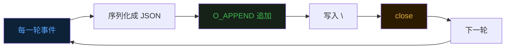
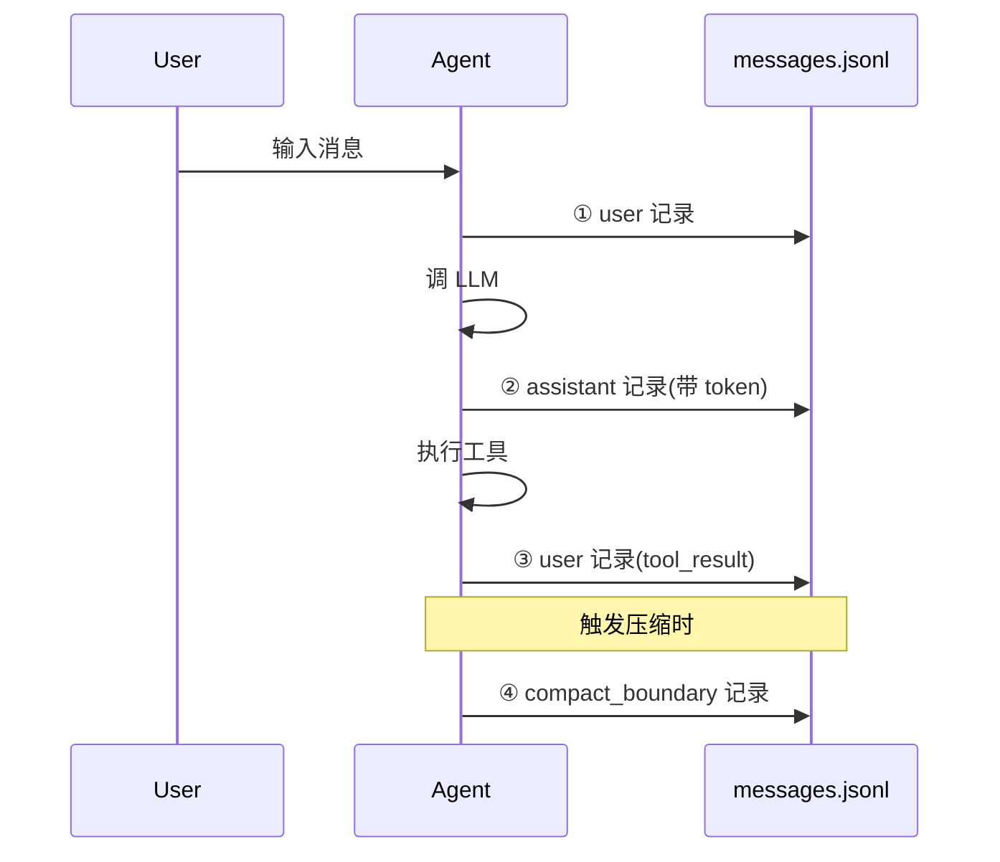
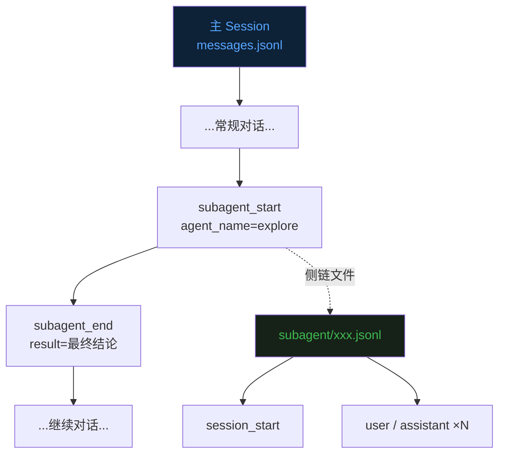
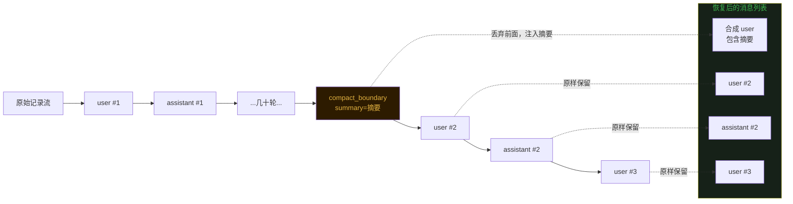
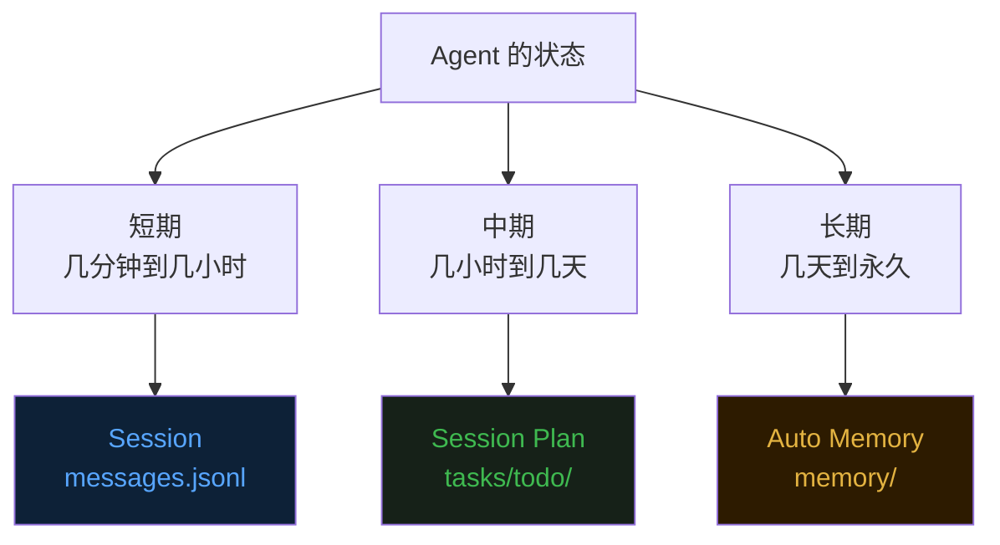

## 零、背景


前十四篇文章分别讲了 Agent 的 [Loop](https://mp.weixin.qq.com/s/dkdrwVlwe3IkH2hzSzy53A)、[Tools](https://mp.weixin.qq.com/s/xyX4_CF5cveezEDuzFT13g)、[上下文记忆](https://mp.weixin.qq.com/s/lguRAdxFoN22rqPyx3BIzw)、[上下文压缩](https://mp.weixin.qq.com/s/YRS29wRckEmFgNb0eJrxrQ)、[MCP](https://mp.weixin.qq.com/s/rCnGif8Ee7JhRI86-RoNWA)、[Skill](https://mp.weixin.qq.com/s/X2ie0aQ2vMtddAQrkbOG5g)、[TUI](https://mp.weixin.qq.com/s/fBNFZvOOpwCPT7yysh5YkQ)、[TODO 任务规划](https://mp.weixin.qq.com/s/UIlEXIuQdacowdrIg1nrDQ)、[Subagent 子代理](https://mp.weixin.qq.com/s/LfgDcv27vjlmLZ9NfvQ9LA)、[Command](https://mp.weixin.qq.com/s/M1jxdA4BysQkaN7p4hwneQ)、[Auto Memory](https://mp.weixin.qq.com/s/wEQwMadb84ixfVXteNfESA)、[Agent.md](https://mp.weixin.qq.com/s/82KmXRTsiDrhB-RZFg5sXw)、[System Prompt 架构](https://mp.weixin.qq.com/s/15mxhcDs1oWBwguF_IIZDg) 和 [任务持久化 Session Plan](https://mp.weixin.qq.com/s/86urMkNycEkI38KCoS0mxg)。  


这篇接着第十四篇的尾巴聊——**会话本身的持久化**。  


第十四篇把"任务进度"搬到了磁盘，但**对话历史依然只活在内存里**。你和 Agent 聊了一个多小时，它读了一堆代码、调了几十次工具、吐了几千 token 的思考——按一下 Ctrl+C，全部归零。下次启动时，Agent 又是一个崭新的、毫无记忆的新人。  


## 一、丢失的不只是消息


最朴素的理解里，"持久化对话"听起来就是把消息列表写到文件里。下次启动时再读回来。  


但真正用过 Agent 的人会发现，事情没这么简单。  


一段几小时长的会话里，**真正有价值的东西远不止 user/assistant 两类消息**。  


工具调用的入参和返回——Agent 读过哪些文件、跑过哪些命令、得到了什么输出。压缩边界——历史在哪一轮被摘要重建过，那段摘要的内容是什么。子代理的输出——某个 task 派出去的子 Agent 跑了 20 轮、最后回了一段结论。token 用量——这次会话累计花了多少钱。当时所在的 git 分支、工作目录、Agent 版本——这些都是排查"为什么当时它会那样做"时绕不开的环境信息。  


如果只存 user/assistant 消息，恢复出来的 Agent 就像一个失忆症患者——它能看到聊天记录，但不知道当时发生了什么、为什么自己这样回答、那段摘要从何而来。  


所以 Session 持久化要解决的真正问题是：**把一次会话所有可观察事件，按发生顺序，原样落到磁盘上**。  


## 二、为什么是 JSONL


agent 选择的存储格式非常简单——**JSON Lines**，一行一条 JSON 记录。  


```
.evo-agent/sessions/
  1780227556183_b525857d/
    messages.jsonl       ← 主轨迹
    meta.json            ← 元数据快照
    subagent/            ← 子代理侧链
      1780227612455_explore_a3f9.jsonl
```


为什么不用一个大 JSON 数组？  


因为 Agent Loop 是**流式产生事件**的——每一轮都会追加几条新记录。如果用一个完整的 JSON 数组，每次写入都需要"读出来 → 解析 → 追加 → 重新序列化 → 整体覆盖"，IO 量随时间线性增长。更糟的是，写到一半进程崩了，整个文件可能直接变成一段无效 JSON，读都读不出来。  


JSONL 把这些问题全部消解。每条记录独立一行，写入逻辑就是 `O_APPEND | O_CREATE | O_WRONLY`——文件指针自动跳到末尾，写一行字节加一个 `\n`，关闭。**任何时刻拉电源都最多丢失最后一行**，前面写好的内容永远是有效的。  


这是一种很老派的设计。日志、消息队列、事件溯源系统——大家都在用 append-only 的思路。原因是它**天然抗崩溃**：写入操作是原子的（一行不超过 PIPE_BUF 的话甚至能保证多进程并发追加不会交错），文件结构永远自洽，恢复逻辑只需要"从头扫到尾"。  





每次开关文件听起来很浪费。但 Session 写入是**低频操作**——人和 Agent 一来一回最多每秒一两次，文件 IO 在这个量级上完全不是瓶颈。换来的是简单到不会出 bug 的写入逻辑。  


## 三、Session ID 的小心思


会话目录名长这样：`1780227556183_b525857d`。  


前面是毫秒级 unix 时间戳，后面是 8 位十六进制随机串。中间用 `_` 分隔。  


```go
func NewSessionID() string {
    return strconv.FormatInt(time.Now().UnixMilli(), 10) + "_" + randHex(4)
}
```


为什么不用 UUID v4？为什么不用 ISO 时间戳？  


**毫秒前缀的妙处在于"字典序 == 时间序"。** `os.ReadDir` 返回的目录项默认按文件名字典序排列。把毫秒时间戳放在最前面，就意味着扫描整个 sessions 目录拿到的列表天然按时间排序，**不需要额外的 sort 步骤**。这对 `/resume` 的列表展示来说省下了一步代码。  


**8 位 hex 是"够用就好"的随机后缀。** 同一毫秒内启动两次 Agent 的概率本来就低，加上 32 位随机数，碰撞概率小到可以忽略。比 UUID 短得多，列表展示也更友好。  


**用 `_` 而不是 `-` 当分隔符。** 因为 agent 名字里可能本身就带 `-`（比如 `general-purpose`），用 `_` 分隔不会产生歧义。  


这个 ID 格式看起来微不足道，但每个细节都在为后续的"列表展示"和"文件解析"省工。  


## 四、写入的四个时机


写入 Session 的位置散落在 Agent Loop 里，但其实只有四个明确的钩子点。  





**用户消息进入时**——`agent.RunQuery` 把 raw text 包装成 `MessageParam` 送进 Loop 之前，先调 `recorder.AppendUser`。这是会话里"人开口"的第一手记录。  


**LLM 回复后**——`Loop` 里 `state.Messages = append(..., resp.ToParam())` 之后立刻 `recorder.AppendAssistant`，同时把 `resp.Usage.InputTokens` 和 `OutputTokens` 一起记下来。这两个数字是 meta.json 里"累计 token"的来源。  


**工具结果回流时**——工具执行完，结果作为 user 角色消息塞回 messages 切片，这一步同样要追加一条 user 记录。注意工具结果在 LLM API 里走的是 user role，所以记录类型也是 `user`。  


**Compact 触发时**——`agent.CompactHistory` 拿到摘要后，在内存消息列表被改写之前，先写一条 `compact_boundary` 记录，把摘要文本和当前是第几次 compact 一起存下来。这一条是恢复时最关键的"分水岭"。  


写入逻辑都封装在 `recorder.go` 里，调用方完全不需要关心序列化、文件路径、错误处理这些细节。**Best-effort 写入**——磁盘出错了打一行 stderr，不影响 Agent 继续聊天。这是个重要的工程取舍：Session 是辅助设施，不应该让 Session 故障拖死主流程。  


## 五、子代理的侧链


第九篇讲过 Subagent——主 Agent 派一个新 Agent 干一件独立的事，子 Agent 跑完只把最后一段文本传回来。  


这种"派单 → 执行 → 汇报"的模型在持久化上有个有趣的问题：**子代理产生的几十轮内部对话，要不要写到主 Session 里？**  


都写进去会污染主轨迹——主 Session 里突然冒出一堆子任务的 tool call，恢复时 Agent 看到的"对话流"和它当时实际看到的不一样。完全不写又会丢失子代理的全部细节，将来想复盘"子代理为啥下了这个结论"就没线索了。  


evo-agent 选择的是"侧链"模型。  


```
sessions/1780227556183_b525857d/
  messages.jsonl
  subagent/
    1780227612455_explore_a3f9.jsonl       ← 第一个子代理的完整轨迹
    1780227851229_review_b7e2.jsonl        ← 第二个子代理的完整轨迹
```


主 Session 里只写两条摘要——`subagent_start` 和 `subagent_end`。`subagent_start` 记录了"这一刻我派出了 agent X，它的轨迹文件在 subagent/xxx.jsonl"。`subagent_end` 记录了"agent X 跑完了，最终回我这段文字"。  


真正的子 Agent 内部对话独立写到 `subagent/` 目录下的侧链文件里。  





这个设计实际上是 git 的"submodule"思路——主仓库只引用子仓库的指针，子仓库的内容独立管理。  


好处有三个。  
**主轨迹保持线性**，恢复逻辑不用处理"对话流里嵌套对话"的复杂情况。  
**侧链文件可独立分析**，将来要做"子代理调用统计"，直接 `ls subagent/` 数文件即可。  
**调试时定位精确**——主轨迹给你一个时间点和文件名，一跳就能跳到子代理当时的完整执行轨迹。  


## 六、Compact Boundary：恢复的水位线


JSONL 完整地记录了所有事件。但**恢复时不能把所有事件原样回放**。  


问题出在 compact。  
第四篇讲过，Agent 历史接近 5 万字符时会触发 full compact——LLM 把整段对话总结成一段摘要，然后用这段摘要重建消息列表。  
压缩之后，前面那一堆 user/assistant 记录在"语义上"已经被替换成了一段总结。  


如果恢复时把所有原始记录都加载回内存，等于是把"已经被压缩过的旧内容"和"压缩后的新内容"一起塞给 LLM——一来 token 浪费严重，二来 LLM 看到的对话流和当时实际看到的不一致，行为会变得诡异。  


正确的恢复规则是这样：**找到最后一条 `compact_boundary` 记录，不加载这条之前的所有 user/assistant 记录，用 boundary 里的摘要代替它们**。  





摘要不是直接当成 system 消息——而是包装成一条合成的 user 消息：  


```
<previous-conversation-summary>
…摘要文本…
</previous-conversation-summary>
```


这个 XML 包裹的小细节有意义——它**告诉 LLM "你接下来看到的是一段历史摘要，不是用户真的说了这段话"**。LLM 在 prompt engineering 里对 XML 标签很敏感，给摘要加上明确的语义边界，能避免它把摘要当成用户的最新指令来响应。  


如果文件里有多次 compact，只用最后一次。前面那些 boundary 之间的内容也都丢弃——它们已经被后续的 compact 进一步总结过了，再回放一次只会增加冗余。  


## 七、三个入口


有了底层的写和读，上层接入就有多种方式。evo-agent 提供了三个入口。  


**命令行 `--resume`** 是最直接的方式：`evo-agent --resume 1780227556183_b525857d`。启动时立即加载指定 Session 的消息列表作为初始历史，然后开一个全新的 Session 文件接着写。**老文件永远不会被修改**，只是被读了一遍。新文件里第一条记录之后会跟一条 `resume_marker`，标记"我是从某某 Session 恢复来的"。  


**TUI 下拉选择 `/resume`** 是给"忘记 ID"准备的。在 TUI 里输入 `/resume`（不带参数），会弹出一个下拉框列出当前项目下所有历史 Session，按更新时间倒序排列。每行展示创建时间、累计 token、首句 prompt 摘要。↑↓ 选中、回车确认、Esc 取消。这个交互是纯前端的——TUI 直接读 `meta.json` 而不是扫整个 jsonl，速度极快。  


**会话内 `/resume <id>`** 是兜底设计。Agent 已经在跑了，但你想切到另一段历史继续——直接在输入框里打 `/resume <id>`。这条指令会被 TUI 端拦截，不发给 LLM，而是替换当前进程的 `state.Messages`。这种切换不需要重启 Agent。  


三种入口背后的核心读路径都是同一个 `LoadForResume` 函数。**最少的代码路径，最多的入口选择。**  


## 八、退出时的提示


很多工具退出后什么都不留下，用户根本不知道刚才那段会话是不是真的存到了哪里。  


evo-agent 在 main.go 末尾用一个 `defer` 注册了一个简单到不能再简单的提示：  


```go
defer fmt.Printf("Resume this session with: evo-agent --resume %s\n", sess.ID)
```


进程退出时一定会执行这一行。用户看到屏幕上多了一句：  


```
Resume this session with: evo-agent --resume 1780227556183_b525857d
```


这条信息让"持久化"这件事**对用户可见、可操作**。下次想接着干，直接复制这条命令就行，不需要去翻 `.evo-agent/sessions/` 目录、不需要记 ID 格式、不需要查文档。  


这是一个非常小的细节，但它把"功能存在"和"用户能用上"这两件事真正连起来了。很多优秀的系统功能死在没有这一行提示——做了等于没做。  


## 九、最后


从第十一篇 Auto Memory，到第十四篇 Session Plan，再到这一篇 Session 持久化——evo-agent 在不同尺度上把"应该是临时的"和"应该是永久的"东西分得越来越清。  


用户偏好这种**长期知识**搬到了 memory。任务进度这种**中期目标**搬到了 plan。会话事件这种**短期上下文**搬到了 session。  


三层存储，三种生命周期，三种恢复方式。共同支撑起一个"能跨越进程、跨越压缩、跨越天数"持续工作的 Agent。  





写到这里有一个观察。  


好的 Agent 持久化系统，本质上是在**重新发明文件系统的某些古老约定**——append-only 文件、毫秒前缀的字典序、sidecar 元数据、侧链引用。这些约定在 Unix 下流传了几十年，到 Agent 时代依然好用。  


Agent 的 Session 持久化，走的是同一条路。  


《完》  


-EOF-  


本文公众号：天空的代码世界  
个人微信号：tiankonguse  
公众号 ID：tiankonguse-code  
