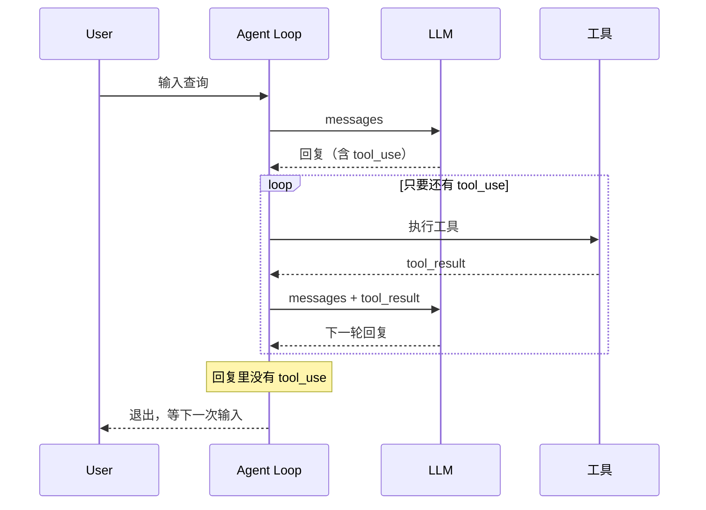
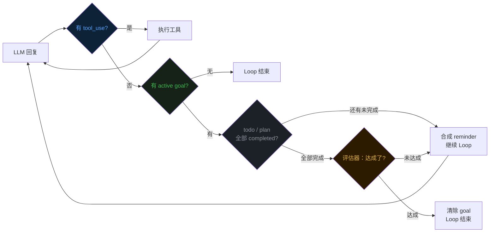
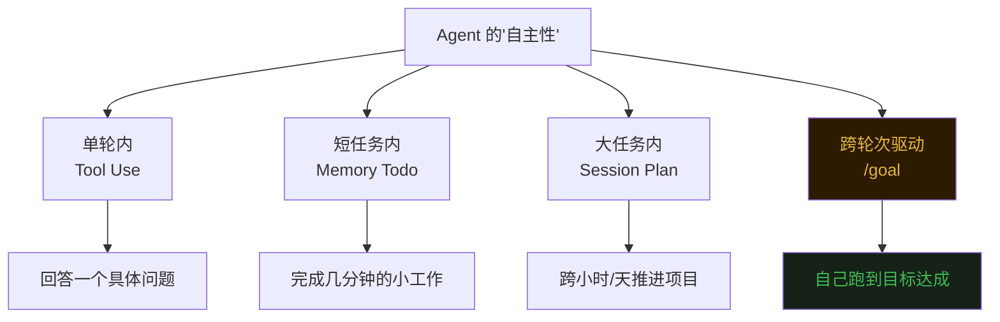

## 零、背景


前十五篇文章分别讲了 Agent 的 [Loop](https://mp.weixin.qq.com/s/dkdrwVlwe3IkH2hzSzy53A)、[工具](https://mp.weixin.qq.com/s/xyX4_CF5cveezEDuzFT13g)、[上下文记忆](https://mp.weixin.qq.com/s/lguRAdxFoN22rqPyx3BIzw)、[上下文压缩](https://mp.weixin.qq.com/s/YRS29wRckEmFgNb0eJrxrQ)、[MCP](https://mp.weixin.qq.com/s/rCnGif8Ee7JhRI86-RoNWA)、[Skill](https://mp.weixin.qq.com/s/X2ie0aQ2vMtddAQrkbOG5g)、[TUI](https://mp.weixin.qq.com/s/fBNFZvOOpwCPT7yysh5YkQ)、[任务规划](https://mp.weixin.qq.com/s/UIlEXIuQdacowdrIg1nrDQ)、[子代理](https://mp.weixin.qq.com/s/LfgDcv27vjlmLZ9NfvQ9LA)、[命令](https://mp.weixin.qq.com/s/M1jxdA4BysQkaN7p4hwneQ)、[跨会话记忆](https://mp.weixin.qq.com/s/wEQwMadb84ixfVXteNfESA)、[Agent.md](https://mp.weixin.qq.com/s/82KmXRTsiDrhB-RZFg5sXw)、[系统提示词](https://mp.weixin.qq.com/s/15mxhcDs1oWBwguF_IIZDg)、[任务持久化](https://mp.weixin.qq.com/s/86urMkNycEkI38KCoS0mxg) 和 [会话持久化](https://mp.weixin.qq.com/s/zyVNi0JXBlbO-z3KtZEFcA)。  


这篇聊聊一个让 Agent 「持续自己干活」的小命令——**/goal**。  


## 一、Agent 为什么"干两步就停"


第一篇文章讲过，Agent 的 Loop 长这样：模型回一段话，看里面有没有 `tool_use` 块，有就执行工具，把结果塞回去再问下一轮；没有，循环结束。  





这套逻辑对"小问答"很合理——你问一句"列一下当前目录有啥"，Agent 调一次 `bash`、看一眼结果、回你一段总结，任务结束，控制权回到用户手上。  


但碰到大任务就体验特别差了。  


假设你说："把 `src/api/` 下所有 REST 调用迁移到 GraphQL，跑通所有测试"。Agent 改了两个文件、跑了一次测试、看到一堆失败、回你一段："我修改了 user.go 和 auth.go，目前 4 个测试还在失败，需要继续修改吗？"——然后**停下来等你回复**。  


你只能再敲一句"继续"。然后又是几步、又是问"还要继续吗"。  


根因藏在 Loop 最底层的那行判断里：  


```go
// 简化伪代码
for {
    resp := llm.Call(messages)
    if !hasToolUse(resp) {
        return  // ← 这里就停了
    }
    runTools(resp)
}
```


**只要 LLM 决定不调工具，仅仅返回文本时，Loop 就退出。**  
这个机制本身没错——它防止 Agent 陷入死循环、占着控制权不还。  
但它也让"自主推进长任务"这件事变得不可能。  


## 二、/goal 的核心思路


/goal 的解法非常直接——**在 Loop 退出之前再加一个判断：用户的目标达成了吗？**  


判断本身分两段做。先扫一眼内存 todo 和磁盘 plan 里还有没有未完成项——只要还有，直接判定为没干完；只有结构化任务都已清零，才舍得调一次小模型读对话历史做语义判断。**结构化校验 + 自然语言评估**串联起来，才算真的完工。  


把轻的检查放前面是有道理的——查内存切片和扫磁盘目录都是几微秒的事，调 LLM 评估器要花几百毫秒外加 token 钱。  
如果任务列表里明摆着还有 in_progress，根本没必要再去问模型"做完了没"。  
**用便宜的判断挡掉大多数情况，把昂贵的判断留给最后一公里**。  





## 三、评估器：让小模型当裁判


真正有意思的是"判断目标是否达成"这一步。  


最直接的做法是让正在干活的那个模型自己判断："我做完了没？"——但这等于运动员自己当裁判。  
模型有强烈的"完成欲"，会倾向把"差不多"说成"完成了"，把"测试还差几个"模糊成"主要测试都过了"。  
让它自己评判自己的工作，可信度堪忧。  


evo-agent 的方案是**把评估这件事交给一个独立的小模型**。  


评估器的输入是两段话——目标本身、最近 N 轮的对话摘要。它的输出是 Yes/No，以及理由 reason。  


reason 限制在 30 词以内。这个限制不是为了省 token，而是逼评估器**给出可读的判断依据**。  
如果它说"达成了"，理由必须具体——"测试输出中显示 X passing, 0 failing"。  
如果说"没达成"，理由也要具体——"还有 3 个 unit test 失败"。  
这条理由会被用作下一轮 LLM 的指导，告诉它"差什么"。  


## 四、最后


从第八篇的内存 todo、第十四篇的磁盘 Session Plan，到这一篇的 /goal 完成条件——evo-agent 在三个不同尺度上回答了同一个问题："Agent 怎么自己往前走？"  


todo 解决"短任务里不迷路"——记住自己在做哪一步。  
Session Plan 解决"长任务跨会话推进"——记住整个项目的骨架。  
**/goal 解决"轮次之间不掉链子"——记住自己应该跑到哪里才算完。**  


三层机制叠在一起，Agent 才真正从"对话助手"长成了"自主代理"。  





《完》  


-EOF-  


本文公众号：天空的代码世界  
个人微信号：tiankonguse  
公众号 ID：tiankonguse-code  
