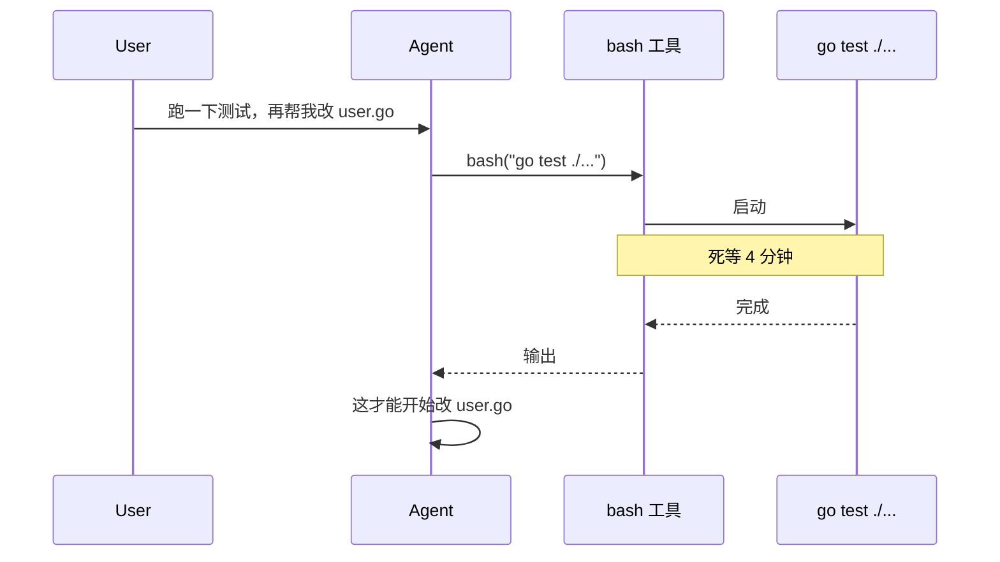
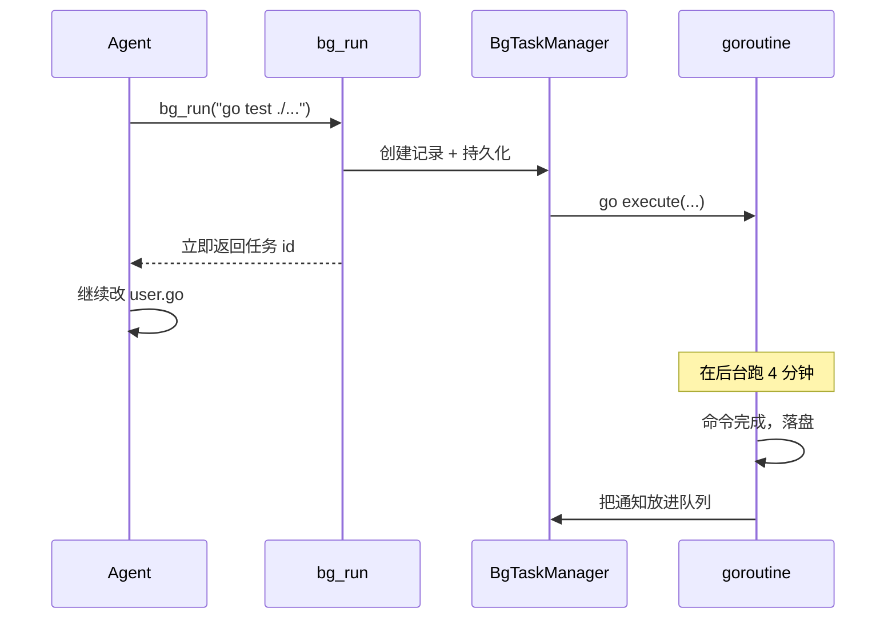
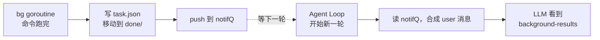
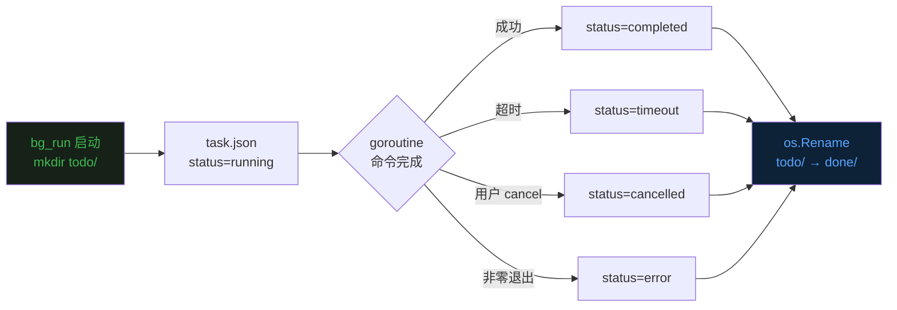
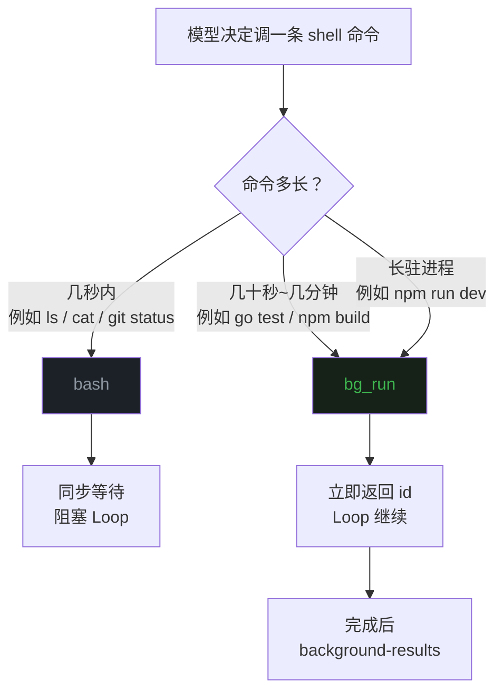
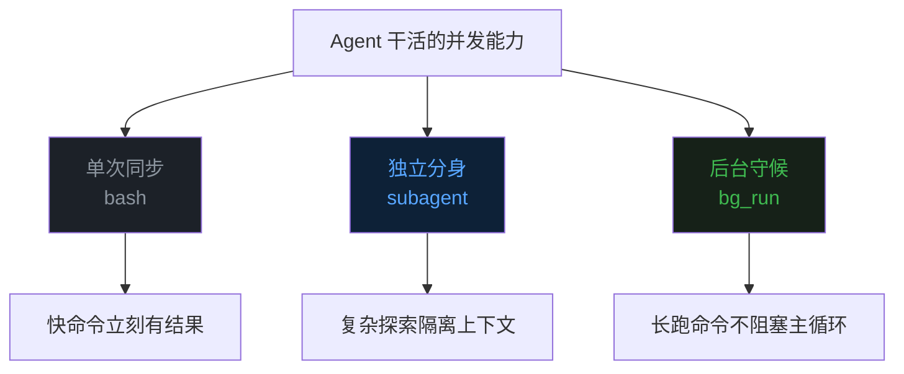

## 零、背景


前十六篇文章分别讲了 Agent 的 [Loop](https://mp.weixin.qq.com/s/dkdrwVlwe3IkH2hzSzy53A)、[工具](https://mp.weixin.qq.com/s/xyX4_CF5cveezEDuzFT13g)、[上下文记忆](https://mp.weixin.qq.com/s/lguRAdxFoN22rqPyx3BIzw)、[上下文压缩](https://mp.weixin.qq.com/s/YRS29wRckEmFgNb0eJrxrQ)、[MCP](https://mp.weixin.qq.com/s/rCnGif8Ee7JhRI86-RoNWA)、[Skill](https://mp.weixin.qq.com/s/X2ie0aQ2vMtddAQrkbOG5g)、[TUI](https://mp.weixin.qq.com/s/fBNFZvOOpwCPT7yysh5YkQ)、[任务规划](https://mp.weixin.qq.com/s/UIlEXIuQdacowdrIg1nrDQ)、[子代理](https://mp.weixin.qq.com/s/LfgDcv27vjlmLZ9NfvQ9LA)、[命令](https://mp.weixin.qq.com/s/M1jxdA4BysQkaN7p4hwneQ)、[跨会话记忆](https://mp.weixin.qq.com/s/wEQwMadb84ixfVXteNfESA)、[Agent.md](https://mp.weixin.qq.com/s/82KmXRTsiDrhB-RZFg5sXw)、[系统提示词](https://mp.weixin.qq.com/s/15mxhcDs1oWBwguF_IIZDg)、[任务持久化](https://mp.weixin.qq.com/s/86urMkNycEkI38KCoS0mxg)、[会话持久化](https://mp.weixin.qq.com/s/zyVNi0JXBlbO-z3KtZEFcA) 和 [goal 命令](https://mp.weixin.qq.com/s/DfDFsIhLZJp1NiXz9dp7ug)。  


这一篇聊一个让 Agent "学会一心二用"的小机制——**后台任务（Background Tasks）**。  


## 一、同步工具的天花板


第二篇文章里就讲过 `bash` 工具，实现极其朴素，就是起一个 bash，等它跑完，把结果返回。  


这套逻辑对"列个目录"、"看个文件大小"这种秒级操作完全够用。  
但碰到三类任务，就特别难受。  


第一类是**完整测试套件**——单元测试加端到端测试，跑一次几分钟很正常。  
第二类是**项目构建**——大型 Go/Rust/Webpack 项目，full build 三五分钟起步。  
第三类是**长驻进程**——本地起个 dev server、跑个 file watcher、起一个调试用的代理，这些进程**根本不会自然退出**。  


同步的 bash 工具碰到前两类只能干等，碰到第三类直接卡死——120 秒超时一到，Agent 看到一个 `Error: Timeout`，里面什么有用信息都没有。  


更糟的是，等待期间 Agent 不能做任何别的事。  
它本可以一边等测试一边读源码、改下一个文件、查文档，但 Loop 就死死卡在那，等待工具的调用返回。    





## 二、解法：工具后台运行


解法看起来很自然——**给一个新工具，调它就立刻返回，命令在后台跑**。  


这里我们加一组新工具，统称 `bg_*`：`bg_run` 启动后台任务，`bg_list` 看清单，`bg_check` 看单条状态，`bg_cancel` 杀进程。  


调用 `bg_run` 时，开一个新的协程，并返回一个 任务 id，之后控制权重新回到 Agent Loop。  
Agent 拿着 任务 id 就可以**继续做别的事**——读文件、改代码、调其他工具，都可以。  





## 三、结果怎么返回给模型


异步模式有一个问题——**任务跑完了，怎么通知调用方？**  


传统系统里有几种方案：调用方主动轮询、回调函数、推送消息、Webhook 等等。  
Agent 是个 Loop，每一轮都要发一次 LLM 请求，最自然的注入点就在每一轮的开头。  


evo-agent 的设计是这样的。  
后台任务跑完后，把结果放到已完成队列中。  
Agent Loop 在每一轮调 LLM 之前，从队列取出消息，包成一条 user 消息塞进 messages 里。  


模型看到消息后，就可以根据任务的结果，来进行下一步推理了。  





## 四、后台任务的持久化


后台任务比同步工具调用多了一份持久化。  
每个后台任务都有一个独立的目录，落在会话目录下面。  


```
.evo-agent/sessions/<sid>/runtime-tasks/
  todo/
    a3f9c2d1/
      task.json       ← 状态 + 元数据
      output.log      ← 完整输出（最多 50KB）
  done/
    b7e2118f/
      task.json
      output.log
```


`todo/` 放正在跑的，`done/` 放跑完的。  


这种"两个持久化"模型在第十四篇 Session Plan 里也用过，是一种朴素到几乎没有学习成本的技术。  





## 五、什么时候后台运行，什么时候等待运行


工具齐了，下一个问题是**让模型自己决定用哪一个**。  
这部分没有什么神奇技巧，就是写好工具描述。  


evo-agent 在系统提示词里专门加了一段话：  


```
Use bg_run for commands that take more than ~30s
(long builds, full test suites, dev servers, watchers).
Use bash for fast, synchronous shell calls — bg_run has 300s timeout
per task and the model can't read its output until the task completes.
```


这段说明回答了三个问题：**bg_run 用于什么**（长命令）、**bash 用于什么**（快命令）、**两者的代价分别是什么**（bg_run 看输出有延迟、bash 会卡住 Loop）。  





## 六、最后


从第二篇的同步 bash，到第九篇的子代理（隔离执行单元），再到这一篇的后台任务（异步执行单元）——evo-agent 在"如何让 Agent 一次干更多事"这条路上走过了三个层次。  


bash 解决"动手能力"——Agent 能调 shell。  
子代理解决"上下文不污染"——长探索过程不会撑爆主上下文。  
**后台任务解决"时间不浪费"——长命令不再卡住主 Loop**。  





**Agent 工程的进步，往往不是来自模型本身变聪明，而是来自把"单线程 LLM 调用"包装成"系统级并发对象"的工程能力**。  


goroutine 不是新东西，进程组不是新东西，append-only JSONL 也不是新东西。  
Agent 工程师做的事，是把这些经过几十年沉淀的系统编程套路，重新组合成一个适合 LLM 推理节奏的运行环境。  
这套组合，就称为 harness。  

《完》  


-EOF-  


本文公众号：天空的代码世界  
个人微信号：tiankonguse  
公众号 ID：tiankonguse-code  
