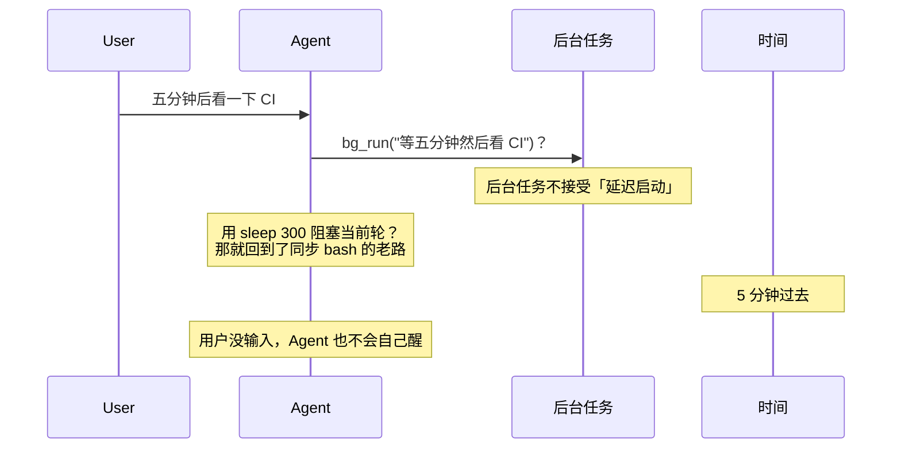
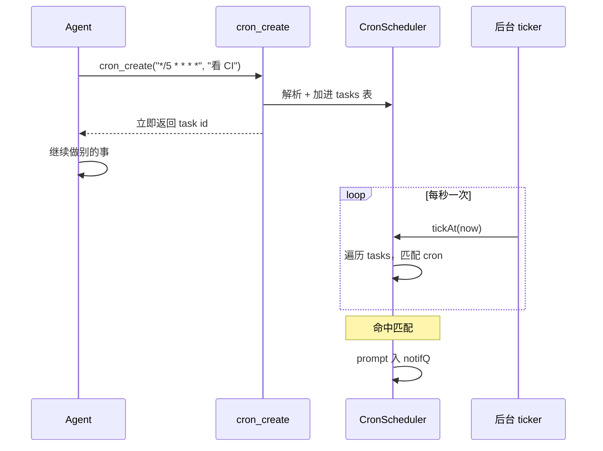
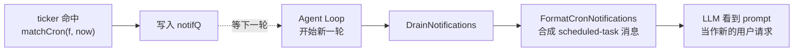
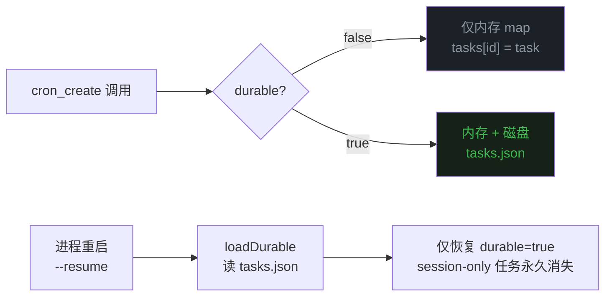
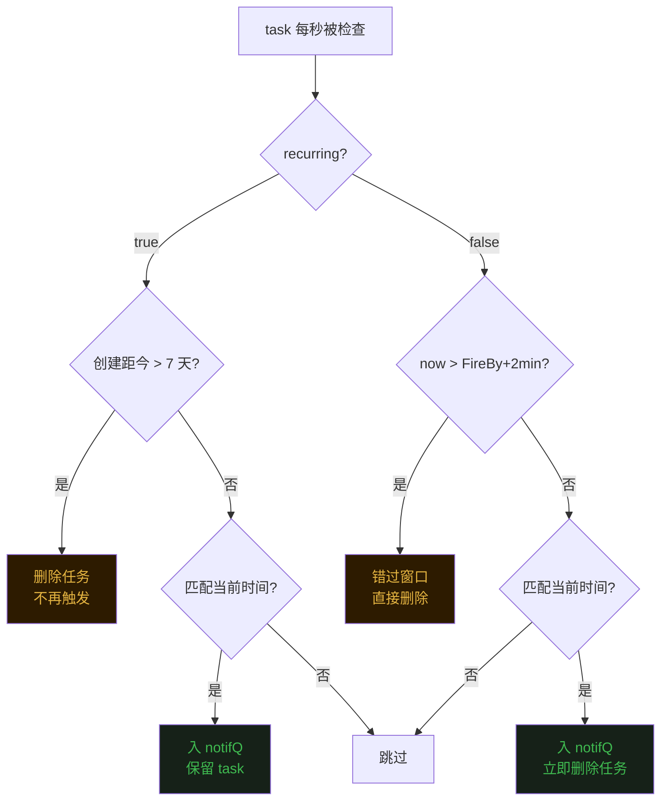
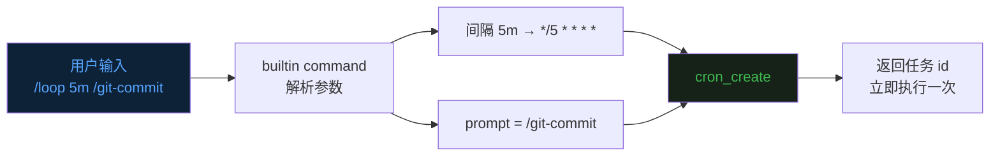
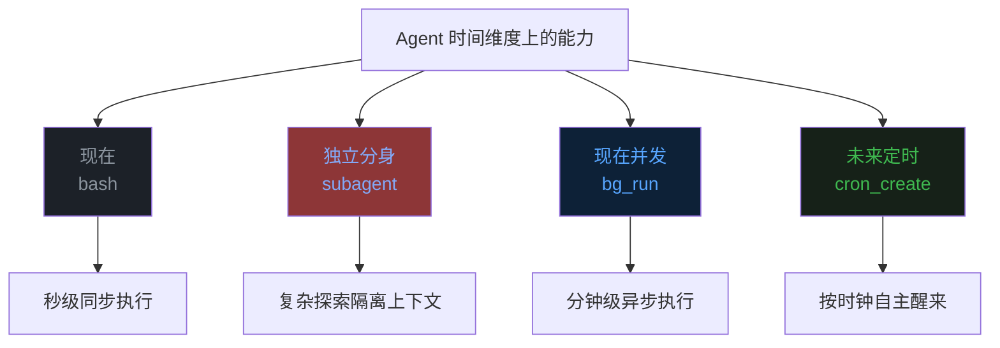

## 零、背景

前十七篇文章分别讲了 Agent 的 [Loop](https://mp.weixin.qq.com/s/dkdrwVlwe3IkH2hzSzy53A)、[工具](https://mp.weixin.qq.com/s/xyX4_CF5cveezEDuzFT13g)、[上下文记忆](https://mp.weixin.qq.com/s/lguRAdxFoN22rqPyx3BIzw)、[上下文压缩](https://mp.weixin.qq.com/s/YRS29wRckEmFgNb0eJrxrQ)、[MCP](https://mp.weixin.qq.com/s/rCnGif8Ee7JhRI86-RoNWA)、[Skill](https://mp.weixin.qq.com/s/X2ie0aQ2vMtddAQrkbOG5g)、[TUI](https://mp.weixin.qq.com/s/fBNFZvOOpwCPT7yysh5YkQ)、[任务规划](https://mp.weixin.qq.com/s/UIlEXIuQdacowdrIg1nrDQ)、[子代理](https://mp.weixin.qq.com/s/LfgDcv27vjlmLZ9NfvQ9LA)、[命令](https://mp.weixin.qq.com/s/M1jxdA4BysQkaN7p4hwneQ)、[跨会话记忆](https://mp.weixin.qq.com/s/wEQwMadb84ixfVXteNfESA)、[Agent.md](https://mp.weixin.qq.com/s/82KmXRTsiDrhB-RZFg5sXw)、[系统提示词](https://mp.weixin.qq.com/s/15mxhcDs1oWBwguF_IIZDg)、[任务持久化](https://mp.weixin.qq.com/s/86urMkNycEkI38KCoS0mxg)、[会话持久化](https://mp.weixin.qq.com/s/zyVNi0JXBlbO-z3KtZEFcA)、[goal 命令](https://mp.weixin.qq.com/s/DfDFsIhLZJp1NiXz9dp7ug) 和 [后台任务](https://mp.weixin.qq.com/s/1fII8BYVinsUuOBnE7lMmA)。  

这一篇聊一个让 Agent「自己定闹钟」的小机制——**定时任务（Scheduled Tasks / Cron）**。  

## 一、后台任务解决不了的问题

上一篇讲后台任务的时候，已经把「跑得慢的命令不要阻塞主循环」这件事解决了。  
但 Agent 还有一类需求，后台任务也帮不上忙。  

比如说「五分钟之后再帮我看一眼 CI 跑得怎么样」、「每小时把生产日志拉一份摘要」、「周一早上九点提醒我交周报」。  

这类需求的共同特点是——**触发时机不在「现在」，而在「未来某个时间点」**。  

后台任务的语义是「我现在就让你跑，你跑你的，我干我的」。  
它解决的是并发，不是延迟。  
你要它五分钟后再启动，它做不到——它一被调用，goroutine 就立刻起来了。  

## 二、定时任务的核心：cron 表达式 + 后台 ticker

解法看起来也不复杂。  
**给 Agent 加一个会看时钟的后台调度器**，并且把「调度任务」变成一个工具，让模型可以在合适的时机自己创建。  

evo-agent 这里直接复用了运维工程师都熟悉的 cron 表达式——五个字段：分、时、日、月、星期。  
为什么是 cron 而不是发明一个新格式？  
因为 cron 是几十年沉淀下来的、跨工具通用的、模型在训练语料里见过几百万次的格式。  
**模型熟悉的 DSL，就是最不容易出错的 DSL**。  

工具长这样：`cron_create` 创建一个定时任务，`cron_list` 列出所有任务，`cron_delete` 取消一个任务。  
另外还有一个后台 goroutine，每秒醒一次，拿当前时间去和所有任务的 cron 表达式做匹配。  

## 三、把结果送回 Agent：和后台任务共用一条管道

调度器醒了、命中了，下一个问题就是——**怎么把这个事件送回 Agent？**  

这个问题在上一篇讲后台任务的时候已经回答过一次了。  
Agent 的 Loop 每一轮都会调一次 LLM，最自然的注入点就在每一轮的开头。  

定时任务直接复用了这套管道。  
任务命中以后，把它的 prompt 包成一条通知放进 `notifQ`。  
Agent Loop 在每轮开头先从队列中取消息，所有的消息包装成作为一条合成的 user 消息塞进 `messages` 里。  

这里有一个非常重要的设计细节——**调度器只负责「在合适的时机唤醒任务」，不负责「立刻执行」**。  
任务唤醒后，prompt 排进队列，等 Agent 下一次进入 Loop 时才会处理。  

如果用户正在打字，Agent 的 Loop 没有跑，那么任务就会在队列里等着。  
直到下一次 Agent 被唤醒（用户输入、其他事件触发），才会一并被处理。  
 

## 四、持久化：要不要跨进程活下来

定时任务比后台任务多了一个考虑：**要不要在进程重启之后继续生效？**  

比如「每天九点跑一次报表」这种需求，肯定要跨进程持久化的——不然你今晚关了 Agent，明天就不会自己醒了。  
但「五分钟之后提醒我看 CI」这种就完全没必要落盘——会话退出了，提醒也就跟着没了，符合直觉。  

evo-agent 把这个选择权交给了模型，给 `cron_create` 加了一个参数。  
默认只活在内存里，进程退出就消失。  
当用户明确说「以后每天都」、「永久生效」、「设置一个长期任务」的时候，模型才会把这条任务写到磁盘。  

落盘的位置就在会话目录下面，跟其他持久化数据放一起。  

## 五、一次性 vs 周期性：给「跑一次」和「跑一辈子」分别上保险

cron 表达式天然就支持周期性触发——`*/5 * * * *` 就是每五分钟一次。  
但用户的需求里有一大类是「就跑一次」——「明天早上九点提醒我」、「半小时后看一下进度」。  

这类需求其实也能用 cron 来表达。  
「明天早上九点」可以写成 `0 9 <明天的 dom> <明天的 month> *`——把「日」和「月」字段都钉死，这条 cron 就只在那一天那一刻匹配一次。  

问题是，如果不做特殊处理，明年同月同日的同一时刻，这条 cron 还会再匹配一次。  

evo-agent 给一次性任务多加了两道保险。  
第一道是不可重复标记 `durable` ——任务唤醒之后立刻从表里删除，下次就匹配不到了。  
第二道是下次运行时间 `FireBy` 字段——创建任务的时候计算出第一次匹配的时间戳，写在任务上。  
后台 ticker 每次扫的时候会先看 `now > FireBy + 2 分钟` 没有，**如果错过了窗口，就直接删除而不触发**。  

另外，周期性任务也有一道保险——**自动过期 7 天**。  
你设了一个「每五分钟」的任务，七天后它会最后触发一次然后被删掉。  

为什么要这个限制？  
因为模型很容易在帮用户解决一个临时问题的时候顺手挂一个长期 cron，但用户可能根本不想要它跑一辈子。  
七天的上限相当于一个保险丝，跑得久了自动断开，避免幽灵任务在系统里默默运行。  

## 六、再封装一层：/loop 命令

`cron_create` 已经够用了，但有时我们想主动增加一个定时任务。  
**这时候就需要 `/loop` 命令了**。  

`/loop` 是 evo-agent 的一个内置 builtin command，专门解决「周期性跑一段命令」这一种场景。  
用法非常直接，比如 `/loop 5m /git-commit`、`/loop 30m 看一下部署状态`、`/loop check the deploy every 20m`，都能一句话搞定。  

如果只写 `/loop check the deploy`，不带间隔，默认就按每 10 分钟一次跑。  

## 七、最后

从第二篇的同步 bash，到第九篇的子代理，再到第十七篇的后台任务，再到这一篇的定时任务——evo-agent 在「让 Agent 一次干更多事」这条路上又走了一步。  

bash 解决「现在动手」——Agent 现在就要执行一条命令。  
子代理解决「分身探索」——Agent 派一个独立上下文去探索复杂问题。  
后台任务解决「时间不浪费」——长命令不阻塞主循环。  
**定时任务解决「自动醒来」——Agent 不需要用户输入也能在合适的时机被唤醒**。  

有意思的是，定时任务这套机制里几乎没有什么「AI」的成分。  
cron 表达式是七十年代就有的格式，goroutine + ticker 是标准的并发原语，事件入队 + 主循环统一处理是几十年沉淀的消息驱动套路。  

**Agent 工程师做的事，其实是把这些经过几十年沉淀的系统编程套路，重新组合成一个适合 LLM 推理节奏的运行环境。**  
模型本身不会变得更聪明，但围绕它的 harness，可以让一个聪明的模型做更多的事。  

时钟、定时器、事件队列——这些工程师从大学就开始用的工具，被重新包装成 Agent 可以用自然语言调用的能力，于是 Agent 就拥有了「时间感」。  
这种「把老工具适配到新主体」的工程能力，可能比模型本身的进化更值得关注。  

《完》  

-EOF-  

本文公众号：天空的代码世界  
个人微信号：tiankonguse  
公众号 ID：tiankonguse-code  
