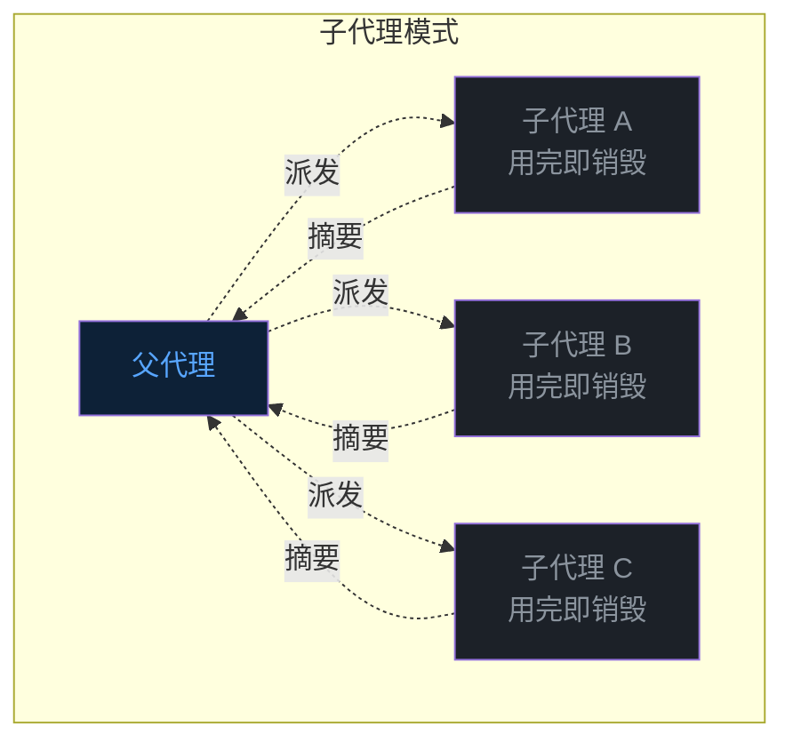
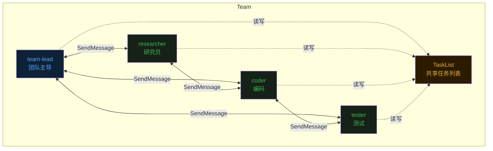
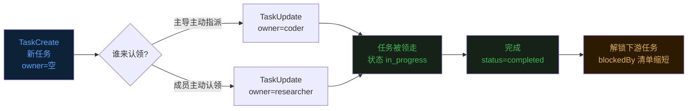
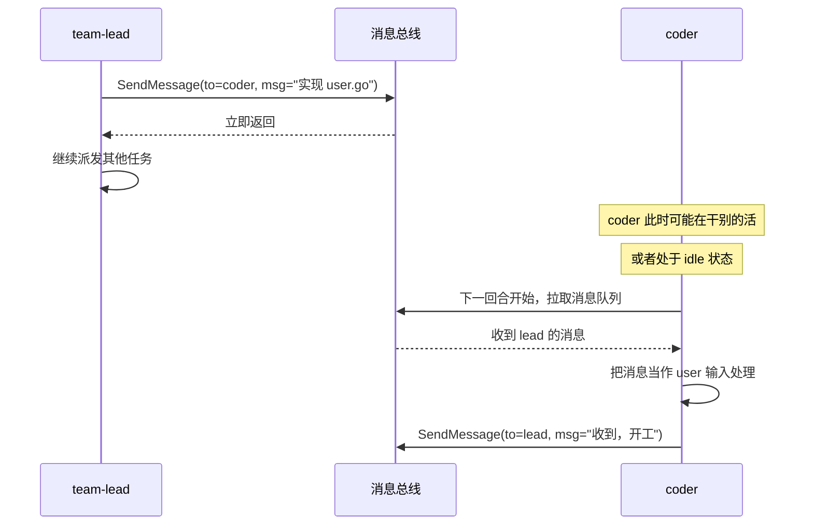
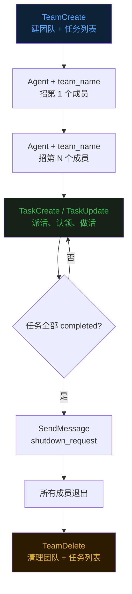
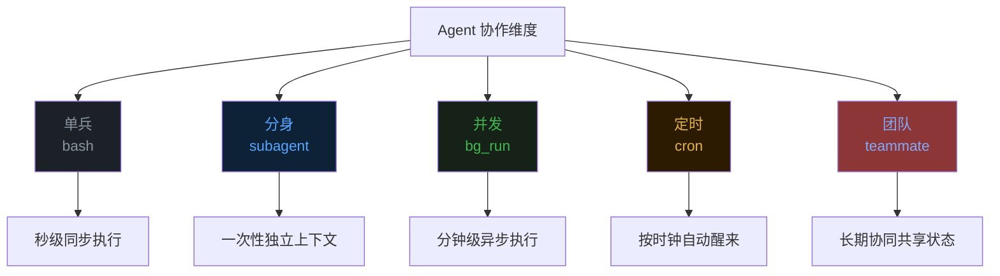

## 零、背景

前十八篇文章分别讲了 Agent 的 [Loop](https://mp.weixin.qq.com/s/dkdrwVlwe3IkH2hzSzy53A)、[工具](https://mp.weixin.qq.com/s/xyX4_CF5cveezEDuzFT13g)、[上下文记忆](https://mp.weixin.qq.com/s/lguRAdxFoN22rqPyx3BIzw)、[上下文压缩](https://mp.weixin.qq.com/s/YRS29wRckEmFgNb0eJrxrQ)、[MCP](https://mp.weixin.qq.com/s/rCnGif8Ee7JhRI86-RoNWA)、[Skill](https://mp.weixin.qq.com/s/X2ie0aQ2vMtddAQrkbOG5g)、[TUI](https://mp.weixin.qq.com/s/fBNFZvOOpwCPT7yysh5YkQ)、[任务规划](https://mp.weixin.qq.com/s/UIlEXIuQdacowdrIg1nrDQ)、[子代理](https://mp.weixin.qq.com/s/LfgDcv27vjlmLZ9NfvQ9LA)、[命令](https://mp.weixin.qq.com/s/M1jxdA4BysQkaN7p4hwneQ)、[跨会话记忆](https://mp.weixin.qq.com/s/wEQwMadb84ixfVXteNfESA)、[Agent.md](https://mp.weixin.qq.com/s/82KmXRTsiDrhB-RZFg5sXw)、[系统提示词](https://mp.weixin.qq.com/s/15mxhcDs1oWBwguF_IIZDg)、[任务持久化](https://mp.weixin.qq.com/s/86urMkNycEkI38KCoS0mxg)、[会话持久化](https://mp.weixin.qq.com/s/zyVNi0JXBlbO-z3KtZEFcA)、[goal 命令](https://mp.weixin.qq.com/s/DfDFsIhLZJp1NiXz9dp7ug)、[后台任务](https://mp.weixin.qq.com/s/1fII8BYVinsUuOBnE7lMmA) 和 [定时任务](https://mp.weixin.qq.com/s/wpBoRmGp3Rz_qfhVwJqZlQ)。  

这一篇聊一个让 Agent「组队作战」的机制——**Teammate 团队模式**。  

## 一、子代理还不够用

第九篇讲过子代理（subagent），父代理派发一个子任务，子代理跑完返回一段摘要。  
这套机制解决了「上下文不被探索过程污染」的问题。  

但子代理有几个非常明确的边界。  

**子代理是一次性的**。一个 prompt 进，一段摘要出，子代理就消失了。它不能保留状态，也不能在多个任务之间复用。  
**子代理是单向的**。父代理派发任务，子代理只能返回一次结果。中途想问父代理一个问题，但是没有通道。  
**子代理是并行的，但不是协作的**。父代理可以同时开多个子代理，但子代理之间彼此不可见，每个都在自己的小世界里干活。  

这套机制很适合「我要扫一遍代码库找性能瓶颈」这种**探索型一次性任务**。  
但碰到「我要做一个完整的功能，前端后端测试文档都要」这种**长周期协作型任务**，子代理就不够用了。  

## 二、Teammate 模式：让 Agent 长期共事

Teammate 模式的核心思想是——**让多个 Agent 长期共存，围绕同一个任务列表协同工作**。  

和子代理对比，每一条假设都反过来了。  

子代理是临时分身，**teammate 是常驻团队成员**，有名字、有身份、有持续的会话状态。  
子代理只能单向汇报，**teammate 之间可以互相发消息**，主代理可以给 teammate 派活，teammate 可以问主代理问题，teammate 之间也可以互相协调。  
子代理彼此不可见，**teammate 共享一份任务列表**，谁在做什么、谁完成了什么、什么任务被谁阻塞，所有人都看得到。  

这个差别，极其类似于**「在兼职平台上找线上外包」与「招几个全职员工在公司组建项目组」**的区别。  

Sub-agent 就像纯线上的兼职外包：你在平台上发个需求，对方接单、干活、交付结果、拿钱走人。你不需要拉他进公司大群，他也看不到你公司的系统源码，更不需要和你的其他外包聊天。他干完一单，这个临时关系就销毁了。  

Teammate 则是你招进来的全职团队：他们每个人有工位、有专属的企业微信账号（名字和身份）。最重要的是，他们不是老死不相往来的独立个体，他们在一个群里（网状通信），每天盯着同一个 Jira 看板或者工单系统（共享任务列表）。前端被后端卡住了会主动去敲对方，测试发现 Bug 了会立刻同步给全组。他们有持续的会话状态，共同对整个大项目的终点负责。  

## 三、共享任务列表：协作的物理基础

多个 Agent 想协作，必须有一个**所有人都能读写的共同状态**。  
没有这个共同状态，每个 Agent 只能凭自己的对话历史推断别人在做什么，那基本等同于猜。  

evo-agent 在第十四篇里已经做过持久化任务规划了——磁盘上一个目录，每个任务一个 JSON 文件，状态、依赖、归属都落盘。  
Teammate 模式直接复用了这套设施，但加了几个团队协作必需的字段。  

这套设计有一个很重要的约束——**Team 和 TaskList 是一一对应的**。  
一个团队就是一个任务列表，一个任务列表就是一个团队的工作面板。  
没有两个团队共享一个任务列表的情况，也没有一个团队跨多个任务列表的情况。  

## 四、消息总线：SendMessage 而不是函数调用

Teammate 之间需要沟通——派活、汇报、求助、商量。  
设计这个沟通通道的时候，有两种思路。  

第一种是**函数调用**——一个 teammate 直接调另一个 teammate，等对方返回。  
这种方式的问题是它本质上是**同步阻塞**的，一个 teammate 等待另一个 teammate 期间什么都做不了。  
更糟的是，如果 A 在等 B、B 在等 A，整个系统就死锁了。  

第二种是**消息队列**——一个 teammate 发一条消息给另一个 teammate，消息进对方的队列，自己继续干别的。  
对方在自己的下一个回合开始时，消息会作为「user 消息」自动注入到上下文里，对方就能看到。  

evo-agent 选了第二种，工具叫 `SendMessage`。  

## 五、生命周期：从招聘到散伙

一个团队的完整生命周期大概是这样的——**先建团队，再招成员，分配任务，干活，最后解散**。  

建团队用 `TeamCreate`。  

招成员通过 `Agent` 工具，但要带上 `team_name` 和 `name` 参数。  
`name` 是这个 teammate 在团队里的「花名」，之后所有的消息收发、任务归属都用这个名字。  

分配任务用 `TaskUpdate` 的 `owner` 字段。  

干活的过程很自然——teammate 看到任务，开始做，做完调 `TaskUpdate` 把状态置为 `completed`，然后回到 `TaskList` 找下一个能做的任务。  

最后散伙用 `TeamDelete`。  

## 六、和子代理的边界

最后值得说一下 teammate 和 subagent 在使用上的边界——**它们不是替代关系，而是互补关系**。  

如果手里这个活儿是「派去做一件具体事，做完返回结论就行」——比如扫一遍日志找异常、读完一个 README 总结要点——**用 subagent**。开销低，回收快，上下文不污染。  

如果手里这个活儿是「一群人围绕一个项目协作几小时甚至几天，中间要互相沟通、要共享进度、要分工依赖」——**用 teammate**。投入更重，但能撑得起复杂的协同场景。  

## 七、最后

从第二篇的同步 bash，到第九篇的子代理，到第十七篇的后台任务，到第十八篇的定时任务，再到这一篇的 teammate。  
evo-agent 在「让 Agent 一次干更多事」的路上，沿着「单 Agent → 临时分身 → 异步执行 → 自动唤醒 → 多 Agent 协同」一路走下来。  

bash 解决「现在动手」。  
子代理解决「分身探索」。  
后台任务解决「时间不浪费」。  
定时任务解决「自动醒来」。  
**Teammate 解决「多人协作」——多个 Agent 围绕同一个目标，分工、沟通、依赖、协同，整个过程像一个真实小团队**。  

《完》  

-EOF-  

本文公众号：天空的代码世界  
个人微信号：tiankonguse  
公众号 ID：tiankonguse-code  
