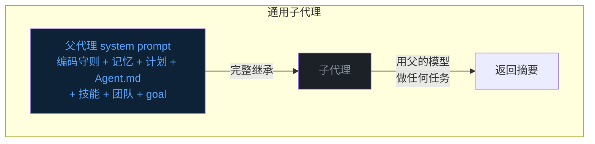
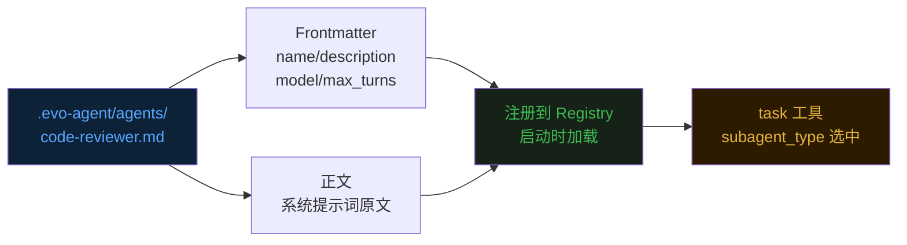
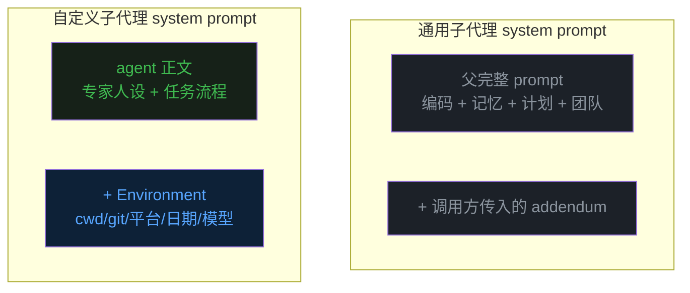
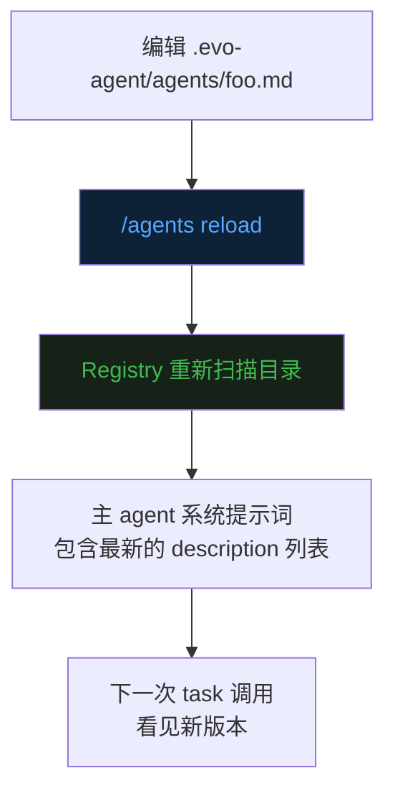
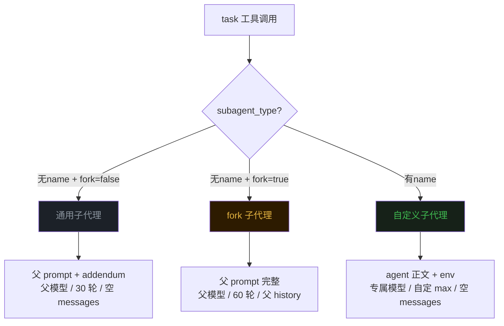
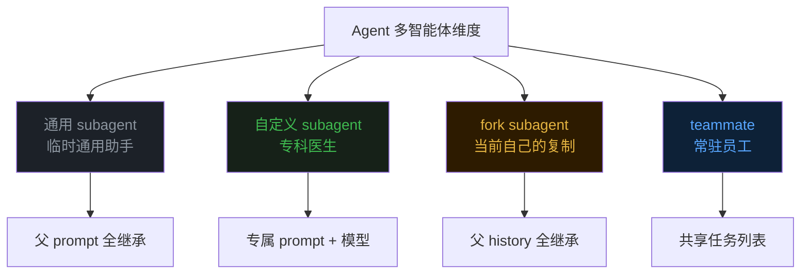

## 零、背景


前十九篇文章分别讲了 Agent 的 [Loop](https://mp.weixin.qq.com/s/dkdrwVlwe3IkH2hzSzy53A)、[工具](https://mp.weixin.qq.com/s/xyX4_CF5cveezEDuzFT13g)、[上下文记忆](https://mp.weixin.qq.com/s/lguRAdxFoN22rqPyx3BIzw)、[上下文压缩](https://mp.weixin.qq.com/s/YRS29wRckEmFgNb0eJrxrQ)、[MCP](https://mp.weixin.qq.com/s/rCnGif8Ee7JhRI86-RoNWA)、[Skill](https://mp.weixin.qq.com/s/X2ie0aQ2vMtddAQrkbOG5g)、[TUI](https://mp.weixin.qq.com/s/fBNFZvOOpwCPT7yysh5YkQ)、[任务规划](https://mp.weixin.qq.com/s/UIlEXIuQdacowdrIg1nrDQ)、[子代理](https://mp.weixin.qq.com/s/LfgDcv27vjlmLZ9NfvQ9LA)、[命令](https://mp.weixin.qq.com/s/M1jxdA4BysQkaN7p4hwneQ)、[跨会话记忆](https://mp.weixin.qq.com/s/wEQwMadb84ixfVXteNfESA)、[Agent.md](https://mp.weixin.qq.com/s/82KmXRTsiDrhB-RZFg5sXw)、[系统提示词](https://mp.weixin.qq.com/s/15mxhcDs1oWBwguF_IIZDg)、[任务持久化](https://mp.weixin.qq.com/s/86urMkNycEkI38KCoS0mxg)、[会话持久化](https://mp.weixin.qq.com/s/zyVNi0JXBlbO-z3KtZEFcA)、[goal 命令](https://mp.weixin.qq.com/s/DfDFsIhLZJp1NiXz9dp7ug)、[后台任务](https://mp.weixin.qq.com/s/1fII8BYVinsUuOBnE7lMmA)、[定时任务](https://mp.weixin.qq.com/s/wpBoRmGp3Rz_qfhVwJqZlQ) 和 [Teammate](https://mp.weixin.qq.com/s/Fv4XKVDPWBOydtG-RAq9sQ)。  


这一篇聊一个让 Agent「随身带一支专家小队」的机制——**自定义子代理（Custom Subagent）**。  


## 一、通用子代理的局限


第九篇讲过子代理（subagent）这个机制——父代理通过 `task` 工具派一个独立上下文的子代理去做探索性任务，做完只返回一段摘要。  


这套机制用了一段时间之后，会发现一些问题。  


**通用子代理继承的东西太多了**。  
子代理启动的时候，系统提示词是父代理的完整 system prompt——编码守则、长期记忆、当前任务计划、Agent.md、技能目录、团队状态、goal 设定，全都跟着一起注入到子代理的上下文里。  


对一个「帮我扫一眼某个文件」的小任务来说，这些通用上下文 90% 都是噪音。  


**通用子代理用的模型也是父代理的模型**。  
父代理可能正在用 Opus 思考一个复杂的架构问题，子代理只是去做一个简单的字符串 grep——但它也得用 Opus，token 单价完全一样。  


**通用子代理没有专业身份**。  
它就是「另一个我」，看到什么任务都按一个通用助手的思路去做，没有针对性的人设和行事方式。  





这就引出了一个问题——**有没有办法让子代理「轻装上阵」，只带它自己这一行需要的提示词，甚至换一个更便宜的模型？**  


## 二、自定义子代理：用 Markdown 定义专家


答案是有的，叫**自定义子代理**。  


核心思想可以一句话概括——**用一个 Markdown 文件定义一个专家 agent，它有自己的系统提示词、自己的模型、自己的轮次上限**。  
父代理调用它的时候，子代理不再继承父代理的任何编码守则与记忆，只看见这个 Markdown 文件里写的内容。  


这套设计参考了 Claude Code ，文件长这样。  


````markdown
---
name: code-reviewer
description: Review code for security, style, and correctness issues
model: inherit
max_turns: 20
---

You are a senior software engineer performing a focused code review.

# Your job
Read the files mentioned in the user's request, identify bugs,
security risks, error handling gaps, and report findings as a Markdown report.
````


YAML frontmatter 写元信息，正文写系统提示词，整个文件就是一个 agent 的完整定义。  





## 三、Frontmatter 字段：四个就够用


自定义子代理的 frontmatter 故意做得很简洁，只有四个字段。  


**`name`**——这个 agent 的唯一标识。  
父代理调用的时候用 `subagent_type: "<name>"` 选中。  
如果不写，默认就是文件名去掉 `.md` 后缀。  


**`description`**——说明这个 agent 适合做什么。  
这个字段非常关键，因为它会被注入到主 agent 的系统提示词里，让模型自己判断什么时候应该调用哪个 agent。  
写得越像一句使用说明，模型越能用对。  


**`model`**——这个 agent 专属的模型 id。  
可以指定一个比父便宜的模型（比如让简单 grep 任务跑 Haiku），也可以写 `inherit` 或留空表示沿用父代理的模型。  


**`max_turns`**——LLM 轮次上限。  
默认 30 轮，可以根据任务复杂度调整。  
简单的「greet」类任务给 5 轮就够，复杂的代码审查可以放到 50。  


正文部分完全自由——`---` 之后到文件结尾的所有内容会原样发给 LLM 作为系统提示词。  


## 四、关键差别：完全替换 vs 部分继承


自定义子代理和通用子代理的核心差别，在于**系统提示词的组装方式**。  


通用子代理是「**父的完整 prompt + 一段补丁**」——所有的项目上下文都带过去。  


自定义子代理是「**agent 自己的正文 + 一段最小环境信息**」——父代理那一大坨上下文一概不见。  
最小环境只包含工作目录、是否在 git 仓库、平台架构、shell、当前日期、所用模型，仅此而已。  





## 五、`/agents` 命令：纯客户端管理


写好 agent 文件之后，怎么确认它被正确加载了？  
怎么看它的完整定义？  
怎么改完之后让 evo-agent 重新加载而不重启？  


evo-agent 提供了一组 `/agents` 命令，全都是**纯客户端命令，不会触发 LLM 轮次**，所以不消耗任何 token。  


`/agents` 或 `/agents list` 列出所有已加载的 agent，连同它们的 model、max_turns、description。  


`/agents show <name>` 打印某个 agent 的完整定义，包括 frontmatter 和系统提示词正文，方便人工核对模型实际看到的是什么。  


`/agents reload` 重新扫描 `.evo-agent/agents/` 目录。改完文件不需要重启 evo-agent，敲这一下就生效了。  





## 七、Fork：第三种子代理


讲完通用和自定义两种 subagent，最后顺手补一种——**fork subagent**。  


如果说通用子代理是「带着公司大手册去做事」，自定义子代理是「带着专家小手册去做事」，那 fork 就是「**完整复制当前这一刻的我去做事**」。  


fork 子代理继承父代理的**完整系统提示词**和**完整对话历史**。  
父代理已经聊了几十轮、读过哪些文件、做过哪些决策——fork 全都看得见。  


## 八、三种子代理对比：什么时候选谁


把三种子代理放在一张表里看会清楚很多。  





判断标准其实很直观。  


手头是一个**通用探索任务**，没有特别专家化的需求——比如「读一下这几个文件，告诉我入口在哪」，**用通用子代理**最简单。  


手头是一个**反复出现的、有固定流程的领域任务**——比如代码审查、测试运行、文档检查——而且你希望它每次的行为都稳定、可控、便宜——**写成自定义子代理**最划算。  


手头是一个**需要继承当前对话语境**的任务——比如父代理已经把架构、约束、决策都讨论过了，现在要把其中一块「外包」出去——**用 fork**，省得把上下文重新讲一遍。  


## 九、最后


从第九篇的通用子代理，到第十九篇的 teammate 长期协作，再到这一篇的自定义子代理，evo-agent 在「让一个 Agent 能驱动多个 Agent」这条路上走得越来越细。  


通用子代理解决「**一次性探索**」——派出去做一件事，做完返回。  
自定义子代理解决「**专家分工**」——为每一类反复出现的任务配一个专科医生。  
fork 子代理解决「**继承语境**」——把父代理这一刻的认知整体复制一份。  
Teammate 解决「**长期协作**」——多个常驻成员围绕同一个目标分工沟通。  





**配置即能力**——这可能是 Agent 工程里最朴素也最强的一种扩展模式。  
和 skill 一样，自定义子代理把「给 Agent 加新行为」的成本压到了「写一段 Markdown」。  
下一个新需求来的时候，写一个文件、敲一个 `/agents reload`，Agent 就多了一项专长。  


《完》  


-EOF-  


本文公众号：天空的代码世界  
个人微信号：tiankonguse  
公众号 ID：tiankonguse-code  
