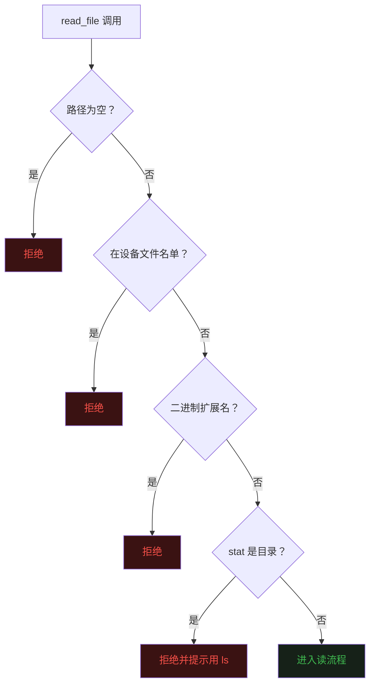
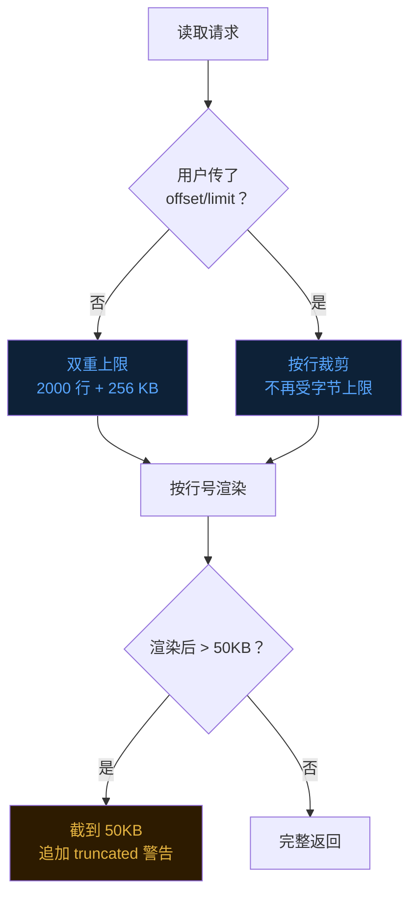
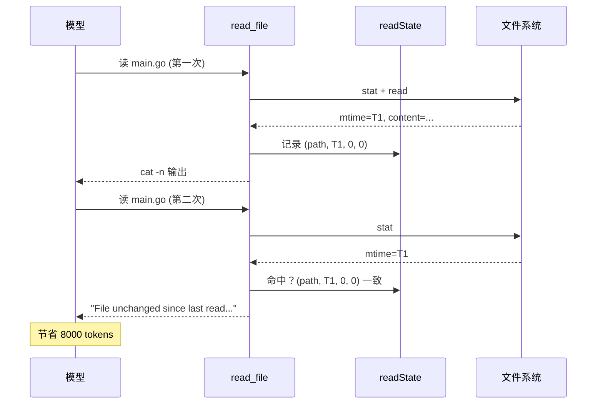

## 零、背景


前二十篇文章分别讲了 Agent 的 [Loop](https://mp.weixin.qq.com/s/dkdrwVlwe3IkH2hzSzy53A)、[工具](https://mp.weixin.qq.com/s/xyX4_CF5cveezEDuzFT13g)、[上下文记忆](https://mp.weixin.qq.com/s/lguRAdxFoN22rqPyx3BIzw)、[上下文压缩](https://mp.weixin.qq.com/s/YRS29wRckEmFgNb0eJrxrQ)、[MCP](https://mp.weixin.qq.com/s/rCnGif8Ee7JhRI86-RoNWA)、[Skill](https://mp.weixin.qq.com/s/X2ie0aQ2vMtddAQrkbOG5g)、[TUI](https://mp.weixin.qq.com/s/fBNFZvOOpwCPT7yysh5YkQ)、[任务规划](https://mp.weixin.qq.com/s/UIlEXIuQdacowdrIg1nrDQ)、[子代理](https://mp.weixin.qq.com/s/LfgDcv27vjlmLZ9NfvQ9LA)、[命令](https://mp.weixin.qq.com/s/M1jxdA4BysQkaN7p4hwneQ)、[跨会话记忆](https://mp.weixin.qq.com/s/wEQwMadb84ixfVXteNfESA)、[Agent.md](https://mp.weixin.qq.com/s/82KmXRTsiDrhB-RZFg5sXw)、[系统提示词](https://mp.weixin.qq.com/s/15mxhcDs1oWBwguF_IIZDg)、[任务持久化](https://mp.weixin.qq.com/s/86urMkNycEkI38KCoS0mxg)、[会话持久化](https://mp.weixin.qq.com/s/zyVNi0JXBlbO-z3KtZEFcA)、[goal 命令](https://mp.weixin.qq.com/s/DfDFsIhLZJp1NiXz9dp7ug)、[后台任务](https://mp.weixin.qq.com/s/1fII8BYVinsUuOBnE7lMmA)、[定时任务](https://mp.weixin.qq.com/s/wpBoRmGp3Rz_qfhVwJqZlQ)、[Teammate](https://mp.weixin.qq.com/s/Fv4XKVDPWBOydtG-RAq9sQ) 和 [自定义子代理](https://mp.weixin.qq.com/s/--PaxhI2_8dz4bpcDy1ciw)。  


从这一篇开始，我打算把目光从「Agent 的整体骨架」收回来，钻进每一个工具的细节里。  


第一个被精读的工具是 **read_file**——参考对象是 Claude Code 仓库里的 `FileReadTool`。  


## 一、读文件这件事，真没那么简单


第二篇文章讲工具系统的时候，evo-agent 的 `read_file` 只有一个 `path` 字段加一个 `limit` 字段，`os.ReadFile` 一把梭，超过 50000 字符截断，结束。  


**这种实现能跑，但用一段时间就会遇到一些问题。**  


用户问 Agent「这个文件第 2000 行写了什么」，Agent 没办法只读一段，只能整文件读进来，然后被截断到前面 50000 字符，永远看不到 2000 行附近的内容。  


用户连续问三次「读一下 main.go」，Agent 每次都把整文件重新塞进上下文，同一段几千行的文件 token 消耗了三遍。  


更糟糕的是，Agent 一不小心点到了 `/dev/zero` 或者一个 200 MB 的二进制 `.so` 文件，没有任何前置检查，有时浪费无数 token。  


Claude Code 的 `FileReadTool` 在生产里被用了几百万次，把这些坑都踩平了。  
看它怎么做的，就是看一个「读文件工具」从玩具变成产品要补齐的那些细节。  


## 二、输出格式：cat -n 风格


旧版的 `read_file` 直接把文件内容原样返回。  
新版改成了 `cat -n` 风格，每行前面加上 6 位宽度的行号。  


```
     1	package tools
     2	
     3	import (
     4		"fmt"
     5	)
```


**为什么要加行号？**  


因为 read 之后通常要 edit。  
模型如果看到了行号，下一次调用 `edit_file` 时就可以非常精确地说「把第 42 行改成 X」，不需要把上下文里的 `old_str` 整段贴一遍。  


这两种语义模型的行为差异很大，加行号是用一个 7 字节的前缀换来一个**确定的语义信号**。  


## 三、四道前置检查：在读之前就拒绝


新版 `read_file` 在真正开始读之前，做了**四道**安全检查。每一道都对应着一类生产事故。  


**第一道：空路径直接拒绝。**  
LLM 在某些 prompt 下会调用 `read_file({"file_path": ""})`，这种调用如果传到 `os.ReadFile` 会读到 cwd 自己，然后报一个非常困惑的错误。早一步拒绝，错误信息也清晰。  


**第二道：设备文件列表。**  
这是最关键的一道。文件系统里有一类「设备文件」——`/dev/zero`、`/dev/random`、`/dev/stdin`、`/proc/self/fd/0`——它们的读操作要么永远返回（`/dev/zero`），要么永远阻塞（`/dev/stdin`）。  


这些路径的特点是**仅凭路径就能判断不该读**，根本不需要 stat。  
Claude Code 的实现里是一张静态名单，evo-agent 移植过来也是同一张：


```go
var blockedDevicePaths = map[string]struct{}{
    "/dev/zero": {}, 
    "/dev/random": {}, 
    "/dev/urandom": {}, 
    "/dev/full": {},
    "/dev/stdin": {}, 
    "/dev/tty": {}, 
    "/dev/console": {},
    "/dev/stdout": {},
    "/dev/stderr": {},
    "/dev/fd/0": {}, 
    "/dev/fd/1": {}, 
    "/dev/fd/2": {},
}
```


**第三道：二进制扩展名拒绝。**  
zip / exe / so / png / pdf / mp4 / woff……这些文件读出来的字节流对模型完全没用，反而会浪费一大片上下文。  
直接按扩展名拒绝，连 stat 都不做。  


**第四道：目录拒绝。**  
读到了一个目录，给一个明确的提示「请用 bash + ls」。  
这一条单独存在的意义是——很多模型会把 `ls` 的需求误判成 `read_file`，明确的错误信息可以引导它换工具。  





## 四、offset / limit：大文件分页读


有了行号输出，分页读取就顺理成章了。  


`offset` 是 1-indexed 的起始行，`limit` 是最多读多少行。两者都不传就用默认值——从第 1 行读起，最多读 2000 行。  


这两个数字是有讲究的。  


**2000 行不是凭空选的。**  
这是 Claude Code 上游 `MAX_LINES_TO_READ` 常量的值。  
基于他们大量真实场景的统计——2000 行能覆盖 95% 以上的源代码文件，一个普通的 React 组件、Go 文件、Python 模块基本都在 2000 行以内。  


超过 2000 行的文件几乎都是巨型生成代码、日志、数据文件——这些情况下「先看一段、再决定继续看哪段」反而是更合理的策略。  


**字节上限是 256 KB。**  
当 `offset` 和 `limit` 都没传时，除了行数限制，还会再叠加一道字节上限。  


为什么要双重保护？因为有人会写出**只有一行的 100 MB JSON**——行数没超 2000，但内存早炸了。  


而当用户明确传了 `offset` 或 `limit` 时，字节上限会被取消——既然你明确知道自己要读哪段，就完整读出来给你，不要画蛇添足。  


**还有一道字符上限：50000。**  
渲染完成的字符串（带行号、带 tab、带换行）整体超过 50000 字符就再截一刀，追加一句 `... (output truncated at byte cap)`。  


这一层是为了保护单次工具结果不要把模型上下文撑爆——2000 行 × 平均 80 字符 = 16 万字符，比 50000 大得多，需要这道闸。  





## 五、单行截断：长行不准撑爆整次结果


还有一类极端情况——**单行就 100 万字符的 minified JS 或者 base64**。  


如果不处理，渲染时整行会被一起塞进 buffer，单行就把 50000 字符的硬上限直接突破。  


`FileReadTool` 在这里有一个细节：**单行渲染前先按 rune 数 clip 到 2000 字符**，超过的部分追加一个省略号 `…`。  


这里特别要注意是 **rune** 数，不是字节数。  


中文一个字符 3 个 UTF-8 字节，按字节截会切到字符中间，渲染出乱码 `\xe4\xb8`。按 rune 截才安全。  


## 六、空文件 / 越界：用 system-reminder 提示


**如果文件是空的**，直接返回一个空字符串会让模型看不出区别——它会以为是工具坏了，或者读的不是它以为的那个文件。  


所以 `FileReadTool` 在这种情况下返回一个特殊的提示：


```
<system-reminder>Warning: the file exists but the contents are empty.</system-reminder>
```


用 `<system-reminder>` 包起来，模型识别这是一段元信息而不是文件内容。  


**`offset` 越界**——比如文件只有 50 行，用户传了 `offset=200`——也走类似的路径：


```
<system-reminder>Warning: the file exists but is shorter than the provided offset (200). The file has 50 lines.</system-reminder>
```


提示里直接告诉模型「这个文件只有 50 行」，模型下一次调用就可以传一个合理的 `offset`。  


这种「错误信息里直接带正确答案」的设计，是 LLM 工具开发里非常重要的一个原则——**别把错误当失败处理，把错误当成「下一步行动的输入」处理**。  


## 七、去重缓存：同一文件不重复发字节


这是新版 `read_file` 最有意思的一个机制——**基于 mtime 的去重**。  


**场景**：模型连续调用了三次 `read_file({"file_path": "main.go"})`，文件期间没变过。  


朴素实现会把同样的几千行字节读三遍、塞三遍到 prompt 里。哪怕有 prompt cache，token 浪费也是真实的——cache 是按前缀算的，三次读如果中间穿插了其他工具调用，cache 就会断。  


**FileReadTool 的解法**：在内存里维护一张表——


```go
type readStateEntry struct {
    mtime  int64 // 文件 mtime（unix 纳秒）
    offset int
    limit  int
}
var readState = map[string]readStateEntry{}
```


每次成功读完，记一笔 `(absPath, mtime, offset, limit)`。  


下次进来如果发现**这四个字段全部一致**——文件没改、读的范围没变——直接返回一个固定字符串：


```
File unchanged since last read. The content from the earlier read_file
tool_result in this conversation is still current — refer to that
instead of re-reading.
```


模型看到这一行，就知道「之前读过的那份内容仍然有效，去翻上下文」。  


这一笔字符串只有 200 字符，比一整个文件几千行省得不是一星半点。  





**去重的失效时机也很关键。**  


如果用户调了 `edit_file` 改了 main.go，再去 `read_file` 必须读到新内容，不能再返回 unchanged 占位。  


所以 `edit_file` 和 `write_file` 在写完之后会主动调一个函数，来把对应的缓存设置为无效。  


另一种自动失效是**文件 mtime 变了**——别的进程在外部改了这个文件，stat 出来的 mtime 不再等于缓存里那个，去重条件直接不成立，自然回到完整读路径。  


## 八、找不到文件：顺手猜一下你想读的


「文件不存在」这种错误，最朴素的做法是返回 `ENOENT`，但 LLM 经常会犯小拼写错误——`utils.go` 写成 `util.go`、`README.md` 写成 `Readme.md`。  


`FileReadTool` 在 not-found 路径上做了一个**模糊匹配**——扫一遍父目录，找一个文件名 stem 相同或相近的兄弟文件，把它写在错误信息里：


```
read_file: File does not exist. Current working directory: /work/repo.
Did you mean /work/repo/utils.go?
```


模型一看这句话就能自动改。这又是「错误信息里带正确答案」的实例。  


实现上分两轮——先匹配**完全相同的 stem**（比如要读 `main.txt` 但只有 `main.go`），再退化到**前缀匹配**：


```go
// 第一轮：去掉扩展名后的 stem 完全相等
if gotStem == wantStem {
    return filepath.Join(dir, e.Name())
}
// 第二轮：前缀匹配
if strings.HasPrefix(got, wantStem) || strings.HasPrefix(wantStem, ...) {
    return filepath.Join(dir, e.Name())
}
```


这是一个非常便宜的提示——几个 ms 的目录扫描，换来模型少一轮纠错。  


## 九、什么没实现：图像 / PDF / Notebook


`FileReadTool` 上游还有几样东西，evo-agent 当前版本**故意没移植**。  


**图像（png / jpg / gif / webp）**——上游会读出 base64，包成 `image` content block，让多模态模型直接「看见」图片。evo-agent 当前的 loop 是纯文本流水线，没有图像通道，所以暂时把图像扩展名一律拒绝在门口。  


**PDF**——上游有一个 `pages` 参数，按页提取文本和图像。需要 poppler/pdfimages 做后端，单独开一篇再说。  


**Jupyter notebook（.ipynb）**——上游会拆 cell 渲染，输出和源代码混排。这个会拆出一个独立的 `read_notebook` 工具来做。  


这些东西不是「不做」，而是「分开做」——一个 `read_file` 工具如果什么都往里塞，schema 会很臃肿，模型也很难选对。把它们拆出去，每个工具只对一种文件负责。  


## 十、最后


从「Agent 的整体骨架」回到「单个工具的细节」，第一站就选了 `read_file`，因为它是最基础的工具，也是最容易被低估的工具。  


预检设备文件、按行号格式化、双重资源上限、单行 rune 截断、mtime 去重、CRLF 归一化、UTF-8 校验、not-found 模糊建议、空文件提示、越界提示——**十个细节，每一个都是 Claude code 从千万用户的输入中调优出来的**。  


做 Agent 的乐趣，一半在于设计 Loop，另一半就在于**把每一个工具都打磨成专业级的 SDK**。  


写得越专业，模型用得越顺手，错误率越低。  


所谓「Agent 工程」，其实大半都是「工具工程」。  


《完》  


-EOF-  


本文公众号：天空的代码世界  
个人微信号：tiankonguse  
公众号 ID：tiankonguse-code  
