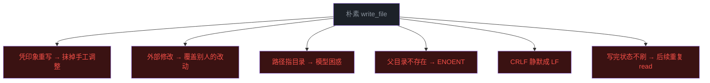
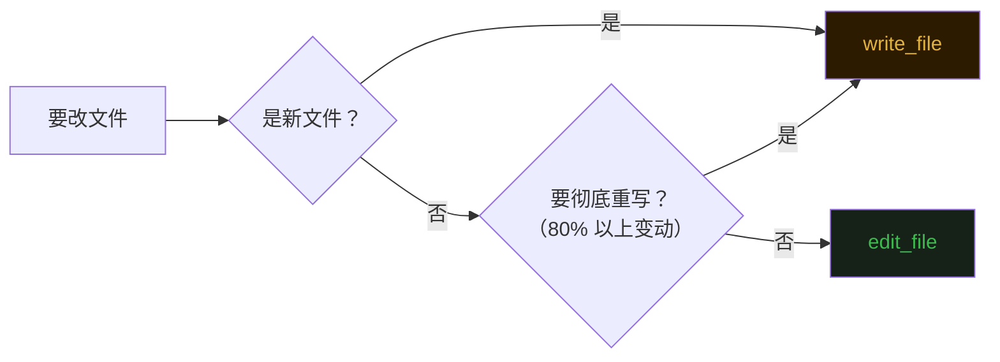
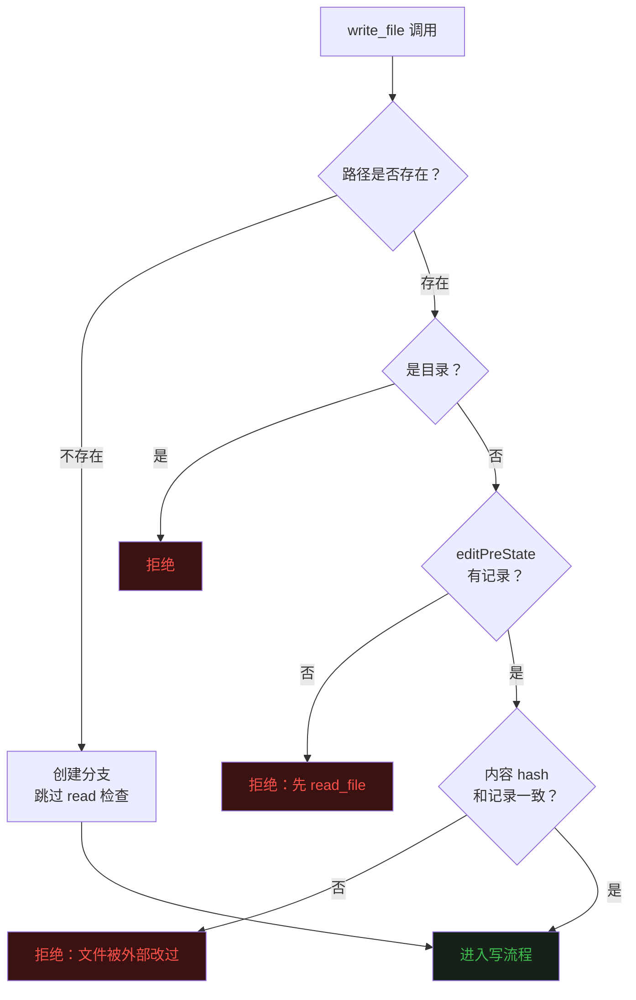
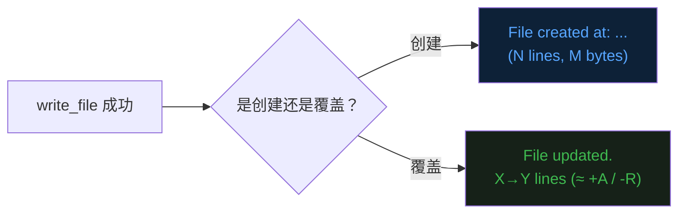
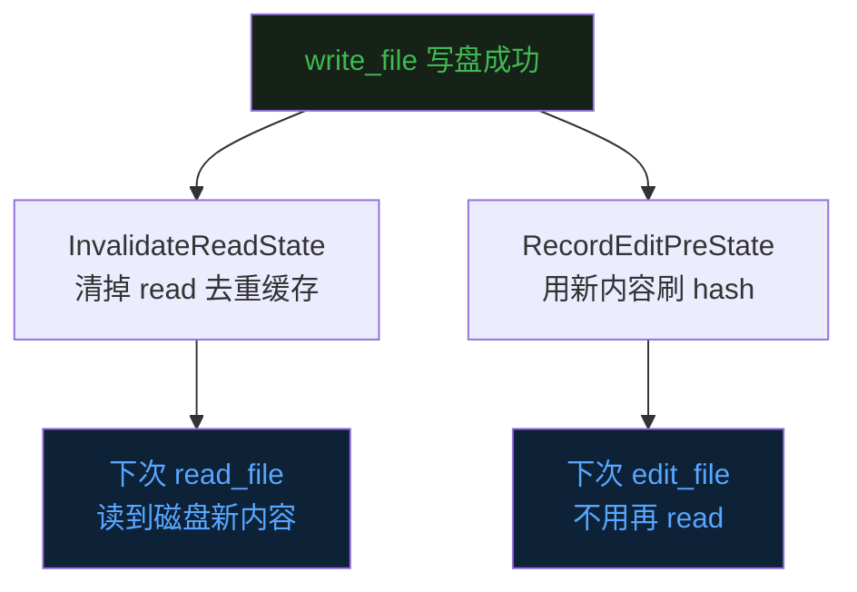

## 零、背景


前二十篇文章把 Agent 的整体骨架——[Loop](https://mp.weixin.qq.com/s/dkdrwVlwe3IkH2hzSzy53A)、[工具](https://mp.weixin.qq.com/s/xyX4_CF5cveezEDuzFT13g)、[上下文记忆](https://mp.weixin.qq.com/s/lguRAdxFoN22rqPyx3BIzw)、[上下文压缩](https://mp.weixin.qq.com/s/YRS29wRckEmFgNb0eJrxrQ)、[MCP](https://mp.weixin.qq.com/s/rCnGif8Ee7JhRI86-RoNWA)、[Skill](https://mp.weixin.qq.com/s/X2ie0aQ2vMtddAQrkbOG5g)、[TUI](https://mp.weixin.qq.com/s/fBNFZvOOpwCPT7yysh5YkQ)、[任务规划](https://mp.weixin.qq.com/s/UIlEXIuQdacowdrIg1nrDQ)、[子代理](https://mp.weixin.qq.com/s/LfgDcv27vjlmLZ9NfvQ9LA)、[命令](https://mp.weixin.qq.com/s/M1jxdA4BysQkaN7p4hwneQ)、[跨会话记忆](https://mp.weixin.qq.com/s/wEQwMadb84ixfVXteNfESA)、[Agent.md](https://mp.weixin.qq.com/s/82KmXRTsiDrhB-RZFg5sXw)、[系统提示词](https://mp.weixin.qq.com/s/15mxhcDs1oWBwguF_IIZDg)、[任务持久化](https://mp.weixin.qq.com/s/86urMkNycEkI38KCoS0mxg)、[会话持久化](https://mp.weixin.qq.com/s/zyVNi0JXBlbO-z3KtZEFcA)、[goal 命令](https://mp.weixin.qq.com/s/DfDFsIhLZJp1NiXz9dp7ug)、[后台任务](https://mp.weixin.qq.com/s/1fII8BYVinsUuOBnE7lMmA)、[定时任务](https://mp.weixin.qq.com/s/wpBoRmGp3Rz_qfhVwJqZlQ)、[Teammate](https://mp.weixin.qq.com/s/Fv4XKVDPWBOydtG-RAq9sQ)、[自定义子代理](https://mp.weixin.qq.com/s/--PaxhI2_8dz4bpcDy1ciw) 都讲了一遍。  


第二十一篇文章开始 Claude Code 源码精读，之前已经介绍了 [读文件](https://mp.weixin.qq.com/s/AGAmabBwRFuyPQUCRHhzAA) 工具。  


这一篇接着上一篇，精读 read 的另一个搭子——**`write_file`**。  


读和写是 Agent 操作代码最基础的两只手，前一篇把「读」拆开了讲，这一篇把「写」拆开。  


写文件这件事看起来比读还简单——一行 `os.WriteFile` 就完事了。  
但放到 Agent 手里，它是把双刃剑——一刀下去能把刚改好的文件覆写成模型脑补的样子，几千行代码瞬间消失。  


Claude Code 仓库里这个工具叫 `FileWriteTool`，TypeScript 源码加上 prompt 几百行。  
看它怎么把这把刀加上保险。  


## 一、写文件这件事，比想象中危险


最朴素的 `write_file` 大概是这样的：模型给一个 `file_path` 和一段完整的 `content`，工具调用一次 `os.WriteFile`，结束。  


十行不到的代码。但只要这个工具被 Agent 调用过几百次，下面这些事故就会一桩桩冒出来。  


**模型「凭印象重写」**。模型没读过这个文件，但它觉得自己「应该知道这个文件长什么样」，于是把整个文件按印象重新生成一份，扔进 `write_file`。如果运气好，文件本来就接近模型脑补的样子，覆写之后看着没问题；运气不好，文件里某些手工调整的细节、某段第三方代码、某个特殊的 license 头被悄悄抹掉，几个 commit 之后才发现回不去。  


**外部修改了文件**。  
模型 5 分钟前读过 `main.go`，期间用户保存了一次、prettier 跑了一次、git checkout 了一次，文件已经不是当时那个文件了。  
模型基于过期内容生成的「完整版本」覆盖回去，等于把别人的改动全部丢掉。  


**目录被一刀写成文件**。  
`file_path` 写错指到一个目录，朴素的 `os.WriteFile` 会报错，但错误信息对模型不友好，可能会把它带到「我先 rm -rf 这个路径吧」的糟糕路径上。  


**父目录不存在**。  
模型想创建 `pkg/utils/helper.go`，但 `pkg/utils/` 目录本身还没建。  
`os.WriteFile` 直接 `ENOENT`，模型一头雾水。  


**CRLF 文件被静默改成 LF**。  
`write_file` 是整个文件覆写，原来的换行风格直接没了。  


**写完之后状态没维护**。写完之后再 read，缓存里还是旧版本；  
写完之后再 edit，前置检查里 hash 对不上又得重新 read 一次。一次操作变两次。  





这六类问题里，前两类是**最危险的语义事故**——文件还在，但内容回不去了。  
后四类是**操作体验问题**——拖慢 Loop、惹模型反复纠错。`FileWriteTool` 都得逐个补上。  


## 二、和 edit_file 的分工：什么时候才该用 write


在 `FileWriteTool` 的 prompt 描述里有这样一句话：  


> Prefer the `edit_file` tool for modifying existing files — it only sends the diff. Only use this tool to create new files or for complete rewrites.


这是工具设计上的明确分工——**`write_file` 只在两种场景里出场**：第一是创建一个全新的文件，第二是对已有文件做完整重写。  
其它所有场景应该走 `edit_file`。  


这个分工不是为了好看，是为了省 token 和降风险。  


省 token 是显而易见的。  
`edit_file` 只发 `old_string` 和 `new_string` 两段，几百字符就能改一行；  
`write_file` 必须把整个文件原样发一遍，几千行的文件要塞几万 token 进 prompt。  


降风险才是更重要的那一面。  
`edit_file` 改的是文件的局部，原文里那些模型没碰过的部分天然保留；  
`write_file` 是整文件覆写，原文里任何东西都得在 `content` 里被显式重写出来才能保留，**任何遗漏都是删除**。  


所以「prefer edit_file」这句 prompt 不是建议，是**风险偏好的工程化表达**。  
能用局部改的地方绝不用整体重写，把模型可能搞错的地方收窄到最小。  





## 三、Must read first：和 edit_file 共享同一道闸


「写之前必须读过」这道前置检查，`write_file` 和 `edit_file` 共用一份状态——`editPreState`。  


```go
type EditPreState struct {
    Mtime int64
    Hash  [16]byte
}
var editPreState = map[string]EditPreState{}
```


`read_file` 每次完整读完一个文件就在这张表里记一笔 `(absPath, mtime, hash)`，**`write_file` 进来后第一件事就是查这张表**：  


```go
pre, hasPre := GetEditPreState(absPath)
if !hasPre {
    return "", fmt.Errorf(
        "write_file: %s has not been read in this session — call read_file on the full file before overwriting it",
        filePath,
    )
}
```


**注意这道检查只对「已存在的文件」生效**。  
如果 `file_path` 指向一个不存在的路径，那这是「创建新文件」场景，没有「读过」的前提可言，跳过这道检查直接进入写流程。  


这个区分非常关键，因为它对应了 `write_file` 的两种合法使用场景的天然差异：  


创建新文件——本来就没有原内容，没什么可读的，模型只需要确定路径正确、内容写对了即可。  


覆写已有文件——必须先看清原文长什么样，再决定要覆盖成什么。  
绕开 read 直接 write 等于让模型对着一个不可见的文件下笔，产物几乎一定有问题。  


这道分支判断就是把这两种场景的安全边界对齐到了同一行代码里：「文件存在 → 必须读过；文件不存在 → 直接写」。  





## 四、No stale writes：写之前再 hash 一次


即使读过了，也不一定能写。  


文件可能在「读」和「写」之间被外部修改——用户手动保存、IDE 的 format-on-save、git checkout、prettier、pre-commit hook……这一段时间窗口在自动化 Loop 里能拖到几十秒甚至几分钟。  


如果跳过这道检查直接 `os.WriteFile`，模型基于过期内容生成的「完整版本」就会把外部的改动**整段抹掉**。  


`write_file` 在写之前会做一次内容 hash 比对：  


```go
oldBytes, err := os.ReadFile(absPath)
// ...
if hashShortContent(oldBytes) != pre.Hash {
    return "", fmt.Errorf(
        "write_file: %s has been modified since it was last read — read it again before writing it",
        filePath,
    )
}
```


这里特别要注意是**先 ReadFile 再 hash 比对，再 WriteFile**。  
三个 syscall 之间存在 TOCTOU 窗口。  
理论上 hash 比完到 WriteFile 之间还可能被改一次。  


对于一个 LLM Loop 来说，这个窗口几乎不会构成事故。  
人和 IDE 都不会以微秒级精度去抢这把锁。  
但如果未来要把工具放到一个 Agent 集群里多个 Agent 同时改同一个仓库，就需要进一步上文件锁或者改 atomic rename，这是后话。  


**为什么 hash 而不是 mtime**  
mtime 在 cloud sync、antivirus、format-on-save 等情况下会更新但内容没变，按 mtime 拒绝会产生大量假阳性。  
hash 是确定信号。  
内容变了一定变，没变一定不变。  
代价是读一遍文件做哈希，对几百 KB 的源代码文件几乎可以忽略。  


## 五、CRLF：故意不保留


`write_file` 的策略为——**读到什么就写什么，不做任何 CRLF 还原**。  


这不是疏忽，是 Claude Code 上游主动做的一个改动。  
原版本里 `FileWriteTool` 也尝试过保留 CRLF，但很快踩到了一个生产事故。  


bash 脚本在 Linux 上必须是 LF 结尾。  
如果一个仓库里有一个 `deploy.sh` 因为某种历史原因变成了 CRLF（被 Windows 编辑器开过、跨平台 git 配置错过），模型重写这个文件时 LLM 会输出干净的 `\n`，但工具又「贴心地」把它变回 `\r\n`。  
下一次 bash 执行就报 `bad interpreter: /bin/bash^M`。  


这种事故在 Linux/macOS 用户那里完全找不到原因——文件看着没问题，diff 看不出区别（git 通常不显示 CR），但执行就是不通。  


所以 `FileWriteTool` 上游决定**显式不保留 CRLF**——模型输出 `\n` 就写 `\n`。  
如果原文件是 CRLF，整文件覆写之后会变成 LF。  


## 六、父目录创建：MkdirAll 提到关键路径之前


创建一个新文件时，父目录不一定存在——模型想建 `pkg/utils/helper.go`，但 `pkg/utils/` 还没创建过。  


朴素的 `os.WriteFile` 在这种情况下直接 `ENOENT`，给模型一个「no such file or directory」的错误。  
模型当然能看懂，但接下来它可能会：先调一次 `bash mkdir -p pkg/utils` 再重试，或者更糟，调一次 `bash` 然后里面手工 `echo >` 写文件。  
多一轮工具调用是真实的 token 浪费。  


`FileWriteTool` 在写文件之前**主动 MkdirAll**：  


```go
if err := os.MkdirAll(filepath.Dir(absPath), 0o755); err != nil {
    return "", fmt.Errorf("write_file: mkdir: %w", err)
}
if err := os.WriteFile(absPath, []byte(content), 0o644); err != nil {
    return "", fmt.Errorf("write_file: %w", err)
}
```


## 七、写完反馈：创建 vs 更新，连行数都报


`write_file` 在 tool result 里做了一份针对模型的反馈优化。  


最朴素的反馈是「success」或者「failed」一句话完事——模型只能从「没报错」推断写成功了，但不知道写了多少、写到哪个具体路径、是新建还是覆盖。  


`FileWriteTool` 把这一步分成两种回复——  


创建场景的回复：  


```
File created successfully at: pkg/utils/helper.go (wrote 42 lines, 1234 bytes).
```


覆写场景的回复：  


```
The file main.go has been updated successfully.
120 line(s) before, 135 line(s) after (≈ +18 / -3).
```


创建场景里报「写了多少行多少字节」——是为了让模型快速核对「我打算写的内容是不是真的全写进去了」。  
如果模型预期写 200 行，结果只看到「2 lines」，立刻能发现自己漏掉了某段 escape 处理或者字符串截断的 bug。  


覆写场景里报「前后行数」+「近似增删」——这条信息更关键，因为它是模型对**自己这次重写覆盖范围的快速 sanity check**。  


如果模型本意是「在原文件基础上加几行 import」，写完看到「+3 / -1」就放心了；  
如果它本意是「加几行 import」但反馈是「+50 / -45」，就立刻知道自己刚刚把整个文件几乎重写了一遍。  
这是一个非常明显的「写超过预期」的信号，可以让模型在下一轮主动验证一下。  





## 八、写后状态维护：让 read 看到新世界


**写完之后，所有相关的内存状态都要刷一遍**。  


```go
InvalidateReadState(absPath)
if newInfo, statErr := os.Stat(absPath); statErr == nil {
    RecordEditPreState(absPath, newInfo.ModTime().UnixNano(), []byte(content))
}
```


第一件事是把 read 去重缓存里这个文件的条目清掉。  
否则下一次 `read_file` 调用进来，看到 mtime 和缓存对得上（因为缓存还没 invalidate），就会返回 `File unchanged since last read.`——而实际上文件已经被 `write_file` 整个覆写过了。  
模型读到这条 unchanged 占位就会去翻上下文里旧版本的内容，世界观和磁盘对不上，bug 就此埋下。  


第二件事是用**新内容**重新 RecordEditPreState。  
这一步是为了让模型可以在同一个 turn 里**连续写或者改同一个文件**——`write_file` 创建完 `helper.go`，下一步直接 `edit_file` 给它加几行内容，不需要中间再插一次 `read_file`。  


`write_file` / `edit_file` / `read_file` 三个工具共享一个状态机——**任何一个工具改变了世界，所有工具都得看到改变**。这个一致性是工具集层面的契约，单个工具的实现只要触碰共享状态就要负责把它刷正确。  





## 九、什么没移植


对照上游 `FileWriteTool.ts`，evo-agent 当前版本**故意没做**几件事。  


**Notebook 写入**——`.ipynb` 文件按 cell 改写、保留 metadata。这条会随 `read_notebook` / `edit_notebook` 单独成一个工具一起做。  


**Diff 渲染**——上游的 tool result 里会附带一个结构化 diff 给前端 UI 渲染绿/红色块。evo-agent 的 TUI 没有 diff 面板，用文本的 `+18 / -3` 概要替代，已经够用。  


**1 GiB 写入硬上限**——上游为了防止 V8 字符串爆掉加了这道闸。Go 侧 `string` 没有这种限制，但是单次写 1 GiB 仍然会消耗大量内存，这条之后会按需补。  


**inputsEquivalent**——UI 层去重。evo-agent 没有 UI 确认层，每次工具调用直接执行。  


这些点不是「不需要」，是「场景不同所以暂时不做」。一个工具的复杂度本身就是它服务场景的折射。  


## 十、最后


回头看一下 `FileWriteTool` 解决的问题清单——**前置检查、no stale writes、CRLF 显式不保留、MkdirAll 提到关键路径之前、创建/覆写区分反馈、近似 diff 让模型 sanity check、写后刷新共享状态**。  


写文件这件事看起来是 `read_file` 的对偶，但它**多了一层「破坏不可逆」的属性**——读错了重读一次就好，写错了文件就回不去了。  


所以 `write_file` 上的设计哲学和 `read_file` 不太一样：read 的目标是「省 token、稳输出」，write 的目标是「**别让模型把自己不知道的东西覆盖掉**」。  


`FileWriteTool` 的每一道闸——必须先读过、hash 不变才能写、目录路径绝不当文件写、CRLF 干脆不保留——背后都是同一句话：**给模型一把尽可能不会割到自己手的刀**。  


所谓「Agent 工程」，其实大半都是「工具工程」。  


下一篇接着聊这一组里最复杂的那个——**`edit_file`**。它把 read 和 write 放进了同一个调用，复杂度也跟着上了一个台阶。  


《完》  


-EOF-  


本文公众号：天空的代码世界  
个人微信号：tiankonguse  
公众号 ID：tiankonguse-code  
