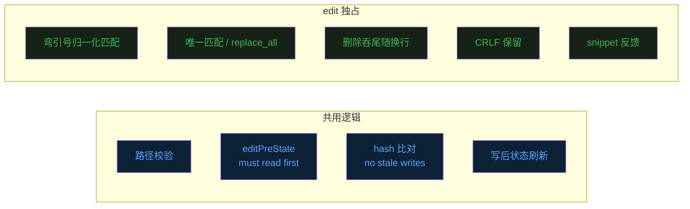
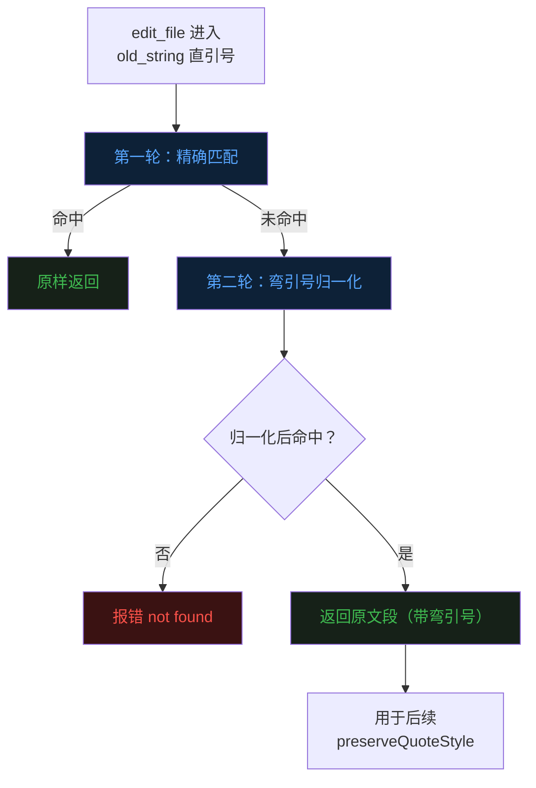
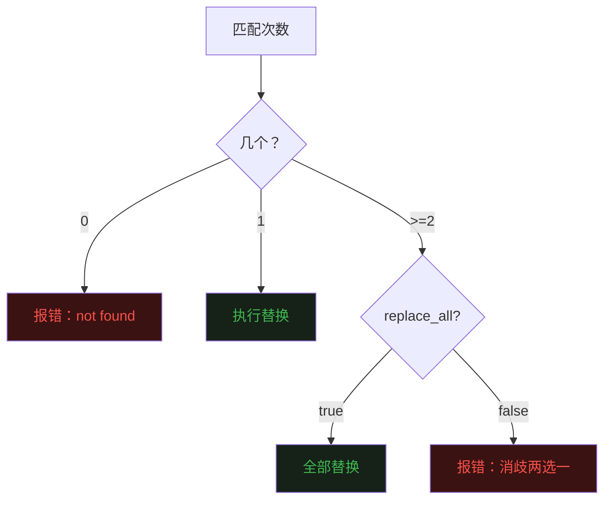
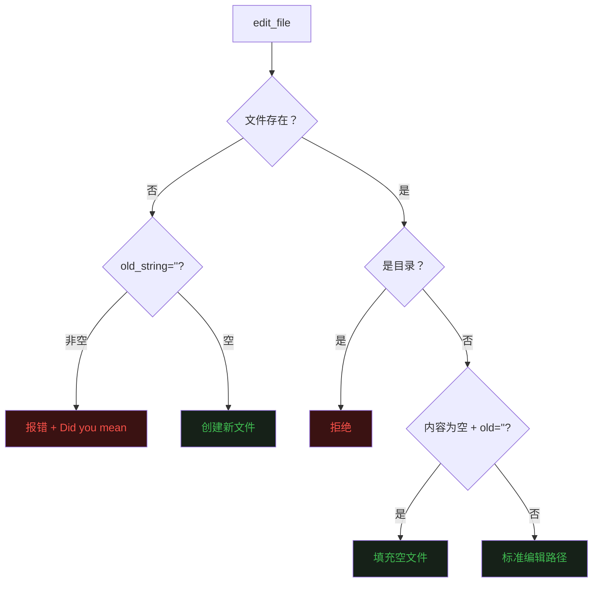

## 零、背景


前二十篇文章把 Agent 的整体骨架，如[Loop](https://mp.weixin.qq.com/s/dkdrwVlwe3IkH2hzSzy53A)、[工具](https://mp.weixin.qq.com/s/xyX4_CF5cveezEDuzFT13g)、[上下文记忆](https://mp.weixin.qq.com/s/lguRAdxFoN22rqPyx3BIzw)、[上下文压缩](https://mp.weixin.qq.com/s/YRS29wRckEmFgNb0eJrxrQ)、[MCP](https://mp.weixin.qq.com/s/rCnGif8Ee7JhRI86-RoNWA)、[Skill](https://mp.weixin.qq.com/s/X2ie0aQ2vMtddAQrkbOG5g)、[TUI](https://mp.weixin.qq.com/s/fBNFZvOOpwCPT7yysh5YkQ)、[任务规划](https://mp.weixin.qq.com/s/UIlEXIuQdacowdrIg1nrDQ)、[子代理](https://mp.weixin.qq.com/s/LfgDcv27vjlmLZ9NfvQ9LA)、[命令](https://mp.weixin.qq.com/s/M1jxdA4BysQkaN7p4hwneQ)、[跨会话记忆](https://mp.weixin.qq.com/s/wEQwMadb84ixfVXteNfESA)、[Agent.md](https://mp.weixin.qq.com/s/82KmXRTsiDrhB-RZFg5sXw)、[系统提示词](https://mp.weixin.qq.com/s/15mxhcDs1oWBwguF_IIZDg)、[任务持久化](https://mp.weixin.qq.com/s/86urMkNycEkI38KCoS0mxg)、[会话持久化](https://mp.weixin.qq.com/s/zyVNi0JXBlbO-z3KtZEFcA)、[goal 命令](https://mp.weixin.qq.com/s/DfDFsIhLZJp1NiXz9dp7ug)、[后台任务](https://mp.weixin.qq.com/s/1fII8BYVinsUuOBnE7lMmA)、[定时任务](https://mp.weixin.qq.com/s/wpBoRmGp3Rz_qfhVwJqZlQ)、[Teammate](https://mp.weixin.qq.com/s/Fv4XKVDPWBOydtG-RAq9sQ)、[自定义子代理](https://mp.weixin.qq.com/s/--PaxhI2_8dz4bpcDy1ciw) 都讲了一遍。  


从第二十一篇文章开始，进入 Claude Code 源码精读。  
前面已经看过 [read_file](https://mp.weixin.qq.com/s/AGAmabBwRFuyPQUCRHhzAA) 和 [write_file](https://mp.weixin.qq.com/s/OWZLoP3xR4SOzfbkV2zhjQ) 两个工具的源码。  


这一篇来看最复杂的 **`edit_file`** 工具，对应 Claude Code 源码里的 `FileEditTool`。  


`read_file` 是「看」，`write_file` 是「覆盖」，`edit_file` 是介于两者之间，给一段 `old_string`，给一段 `new_string`，去文件里精确替换。  


听起来比 write 还简单，一次 `strings.Replace` 就完事。  
但 edit 的麻烦在于： read 和 write 的所有边界条件都需要考虑，还额外多出一堆只有「字符串替换」语义才会遇到的问题。


## 一、三件套对照：哪些共用、哪些独占


读 / 写 / 编辑这三个工具，看似各管一摊，其实大半的设计都是共用的。  


| 维度 | `read_file` | `write_file` | `edit_file` |
| --- | --- | --- | --- |
| 路径合法性（空路径、目录、不存在）| ✓ 拒绝 | ✓ 拒绝 | ✓ 拒绝 |
| 二进制 / 设备文件拦截 | ✓ | — | — |
| Must read first| 生产者 | ✓ 消费者 | ✓ 消费者 |
| No stale writes（hash 比对）| — | ✓ | ✓ |
| 写后 `InvalidateReadState` | — | ✓ | ✓ |
| 写后 `RecordEditPreState`| ✓ | ✓ | ✓ |
| `MkdirAll` 父目录 | — | ✓ | ✓|
| CRLF 风格 | 归一化输出 | 故意不保留 | **保留原风格** |
| 字符串匹配 | — | — | ✓（独占）|
| 弯引号归一化 + 风格保留 | — | — | ✓（独占）|
| 唯一匹配 / `replace_all` 消歧 | — | — | ✓（独占）|
| 删除时吞尾随换行 | — | — | ✓（独占）|
| 错误信息里带 "Did you mean" | ✓ | — | ✓ |
| 反馈给模型的内容 | cat -n 文本 | 行数 / 字节数 | snippet + 行号 |


从这张表能直接读出 edit 的特征。  


**共用部分**集中在「读必先于写」「写不能盖掉别人的改动」「写完同步状态」这一类**前置/后置逻辑**上，三个工具是同一套机制，只是站位不同。  
这一部分前两篇文章已经讲过了，本篇用一节快速带过。


**edit 独占部分**集中在「字符串替换语义」本身，匹配怎么找、找到多个怎么办、删除如何处理换行符、引号风格怎么保留、CRLF 为什么和 write 反着来。  
这是 edit 真正的复杂度所在，本篇会逐项详细拆开。





## 二、共用逻辑：一节快速带过


这一节把三个工具共用的机制集中处理，因为前两篇已经详细拆过，这里只点到为止。


**Must read first**  
`edit_file` 进来后查 `editPreState`，没记录就直接拒绝并提示「先 read_file」。  
状态由 `read_file` 完整读取后写入，`edit_file` 和 `write_file` 共同消费。


**No stale writes**  
读完到改完之间文件可能被外部改动。  
改之前用 hash 比一次，不一致就拒绝并提示重新 read：


**写后状态刷新**  
清掉 `read_file` 的去重缓存，再用新内容重新 `RecordEditPreState`，让模型可以**在同一个 turn 里连续 edit 同一个文件**而不必中间穿一次 read：


**目录 / 不存在路径**  
目录直接拒绝；不存在路径分两种语义（创建 / 误用），后面会单独讲。


这四条机制是 read / write / edit 三件套的「**共享逻辑**」，单看 edit 没什么新意。真正让 edit 复杂的是下面这几节。


## 三、字符串匹配的坑：弯引号 vs 直引号


这是 edit 第一个独占问题，**模型给的 `old_string` 在文件里找不到**。


最容易踩的一类是引号被悄悄换掉了。  
`"`（直引号、ASCII）和 `“ ”`（弯引号、typographic quote）在显示上几乎一致，但在字节层面是完全不同的字符。    
模型训练数据里两种都有，输出的时候究竟是哪一种谁都不知道。


结果就是，**文件里写的是 `“hello”`（弯引号），模型给的 old_string 是 `"hello"`（直引号）**。  
朴素的 `strings.Contains` 找不到，edit 报错。


`FileEditTool` 在这里有一道两轮匹配的 fallback。  


第一轮精确匹配命中，返回的就是 `search` 本身。  
第二轮归一化命中，**返回的是原文里那段位置的实际内容（带弯引号）**，不是模型给的直引号版本。  





## 四、引号风格保留：写回也要讲究


匹配阶段做了归一化，写回的时候要做一道反向操作：**把模型 `new_string` 里的 ASCII 引号「升级」成弯引号**，否则文件里会出现「弯引号原文 + 直引号补丁」的混排。


判断每个引号该是「左」还是「右」靠的是上下文。  


对单引号还多了一条特殊规则——**英文撇号**：


`don't` 这种缩写中间的撇号，前后都是字母，在排版上一定是闭单引号（'），不能写成开引号。


这套保留逻辑只在「第一轮没命中、第二轮归一化命中」时才触发，99% 的场景根本不会进来。  
但一旦进来，需要保证写回的内容和原文排版一致。  


## 五、唯一匹配 vs replace_all：消歧的两条路


edit 的另一道独占机制，**`old_string` 在文件里命中多次时，默认拒绝执行**，除非模型主动开了 `replace_all=true`。


这条规则的意义在于，把「替换哪一处」的歧义**完全消除**。  





## 六、删除一行：吞掉那个尾随换行


这是另一类只有 edit 才会遇到的细节：**删除语义**。


当 `new_string=""` 而 `old_string` 不为空时，edit 的语义是「把 old_string 这段从文件里删掉」。  


最朴素的实现 `strings.Replace(original, oldString, "", n)` 会留下一个非常恼人的副作用，**原本 old_string 后面那个 `\n` 还在**。  


只在两个条件同时成立时触发：`old_string` 自己不以 `\n` 结尾（说明是「半行」），且原文里 `old_string + "\n"` 存在（说明位于行尾）。  


这两个条件保证了**只有「删除整行」的场景才会吞尾随换行**。  
如果 old_string 已经带 `\n` 或位于行中间，不动它。  


## 七、新文件创建：edit 的另一条入口


`edit_file` 还承担了「创建新文件」的语义。  
`old_string=""` 且文件不存在时，把 `new_string` 当作整个文件内容写出去。


文件不存在时分两条路。  


`old_string != ""`：模型在「编辑一个不存在的文件」，明显误用。  
错误信息带上 cwd，`findSimilarFile` 在父目录里找一下相近名字的兄弟文件给出 "Did you mean" 提示。  
这里与 `read_file` 的实现保持一致，即把「错误信息里带正确答案」。


`old_string == ""`：合法的「创建」语义，先创建目录，再写文件。  


还有一种 corner case 是文件存在但内容为空，这时 `old_string=""` 是「填充空文件」语义，单独走写文件，返回的消息会区分「created」还是「filled empty file」。  





## 八、CRLF：和 write 选了相反的方向


edit 和 write 在换行处理上的决策完全相反。


write 那一篇里讲过，`FileWriteTool` **故意不保留 CRLF**。  
因为整文件覆盖时强行还原 CRLF 会让原本错配的 bash 脚本继续保持错配。


但 `FileEditTool` **主动保留原文件的 CRLF 风格**。  


两个工具选了相反方向，背后是同一条原则，**write 是覆盖语义、整个文件你说了算；edit 是局部修改语义、原文风格不该被这一次小改动改掉**。


## 九、写后反馈：snippet + 行号


最后一道独占机制是反馈。


最朴素的反馈是「The file has been updated successfully.」一句话。  
模型只能从「没报错」推断改成功了，但不知道改到哪一行、周围长什么样。  


`FileEditTool` 在 tool result 里**附带一段编辑后的 snippet**：


```
The file main.go has been updated successfully.

Snippet (around line 42 after the edit):
    38	import "os"
    39	import "strings"
    40	
    41	func main() {
    42		fmt.Println("hello, world")
    43		os.Exit(0)
    44	}
```


snippet 里前后各 4 行上下文 + 改动那几行，带 `cat -n` 风格的行号。


这是给模型的「**self-check 信号**」，不需要再调一次 read_file，tool result 本身就把答案带回来。


## 十、最后


三个工具最终组成了最基本的增删改查操作。  


read 的目标是「**省 token、稳输出**」。  


write 的目标是「**别让模型把自己不知道的东西覆盖掉**」。  


edit 的目标是「**让字符串替换在真实代码里足够鲁棒**」。  


三把刀都打磨好了，Agent 才有动手术的底气。  


《完》  


-EOF-  


本文公众号：天空的代码世界  
个人微信号：tiankonguse  
公众号 ID：tiankonguse-code  
